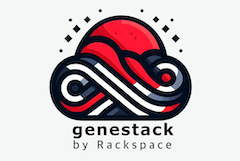

# Welcome to Genestack: Where Cloud Meets You

Genestack — where Kubernetes and OpenStack tango in the cloud. Imagine a waltz between systems that deploy
what you need.


## Included/Required Components

The following components are part of the initial product release
and largely deployed with Helm+Kustomize against the K8s API (v1.28 and up):

| Group      | Component            | OpenStack Flex | OpenStack Enterprise |
|------------|----------------------|----------------|----------------------|
| Kubernetes | Kubernetes           | Required       | Required             |
| Kubernetes | Kubernetes Dashboard | Required       | Required             |
| Kubernetes | Cert-Manager         | Required       | Required             |
| Kubernetes | MetaLB (L2/L3)       | Required       | Required             |
| Kubernetes | Core DNS             | Required       | Required             |
| Kubernetes | Ingress Controller (Nginx) | Required       | Required             |
| Kubernetes | Kube-Proxy (IPVS)    | Required       | Required             |
| Kubernetes | Calico               | Optional       | Required             |
| Kubernetes | Kube-OVN             | Required       | Optional             |
| Kubernetes | Helm                 | Required       | Required             |
| Kubernetes | Kustomize            | Required       | Required             |
| OpenStack  | openVswitch (Helm)   | Optional       | Required             |
| OpenStack  | Galera (Operator)    | Required       | Required             |
| OpenStack  | rabbitMQ (Operator)  | Required       | Required             |
| OpenStack  | memcacheD (Operator) | Required       | Required             |
| OpenStack  | Ceph Rook            | Optional       | Required             |
| OpenStack  | iscsi/tgtd           | Required       | Optional             |
| OpenStack  | Keystone (Helm)      | Required       | Required             |
| OpenStack  | Glance (Helm)        | Required       | Required             |
| OpenStack  | Cinder (Helm)        | Required       | Required             |
| OpenStack  | Nova (Helm)          | Required       | Required             |
| OpenStack  | Neutron (Helm)       | Required       | Required             |
| OpenStack  | Placement (Helm)     | Required       | Required             |
| OpenStack  | Horizon (Helm)       | Required       | Required             |
| OpenStack  | Skyline (Helm)       | Optional       | Optional             |
| OpenStack  | Heat (Helm)          | Required       | Required             |
| OpenStack  | Designate (Helm)     | Optional       | Required             |
| OpenStack  | Barbican (Helm)      | Required       | Required             |
| OpenStack  | Octavia (Helm)       | Required       | Required             |
| OpenStack  | Ironic (Helm)        | Optional       | Required             |
| OpenStack  | metal3.io            | Optional       | Required             |

Initial monitoring componets consists of the following projects

| Group      | Component            | OpenStack Flex | OpenStack Enterprise |
|------------|----------------------|----------------|----------------------|
| Kubernetes | Prometheus           | Required       | Required             |
| Kubernetes | Thanos               | Required       | Required             |
| Kubernetes | Alertmanager         | Required       | Required             |
| Kubernetes | Grafana              | Required       | Required             |
| Kubernetes | Node Exporter        | Required       | Required             |
| Kubernetes | redfish Exporter     | Required       | Required             |
| OpenStack  | OpenStack Exporter   | Required       | Required             |

At a later stage these components will be added

| Group     | Component            | OpenStack Flex | OpenStack Enterprise |
|-----------|----------------------|----------------|----------------------|
| OpenStack | MongoDB              | Optional       | Required             |
| OpenStack | Aodh (Helm)          | Optional       | Required             |
| OpenStack | Ceilometer (Helm)    | Optional       | Required             |
| OpenStack | Masakari (Helm)      | Optional       | Required             |


### Symphony of Simplicity

Genestack conducts this orchestra of tech with style. Operators play the score, managing the complexity with
a flick of their digital batons. They unify the chaos, making scaling and management a piece of cake. Think
of it like a conductor effortlessly guiding a cacophony into a symphony.


### Hybrid Hilarity

Our hybrid capabilities aren’t your regular circus act. Picture a shared OVN fabric — a communal network
where workers multitask like pros. Whether it’s computing, storing, or networking, they wear multiple
hats in a hyperconverged circus or a grand full-scale enterprise cloud extravaganza.


### The Secret Sauce: Kustomize & Helm

Genestack’s inner workings are a blend dark magic — crafted with [Kustomize](https://kustomize.io) and
[Helm](https://helm.sh). It’s like cooking with cloud. Want to spice things up? Tweak the
`kustomization.yaml` files or add those extra 'toppings' using Helm's style overrides. However, the
platform is ready to go with batteries included.

Genestack is making use of some homegrown solutions, community operators, and OpenStack-Helm. Everything
in Genestack comes together to form cloud in a new and exciting way; all built with opensource solutions
to manage cloud infrastructure in the way you need it.

#### Dependencies

Yes there are dependencies. This project is made up of several submodules which are the component
architecture of the Genestack ecosystem.

* Kubespray: The bit delivery mechanism for Kubernetes. While we're using Kubespray to deliver a production
  grade Kubernetes baremetal solution, we don't really care how Kubernetes gets there.
* MariaDB-Operator: Used to deliver MariaBD clusters
* OpenStack-Helm: The helm charts used to create an OpenStack cluster.
* OpenStack-Helm-Infra: The helm charts used to create infrastructure components for OpenStack.
* Rook: The Ceph storage solution du jour. This is optional component and only needed to manage Ceph
  when you want Ceph.

### Environment Architecture

They say a picture is worth 1000 words, so here's a picture.


## Get Deploying

Read the [docs](https://github.com/rackerlabs/genestack/wiki), start building your clouds with Genestack now.

### Get the Docs

You can clone a copy of all of our documentation locally by running the following command.

``` shell
git clone https://github.com/rackerlabs/genestack/wiki
```
