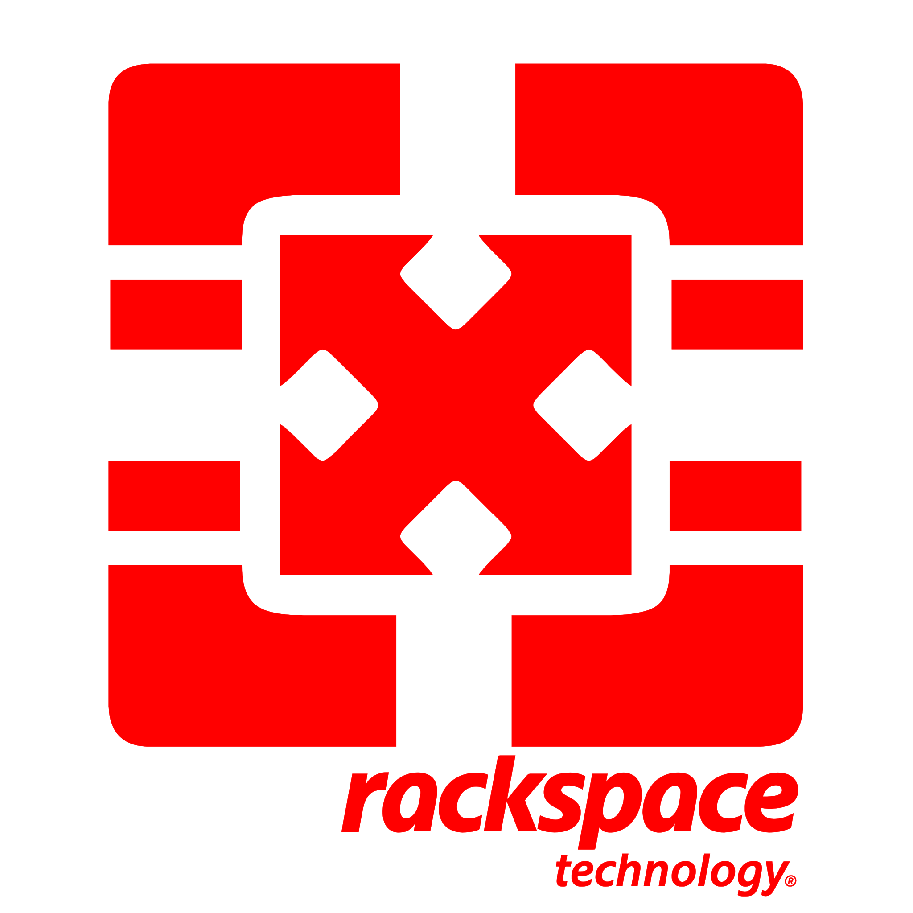

# How does Rackspace implement Accelerated Computing?

{ align=left : style="max-width:175px" }

## Palo Alto Networks PA-5420

The Palo Alto Networks PA-5420 is a next-generation firewall (NGFW) designed to deliver high-performance
security in enterprise data centers, service providers, and large-scale environments. Part of the Palo
Alto PA-5400 Series, it’s a high-throughput, high-capacity device equipped with features that help secure
networks, prevent advanced threats, and improve overall performance. Here are the key features of the
Palo Alto PA-5420:

  1. **High Performance and Throughput**: The PA-5420 is built for high-performance environments, with
     throughput capabilities designed to handle large volumes of traffic in data centers and enterprise
     networks. It offers up to 72 Gbps of firewall throughput and 32 Gbps of Threat Prevention throughput,
     allowing it to process large amounts of traffic efficiently even when advanced security features
     are enabled. Its performance makes it suitable for handling data-intensive workloads and securing
     traffic across multiple high-speed connections.

  2. **Advanced Threat Prevention**: The PA-5420 integrates Palo Alto’s Threat Prevention services, which
     include Intrusion Prevention System (IPS), antivirus, and anti-spyware to detect and block threats
     in real-time. It provides multi-layered protection by analyzing traffic for malware, exploits,
     and vulnerabilities, preventing threats before they enter the network. The Threat Prevention engine
     works alongside other features like WildFire (sandboxing) to detect zero-day threats and unknown
     malware.

  3. **Application-Based Traffic Control with App-ID**: Using Palo Alto’s App-ID technology, the PA-5420
     can accurately identify applications regardless of port, protocol, or encryption. This allows
     administrators to set granular policies based on application usage, enabling application-specific
     access control and minimizing the attack surface. App-ID also improves visibility by allowing
     organizations to monitor and control applications in real-time, enhancing overall security management.

  4. **User and Content-Based Control with User-ID and Content-ID**: User-ID maps network traffic to specific
     users, rather than just IP addresses, allowing for user-based policy enforcement and access control.
     Content-ID provides in-line content inspection and control, analyzing traffic for potentially
     malicious content or data leakage. It includes URL filtering, data filtering, and file blocking,
     which are essential for controlling data usage and mitigating risks associated with malicious or
     inappropriate content.

  5. **SSL Decryption and Inspection**: The PA-5420 has dedicated hardware for SSL decryption, allowing
     it to inspect encrypted traffic without significant performance degradation. This capability is
     essential for detecting threats hiding within encrypted traffic, which is becoming increasingly
     common. By decrypting SSL/TLS traffic, the PA-5420 ensures that threat prevention and content
     inspection capabilities extend to encrypted traffic, improving overall security visibility.

  6. **Integrated WildFire for Advanced Malware Analysis**: WildFire is Palo Alto’s cloud-based threat
     intelligence and malware analysis platform that detects unknown and zero-day threats. Suspicious
     files are sent to WildFire for sandboxing, where they are executed in a controlled environment
     to observe malicious behavior. This enables the PA-5420 to detect and prevent advanced threats
     and novel malware variants that have not been previously identified.

  7. **Scalable and Modular Connectivity Options**: The PA-5420 supports multiple interface types, including
     10GbE, 25GbE, and 40GbE, which provides flexibility in network connectivity and scalability. High-speed
     connectivity options make it suitable for integration into modern data centers, supporting large
     volumes of data with minimal latency.

  8. **High Availability and Redundancy**: The PA-5420 supports high availability (HA) configurations,
     allowing for redundancy in case of failure. This ensures continuous protection and network uptime.
     With active/active and active/passive HA modes, the PA-5420 can be deployed with failover capabilities,
     making it reliable for mission-critical applications.

  9. Comprehensive Security Subscriptions: The PA-5420 can be integrated with Palo Alto’s suite of security
     subscriptions, which add a range of advanced capabilities:

    * Threat Prevention: Provides real-time protection from known threats, including malware, exploits,
      and command-and-control traffic.

    * URL Filtering: Blocks malicious and unwanted web content based on categories and custom policies.

    * DNS Security: Protects against DNS-based threats, such as domain generation algorithms (DGA),
      malware communication, and phishing.

    * GlobalProtect: Extends security policies to remote users and mobile devices, providing a secure
      remote access solution.

    * SD-WAN: Optimizes and secures WAN traffic, enabling more flexible and cost-effective branch connections.

  10. **Automation and Centralized Management**: The PA-5420 integrates with Panorama, Palo Alto’s centralized
      management system, enabling network administrators to manage multiple firewalls from a single
      interface. It offers APIs for automation, making it compatible with DevOps workflows and enabling
      integration with SIEM tools and other third-party security systems. This integration simplifies
      policy management, monitoring, and reporting across complex multi-firewall environments.

  11. **Machine Learning for Autonomous Security**: The PA-5420 utilizes ML-powered capabilities to improve
      threat detection and response times, leveraging machine learning models trained on global threat
      data. It enables automated policy recommendations, adaptive security, and proactive defense against
      emerging threats by constantly learning and adapting to new security challenges.

  12. **Zero Trust Network Security Capabilities**: The PA-5420 is built with Zero Trust principles in mind,
      focusing on enforcing least-privilege access and verifying identity at every stage. Features like
      User-ID, App-ID, and SSL decryption contribute to creating a Zero Trust architecture, allowing
      for granular control and ensuring only authorized access to sensitive resources.

  13. **Energy Efficiency and Form Factor**: Designed for high performance and efficiency, the PA-5420 offers
      robust security features within a compact form factor. This makes it energy-efficient, which is
      important for organizations aiming to reduce operational costs and their carbon footprint in data centers.

In summary, the Palo Alto Networks PA-5420 is a powerful, high-performance next-generation firewall
designed for large, data-intensive environments. With robust features for advanced threat prevention,
SSL inspection, application control, and high-speed connectivity, it offers a comprehensive security
solution for enterprises and service providers.

### **Ideal Use Cases**

* **Enterprise Data Centers**: The PA-5420’s high throughput and advanced threat prevention features make
  it ideal for protecting large data centers.

* **Service Providers and Large Enterprises**: With its scalability and ability to handle high traffic
  volumes, the PA-5420 is suited for large enterprises and service providers that need to secure and
  segment large, complex networks.

* **Cloud and Hybrid Environments**: Its integration with Palo Alto’s cloud-delivered services makes it
  suitable for hybrid and multi-cloud deployments.

* **High-Risk Sectors**: Industries requiring stringent security, such as financial services, healthcare,
  and government, can benefit from the advanced threat detection, SSL inspection, and content filtering
  capabilities.
