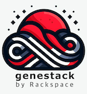

---
hide:
- navigation
- toc
---

# Rackspace Flex Cloud API Status

{ align=left : style="filter:drop-shadow(#3c3c3c 0.5rem 0.5rem 10px);" }

## :octicons-quote-24: Available Regions

- [SJC](https://status.api.sjc3.rackspacecloud.com/) 

- [DFW](https://status.api.dfw3.rackspacecloud.com/) 
