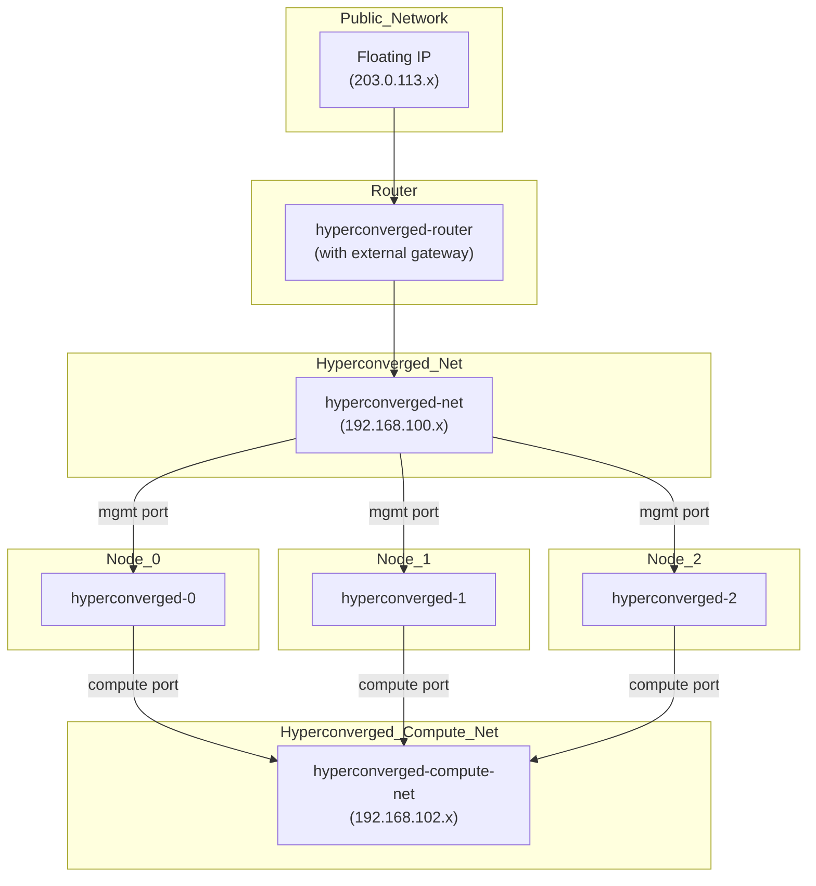

# Quick Start Guide

This guide will walk you through the process of deploying a test environment for Genestack. This is a great way to get started
with the platform and to familiarize yourself with the deployment process. The following steps will guide you through the process
of deploying a test environment on an OpenStack cloud in a simple three node configuration that is hyper-converged.

## Build Script

The following script will deploy a hyperconverged lab environment on an OpenStack cloud. The script can be found at
[`scripts/hyperconverged-lab.sh`](https://raw.githubusercontent.com/rackerlabs/genestack/refs/heads/main/scripts/hyperconverged-lab.sh).

??? "View the Hyper-converged Lab Script"

    ``` shell
    --8<-- "scripts/hyperconverged-lab.sh"
    ```

The build script is interactive and will prompt you for the following information

| <div style="width:156px">Variable</div> | Description | <div style="width:156px">Default</div> |
|----------|-------------|---------|
| `ACME_EMAIL` | Email address for Let's Encrypt. If an email address is defined and a real domain is used, the deployment will attempt to pull production certificates. | "" |
| `GATEWAY_DOMAIN` | Domain name used for routes within the gateway API. If a valid domain is used, it will be associated with the gateway routes. | "cluster.local" |
| `OS_CLOUD` | OpenStack cloud name. | "default" |
| `OS_FLAVOR` | OpenStack instance flavor, this will automatically select a flavor with < 24GiB of RAM. | "gp.X.8.16" |
| `OS_IMAGE` | OpenStack image name. | "Ubuntu 20.04" |
| `HYPERCONVERGED_DEV` | enable hyperconverged development mode. This will attempt to sync a local copy of Genestack to the development environment. | `false` |
| `LAB_NAME_PREFIX` | Prefix for the lab environment. Useful when building multiple labs in a single project | "hyperconverged" |

All of the variables can be defined on the command line using environment variables.

!!! example "Deploying a Hyper-converged Lab Environment with Environment Variables"

    ``` shell
    export ACME_EMAIL="user@domain.com"
    export GATEWAY_DOMAIN="cluster.local"
    export OS_CLOUD="default"
    export OS_FLAVOR="gp.0.8.16"
    export OS_IMAGE="Ubuntu 20.04"
    export HYPERCONVERGED_DEV="false"
    /opt/genestack/scripts/hyperconverged-lab.sh
    ```

## Overview

A simple reference architecture for a hyper-converged lab environment is shown below. This environment consists of three nodes
that are connected to a two networks. The networks are connected via a router that provides external connectivity.



## Build Phases

The deployment script will perform the following steps:

- Create a new OpenStack router
- Create a new OpenStack networks
- Create a new OpenStack security groups
- Create a new OpenStack ports
- Create a new OpenStack keypair
- Create a new OpenStack instance
- Create a new OpenStack floating IP
- Execute the basic Genestack installation

## Post Deployment

After the deployment is complete, the script will output the internal and external floating IP address information.

With this information, operators can login to the Genestack instance and begin to explore the platform.

## Demo

[](https://asciinema.org/a/706976)
