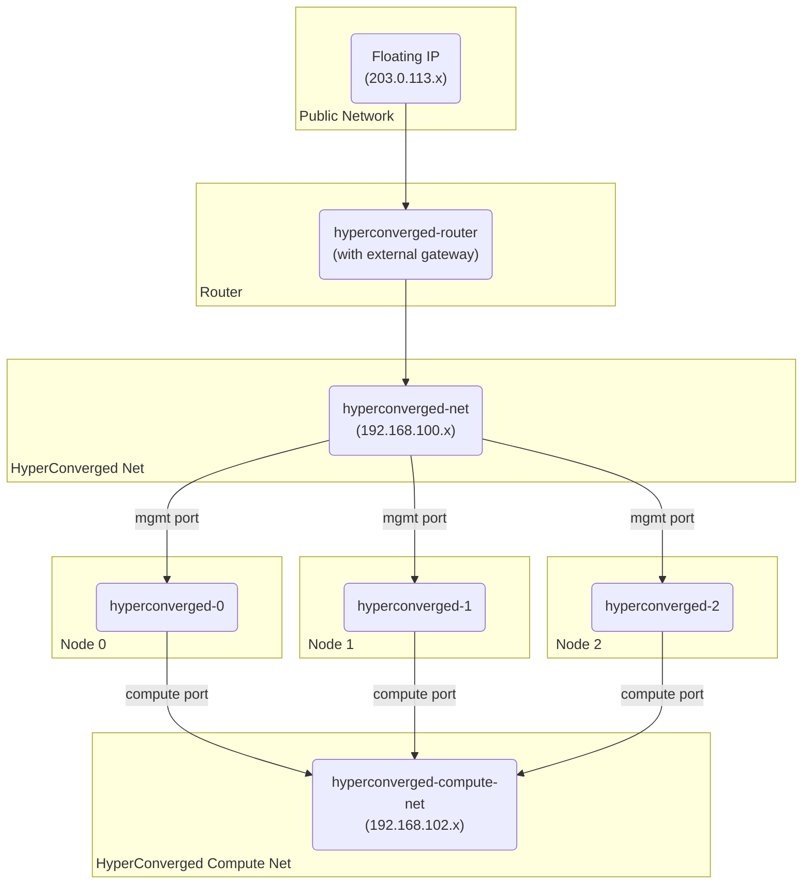

# Quick Start Guide

This guide will walk you through the process of deploying a test environment for Genestack. This is a great way to get started
with the platform and to familiarize yourself with the deployment process. The following steps will guide you through the process
of deploying a test environment on an OpenStack cloud in a simple three node configuration that is hyper-converged.

## Build Script

The following script will deploy a hyperconverged lab environment on an OpenStack cloud. The script can be found at
[`scripts/hyperconverged-lab.sh`](https://raw.githubusercontent.com/rackerlabs/genestack/refs/heads/main/scripts/hyperconverged-lab.sh).

??? "View the  Hyper-converged Lab Script"

    ``` shell
    --8<-- "scripts/hyperconverged-lab.sh"
    ```

The build script is interactive and will prompt you for the following information

| <div style="width:156px">Variable</div> | Description | <div style="width:156px">Default</div> |
|----------|-------------|---------|
| `ACME_EMAIL` | Email address for Let's Encrypt. If an email address is defined and a real domain is used, the deployment will attempt to pull production certificates. | "" |
| `GATEWAY_DOMAIN` | Domain name used for routes within the gateway API. If a valid domain is used, it will be associated with the gateway routes. | "cluster.local" |
| `OS_CLOUD` | OpenStack cloud name. | "default" |
| `OS_FLAVOR` | OpenStack instance flavor, this will automatically select a flavor with < 24GiB of RAM. | "gp.X.8.16" |
| `OS_IMAGE` | OpenStack image name. | "Ubuntu 24.04" |
| `HYPERCONVERGED_DEV` | enable hyperconverged development mode. This will attempt to sync a local copy of Genestack to the development environment. | `false` |
| `LAB_NAME_PREFIX` | Prefix for the lab environment. Useful when building multiple labs in a single project | "hyperconverged" |

All of the variables can be defined on the command line using environment variables.

!!! example "Deploying a Hyper-converged Lab Environment with Environment Variables"

    ``` shell
    export ACME_EMAIL="user@domain.com"
    export GATEWAY_DOMAIN="cluster.local"
    export OS_CLOUD="default"
    export OS_FLAVOR="gp.0.8.16"
    export OS_IMAGE="Ubuntu 24.04"
    export HYPERCONVERGED_DEV="false"
    /opt/genestack/scripts/hyperconverged-lab.sh
    ```

## Overview

A simple reference architecture for a hyper-converged lab environment is shown below. This environment consists of three nodes
that are connected to a two networks. The networks are connected via a router that provides external connectivity.



## Build Phases

The deployment script will perform the following steps:

- Create a new OpenStack router
- Create a new OpenStack networks
- Create a new OpenStack security groups
- Create a new OpenStack ports
- Create a new OpenStack keypair
- Create a new OpenStack instance
- Create a new OpenStack floating IP
- Execute the basic Genestack installation

## Post Deployment

After the deployment is complete, the script will output the internal and external floating IP address information.

With this information, operators can login to the Genestack instance and begin to explore the platform.

!!! Genestack
    Genestack uses DNS to route services in Kubernetes, which may be a bit different from what you might be used to in other lab environments, where
    IP addresses are used heavily.  To be able to access OpenStack externally from the jumpbox, set `GATEWAY_DOMAIN` to a DNS domain that you control.

### Setting up DNS for a Hyper-Converged Lab

At the end of the hyper-converged lab script run, you will see output that looks like this:

```
The lab is now ready for use and took 1298 seconds to complete.
This is the jump host address WW.XX.YY.ZZ, write this down.
This is the VIP address internally 192.168.100.NN with public address AA.BB.CC.DD within MetalLB, write this down.
```

To make DNS correctly resolve the OpenStack services in the lab, you will need to set some DNS entries for the `GATEWAY_DOMAIN` you specified when building the lab.  Using the "cluster.local" default example domain, you should configure something like this:

```
jumpbox.cluster.local       A       WW.XX.YY.ZZ
cluster.local               A       AA.BB.CC.DD
*.cluster.local             CNAME   cluster.local
```

!!! Warning
    Do **NOT** use `cluster.local` as your domain.  You will need to use a domain that you control and you will need to set the `GATEWAY_DOMAIN` variable to this prior to building your hyper-converged lab.

### Accessing your Hyper-Converged Lab

When generating your hyper-converged lab, the script creates an SSH key pair and puts it into your `$HOME/.ssh` directory.  The name of the key is derived from the `LAB_NAME_PREFIX` variable, and the default is `hyperconverged`.

To access the lab, you can SSH into the jumpbox using this key as the default user of the OpenStack Glance image you specified.  The default image is Ubuntu 24.04 LTS which has a default user of `ubuntu`.  In this case, the SSH command would be as follows:

```bash
bash$ ssh -i $HOME/.ssh/hyperconverged-key.pem ubuntu@jumpbox.cluster.local
```

The jumpbox user has passwordless sudo if configured in the Glance image. (The Ubuntu 24.04 LTS image has this.)

If you sudo to the `root` user, and look at the `clouds.yaml` file for that user, you will be able to see the OpenStack `admin` user password:

```
bash$ sudo su - root
bash# cat $HOME/.config/openstack/clouds.yaml
cache:
  auth: true
  expiration_time: 3600
clouds:
  default:
    auth:
      auth_url: http://keystone-api.openstack.svc.cluster.local:5000/v3
      project_name: admin
      tenant_name: default
      project_domain_name: default
      username: admin
      password: <PASSWORD>
      user_domain_name: default
    region_name: RegionOne
    interface: internal
    identity_api_version: "3"
```

This can be used to login to the Skyline web console.  To access the Skyline web console, you can just enter `https://skyline.cluster.local` (again, using `cluster.local` as an example) and access it from your web browser.

!!! Note
    If you get SSL errors, wait a bit. Cert Manager takes time to generate all the SSL certs it using with Let's Encrypt.

## Demo

[](https://asciinema.org/a/706976)
