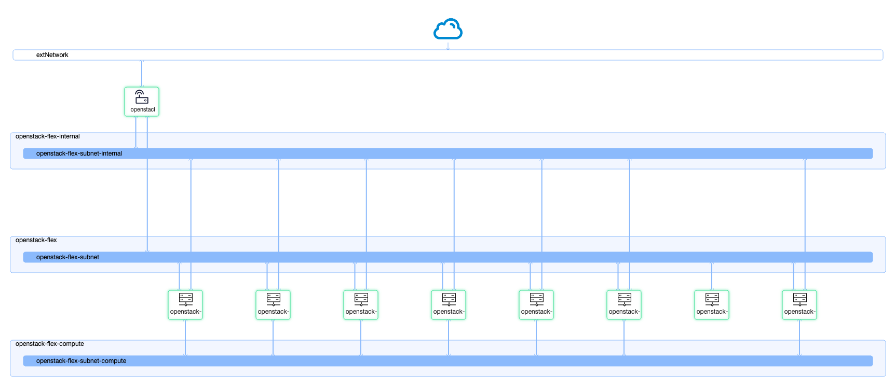

# Lab Build Demo

[](https://asciinema.org/a/629776)

The information on this page is only needed when building an environment in Virtual Machines.

## Prerequisites

Take a moment to orient yourself, there are a few items to consider before moving forward to help you get underway.

### Clone Genestack

> Your local genestack repository will be transferred to the eventual launcher instance for convenience **perfect for development**.
See [Getting Started](quickstart.md] for an example on how to recursively clone the repository and its submodules.

### Create a VirtualEnv

This is optional but always recommended. There are multiple tools for this, pick your poison.

### Install Ansible Dependencies

> Activate your venv if you're using one.

```
pip install ansible openstacksdk
```

### Configure openstack client

The openstacksdk used by the ansible playbook needs a valid configuration to your environment to stand up the test resources.

An example `clouds.yaml`:

``` yaml
cache:
  auth: true
  expiration_time: 3600
clouds:
  dfw:
    auth:
      auth_url: https://$YOUR_KEYSTONE_HOST/v3
      project_name: $YOUR_PROJECT_ID
      project_domain_name: $YOUR_PROJECT_DOMAIN
      username: $YOUR_USER
      password: $YOUR_PASS
      user_domain_name: $YOUR_USER_DOMAIN
    region_name:
      - DFW3
    interface: public
    identity_api_version: "3"
```

See the configuration guide [here](https://docs.openstack.org/openstacksdk/latest/user/config/configuration.html) for more examples.

## Create a Test Environment

> This is used to deploy new infra on an existing OpenStack cloud. If you're deploying on baremetal this document can be skipped.

If deploying in a lab environment on an OpenStack cloud, you can run the `infra-deploy.yaml` playbook which will create all of the resources needed to operate the test environment.

Before running the `infra-deploy.yaml` playbook, be sure you have the required ansible collections installed.

``` shell
ansible-galaxy collection install -r ansible-collection-requirements.yml
```

Move to the ansible playbooks directory within Genestack.

``` shell
cd ansible/playbooks
```

Run the test infrastructure deployment.

> Ensure `os_cloud_name` as well as other values within your `infra-deploy.yaml` match a valid cloud name in your openstack configuration as well as resource names within it.

> [!IMPORTANT]
> Pay close attention to the values for both `kube_ovn_iface` and `kube_ovn_default_interface_name`, they will need to match the desired interface name(s) within your test hosts!

``` shell
ansible-playbook -i localhost, infra-deploy.yaml
```

Here's an example where all of the cloud defaults have been overridden to use known options within my OpenStack Cloud environment.

``` shell
ansible-playbook -i localhost, infra-deploy.yaml -e os_image_id=Ubuntu-22.04 \
                                                 -e os_cloud_name=dfw \
                                                 -e os_launcher_flavor=m1.small \
                                                 -e os_node_flavor=m1.large
```

The test infrastructure will create the following OpenStack resources.

* Neutron Network/Subnet
  * Assign a floating IP
* Cinder Volumes
* Nova Servers

The result of the playbook will look something like this.



* The first three nodes within the build playbook will be assumed as controllers
* The last three nodes will be assumed to be storage nodes with 3 volumes attached to them each
* All other nodes will be assumed to be compute nodes.

### Running the deployment

The lab deployment playbook will build an environment suitable for running Genestack, however, it does not by itself run the full deployment. Once your resources are online, you can login to the "launcher" node and begin running the deployment. To make things fairly simple, the working development directory will be sync'd to the launcher node, along with keys and your generated inventory.

> If you're wanting to inspect the generated inventory, you can find it in your home directory.

### SSH to lab

If you have not set your .ssh config do not forget to  put in your path for your openstack-flex-keypair. Your Ip will be present after running the infra-deploy.yaml.

``` shell
ssh -i /path/to/.ssh/openstack-flex-keypair.key ubuntu@X.X.X.X

```