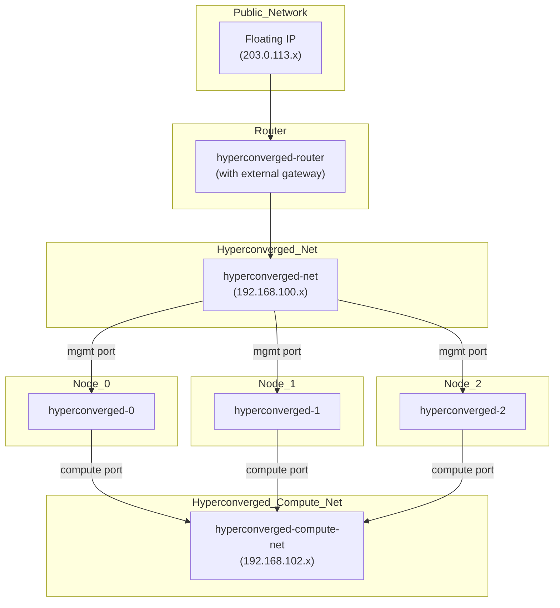

# Quick Start Guide

This guide will walk you through the process of deploying a test environment for Genestack. This is a great way to get started
with the platform and to familiarize yourself with the deployment process. The following steps will guide you through the process
of deploying a test environment on an OpenStack cloud in a simple three node configuration that is hyper-converged.

## Build Script

The following script will deploy a hyperconverged lab environment on an OpenStack cloud. The script can be found at
[`scripts/hyperconverged-lab.sh`](https://raw.githubusercontent.com/rackerlabs/genestack/refs/heads/main/scripts/hyperconverged-lab.sh).

??? "View the Hyper-converged Lab Script"

    ``` shell
    --8<-- "scripts/hyperconverged-lab.sh"
    ```

## Overview

A simple reference architecture for a hyper-converged lab environment is shown below. This environment consists of three nodes
that are connected to a two networks. The networks are connected via a router that provides external connectivity.



## Build Phases

The deployment script will perform the following steps:

- Create a new OpenStack router
- Create a new OpenStack networks
- Create a new OpenStack security groups
- Create a new OpenStack ports
- Create a new OpenStack keypair
- Create a new OpenStack instance
- Create a new OpenStack floating IP
- Execute the basic Genestack installation

## Post Deployment

After the deployment is complete, the script will output the internal and external floating IP address information.

With this information, operators can login to the Genestack instance and begin to explore the platform.

## Demo

[](https://asciinema.org/a/706976)
