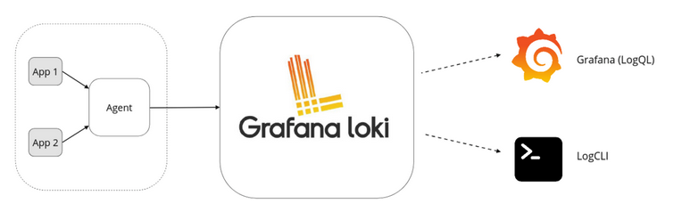
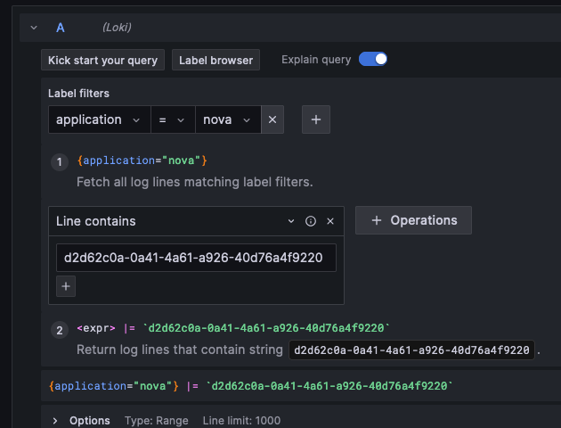

# Genestack Logging

[TOC]

### Introduction

Genestack logging is a straight forward system that collects, stores and provides an interface to search and read logs on-demand.  The storage backend is open to fit the needs of your deployment, so whether backing up to Openstack Swift, S3, Ceph, or file-share, Genestack logging can fit in your environment.

Out-of-box Genestack logging is comprised of three separate technologies:

- [Fluentbit](https://fluentbit.io/), a fast and lightweight telemetry agent for logs, metrics, and traces for Linux, macOS, Windows, and BSD family operating systems.  Fluentbit grabs log entries immediately from your Kubernetes application and ships them to Loki for aggregation
- [Loki](https://github.com/grafana/loki), a log aggregation system for Kubernetes that stores logs in a time series database and is often used with Grafana to visualize them.
- [Grafana](https://grafana.com/), enables you to query, visualize, alert on, and explore your metrics, logs, and traces.

These components are easily replaceable so that implementation in your existing environment is simple as possible.  For example, Grafana needs not to be your dashboard if your environment you are licensed for Splunk.

### Architecture

### Configuration

All configurations for Loki and FluentBit are in [genestack/base-helm-configs/loki](https://github.com/rackerlabs/genestack/tree/main/base-helm-configs/loki).  Review the default deployment settings and overrides for your needs.

### FluentBit, Loki, and Storage Operations

Let's break down the process of how Fluent Bit, Kubernetes, Loki, and OpenStack Swift interact to efficiently collect and store application logs:

1. Log Generation in Kubernetes:

    Kubernetes applications run within pods, which are the smallest deployable units of computing that contain one or more containers. Applications generate logs as part of their normal operation, recording events, errors, and other relevant information.

2. Fluent Bit as the Log Collector:

    Fluent Bit is deployed as a **DaemonSet** in Kubernetes, ensuring it runs on every node of the cluster.  It acts as a lightweight log collector, efficiently gathering logs from various sources, including application pods.  It can parse and enrich logs with additional metadata, such as timestamps, hostnames, and Kubernetes labels.

3. Sending Logs to Loki:

    Loki is configured as the output destination for Fluent Bit, which sends the collected and enriched logs to Loki which in turn indexes the logs, allowing for efficient querying and searching later.

4. Loki's Role in Long-Term Storage:

    Loki can retain logs for a specified duration, depending on your configuration.  Loki chunks the application logs it has received into large objects which are then sent via HTTP/HTTPS calls to Openstack Swift to reduce long-term storage costs and maintain historical data.

5. OpenStack Swift as Object Storage:

    OpenStack Swift, or other S3-Compatible storage solutions such Ceph,  provides object storage leveraging Swift's durability and scalability to store archived logs for extended periods.

### Key Benefits of This Architecture

- Efficient Log Collection: Fluent Bit's lightweight design and efficient data transfer mechanisms ensure timely log collection.
- Scalable Log Aggregation: Loki's distributed architecture can handle large volumes of logs and scale horizontally to meet increasing demands.
- Flexible Log Retention: Loki's ability to archive logs to object storage provides a cost-effective solution for long-term retention.
- Powerful Log Querying: Loki's query language allows for complex log analysis and troubleshooting.
- Secure and Reliable Storage: OpenStack Swift offers durable and secure object storage for critical log data.

### Accessing Log Information through Grafana

The logs that Loki stores for us can be searched and read though Grafana.  From the left-side menu bars, select 'Explore' to enter queries in Grafana.

Start by selecting from the '**Label Filter**' drop-down for the application area of logs you want to search from.  These are keyed on labels determined in the Kubernetes deployment. For example, the 'application' choice will allow you to choose all Openstack services  by name (nova, cinder, etc ). All label filters are defined in base-helm-configs and can be referenced there. Only one selection is allowed per exporession, so you will need to select press the **+** to add more selections for refined searches.  Then you enter the text you are searching for with its search qualifier ( line contains, line does not continue, etc).  The example here shows searching for a server UUID in Nova:

  Label matching operators are as follows:

- `=`: exactly equal
- `!=`: not equal
- `=~`: regex matches
- `!~`: regex does not match

Extensive documentation for query is available in the [Grafana](https://grafana.com/docs/loki/latest/query/) pages.
