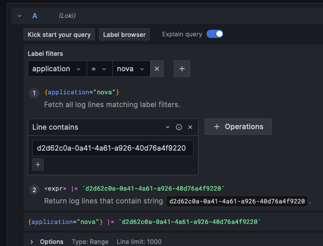

# Genestack Logging

[TOC]

## Introduction

Genestack logging is a modern, scalable system that collects, stores, and provides an interface to search and read logs on-demand. The storage backend is flexible to fit the needs of your deployment, whether backing up to OpenStack Swift, S3, Ceph, or file-share, Genestack logging can fit in your environment.

Out-of-the-box Genestack logging is comprised of three core technologies:

- **[OpenTelemetry](https://opentelemetry.io/)** - A vendor-neutral, open-source standard for telemetry collection. OpenTelemetry's filelog receiver collects logs from Kubernetes containers and OpenStack services, enriches them with metadata, and forwards them to Loki.
- **[Loki](https://github.com/grafana/loki)** - A log aggregation system designed for Kubernetes that stores logs using label-based indexing in a time-series database. Loki is cost-effective and integrates seamlessly with Grafana for visualization.
- **[Grafana](https://grafana.com/)** - Enables you to query, visualize, alert on, and explore your logs alongside metrics and traces in a unified interface.

These components work together to provide a complete logging solution while remaining modular enough to integrate with existing infrastructure if needed.

---

## Architecture

### Log Flow Overview

```
┌─────────────────────────────────────────────────────────────────────┐
│                      Log Collection & Storage                       │
└─────────────────────────────────────────────────────────────────────┘

Log Sources                Collector              Storage        Query
───────────                ─────────              ───────        ─────

/var/log/pods/  ──────┐
 (K8s containers)     │
                      ├──► OpenTelemetry  ──► Loki      ──► Grafana
/var/log/pods/  ──────┤    (filelog        │   (Index)      (Explore)
 (OpenStack svcs)     │     receiver)      │   (Store)      (Search)
                      │                    │                (Alert)
K8s Events  ──────────┘                    │
                                           │
                                           ▼
                                      S3/Swift/Ceph
                                     (Long-term Storage)
```

### Component Roles

| Component | Role | Key Features |
|-----------|------|--------------|
| **OpenTelemetry** | Log collection and processing | Multi-line parsing, metadata enrichment, filtering |
| **Loki** | Log aggregation and indexing | Label-based indexing, cost-effective storage, LogQL |
| **Grafana** | Visualization and querying | Interactive search, dashboards, alerting |
| **S3/Swift** | Long-term storage | Durable object storage, cost-effective retention |

---

## OpenTelemetry Log Collection

### Overview

OpenTelemetry replaces traditional log collectors like Fluentbit with a unified, vendor-neutral approach to telemetry collection. The OpenTelemetry Collector uses the **filelog receiver** to gather logs from Kubernetes and OpenStack services.

### Deployment

OpenTelemetry is deployed as a **DaemonSet** in Kubernetes, ensuring it runs on every node of the cluster. This allows it to:

- Access container logs directly from the host filesystem (`/var/log/pods`)
- Collect logs with minimal latency
- Automatically discover new pods and services
- Enrich logs with Kubernetes metadata

### Log Sources

The OpenTelemetry filelog receiver collects logs from:

#### 1. Kubernetes Container Logs

```yaml
receivers:
  filelog/k8s_containers:
    include:
      - /var/log/pods/*/*/*.log
    exclude:
      - /var/log/pods/*/otel-collector/*.log
    start_at: end
    include_file_path: true
    operators:
      - type: container
        id: container-parser
```

**What gets collected:**
- All pod logs from `/var/log/pods`
- Automatic CRI (Container Runtime Interface) format parsing
- Pod metadata extraction (namespace, pod name, container name)

#### 2. OpenStack Service Logs

```yaml
receivers:
  filelog/openstack:
    include:
      - /var/log/pods/*/nova-*/*.log
      - /var/log/pods/*/neutron-*/*.log
      - /var/log/pods/*/keystone-*/*.log
      - /var/log/pods/*/cinder-*/*.log
      # ... other OpenStack services
    multiline:
      line_start_pattern: '^(\d{4}-\d{2}-\d{2}T\d{2}:\d{2}:\d{2}\.\d+Z stdout [FP] )?\d{4}-\d{2}-\d{2}[ T]\d{2}:\d{2}'
```

**What gets collected:**
- OpenStack service logs (Nova, Neutron, Keystone, etc.)
- Multi-line log messages (Python stack traces, exceptions)
- Structured log parsing (timestamps, severity, components)

#### 3. Kubernetes Events

```yaml
receivers:
  k8sobjects:
    auth_type: serviceAccount
    objects:
      - name: events
        mode: watch
        namespaces: [openstack, kube-system, default]
```

**What gets collected:**
- Kubernetes events (pod lifecycle, scheduling, errors)
- Real-time event streaming
- Namespace-specific event filtering

### Log Processing Pipeline

OpenTelemetry processes logs through a series of operators:

#### 1. Container Parser
Extracts metadata from the CRI log format:
```
2026-03-17T10:15:30.123456789Z stdout F Actual log message
                                ^^^^^^ ^
                                stream logtag
```

#### 2. Kubernetes Metadata Extraction
Adds resource attributes:
- `k8s.namespace.name`
- `k8s.pod.name`
- `k8s.pod.uid`
- `k8s.container.name`
- `k8s.node.name`

#### 3. OpenStack Log Parsing

Parses standard OpenStack log format:
```
2024-03-17 12:34:56.789 12345 INFO nova.compute.manager [req-abc-123] Log message
└──────────┬──────────┘ └─┬─┘ └┬─┘ └────────┬─────────┘ └─────┬─────┘ └────┬────┘
        timestamp        PID  level     component         request_id    message
```

**Extracted fields:**
- `timestamp` - Log timestamp
- `severity` - Log level (INFO, WARNING, ERROR)
- `component` - Service component (e.g., nova.compute.manager)
- `request_id` - OpenStack request ID for tracing
- `message` - Log message content

#### 4. Label Enrichment

Adds Loki labels for efficient querying:
```yaml
processors:
  resource/loki-labels:
    attributes:
      - key: namespace
        from_attribute: k8s.namespace.name
      - key: pod
        from_attribute: k8s.pod.name
      - key: container
        from_attribute: k8s.container.name
      - key: service_name
        from_attribute: service.name
```

### Export to Loki

Processed logs are sent to Loki via OTLP/HTTP:

```yaml
exporters:
  otlphttp/loki:
    endpoint: "http://loki-gateway.monitoring.svc.cluster.local/otlp"

service:
  pipelines:
    logs/k8s:
      receivers:
        - filelog/k8s_containers
      processors:
        - memory_limiter
        - k8sattributes
        - batch
        - resource/loki-labels
      exporters:
        - otlphttp/loki
        - debug
```

---

## Loki Log Storage

### Overview

Loki is a horizontally scalable, highly available log aggregation system designed for cloud-native environments. Unlike traditional log systems, Loki only indexes labels (not log content), making it extremely cost-effective.

### Architecture

Loki is deployed with distributed components:

- **Gateway** - Receives logs from OpenTelemetry collectors
- **Distributor** - Routes logs to ingesters
- **Ingester** - Writes logs to storage and serves recent queries
- **Querier** - Serves log queries from storage
- **Compactor** - Compacts and manages stored logs

### Label-Based Indexing

Loki indexes logs based on labels, not content:

**Traditional approach (expensive):**
```
Index every word in every log → Large index → High storage costs
```

**Loki approach (cost-effective):**
```
Index only labels (namespace, pod, service) → Small index → Low storage costs
Query by labels, then search content → Fast and efficient
```

### Storage Tiers

#### 1. Short-Term Storage (Local)
- **Duration**: 24-72 hours
- **Storage**: Local PVCs on Kubernetes nodes
- **Purpose**: Fast queries for recent logs

#### 2. Long-Term Storage (Object Storage)
- **Duration**: 30+ days (configurable)
- **Storage**: S3, Swift, Ceph, or other object storage
- **Purpose**: Historical log retention, compliance

### Configuration

All configurations for Loki and OpenTelemetry are in:
- **Loki**: `genestack/base-helm-configs/loki`
- **OpenTelemetry**: `genestack/base-helm-configs/opentelemetry`

Review the default deployment settings and adjust for your needs.

---

## Log Storage Operations

### How Logs Flow Through the System

1. **Log Generation in Kubernetes**

   Applications running in Kubernetes pods generate logs as part of their normal operation, recording events, errors, and other relevant information.

2. **OpenTelemetry Collection**

   OpenTelemetry, deployed as a **DaemonSet**, runs on every node:
   - Collects logs from `/var/log/pods` in real-time
   - Parses CRI format and extracts metadata
   - Handles multi-line logs (stack traces, exceptions)
   - Enriches logs with Kubernetes labels and attributes

3. **Processing and Batching**

   OpenTelemetry processors:
   - Filter unwanted logs
   - Batch logs for efficient transmission
   - Add resource attributes for Loki labels
   - Rate limit to prevent overwhelming Loki

4. **Sending Logs to Loki**

   Processed logs are sent to Loki via OTLP/HTTP:
   - Labels are indexed (namespace, pod, service)
   - Log content is stored (not indexed)
   - Timestamps are preserved

5. **Loki Indexing and Storage**

   Loki receives and processes logs:
   - **Distributor** validates and routes logs
   - **Ingester** writes to local storage and memory
   - **Chunks** are created (compressed log blocks)
   - Recent logs are kept in memory for fast queries

6. **Long-Term Storage**

   Loki chunks logs into large objects:
   - Chunks are compressed (gzip or snappy)
   - Sent to object storage (S3, Swift, Ceph)
   - Local storage is freed
   - Index remains small (only labels)

7. **Object Storage**

   OpenStack Swift, S3, or Ceph provides:
   - Durable storage for archived logs
   - Cost-effective long-term retention
   - Scalable capacity

### Key Benefits of This Architecture

✅ **Efficient Log Collection**
- OpenTelemetry's lightweight design ensures minimal resource usage
- Automatic discovery of new pods and services
- Built-in retry and backpressure handling

✅ **Cost-Effective Storage**
- Loki only indexes labels (not content) → 10x smaller index
- Compressed chunks reduce storage costs
- Object storage is cheaper than database storage

✅ **Scalable Log Aggregation**
- Loki's distributed architecture handles billions of log lines
- Horizontal scaling by adding more ingesters/queriers
- No single point of failure

✅ **Flexible Log Retention**
- Short-term: Fast queries from local storage
- Long-term: Cost-effective object storage
- Configurable retention per label (e.g., keep errors longer)

✅ **Powerful Log Querying**
- LogQL provides Prometheus-like syntax for logs
- Filter by labels, then search content
- Aggregate log data (rate, count, percentiles)

✅ **Secure and Reliable Storage**
- Object storage provides durability (99.999999999%)
- Encryption at rest and in transit
- Multi-region replication (if configured)

---

## Accessing Logs Through Grafana

The logs that Loki stores can be searched and analyzed through Grafana's Explore interface.

### Accessing Grafana

```bash
# Port-forward to Grafana
kubectl -n monitoring port-forward svc/grafana 3000:80

# Open browser to http://localhost:3000
# Username: admin
# Password: (from secret)
```

### Using Grafana Explore

From the left-side menu, select **Explore** to enter LogQL queries.

#### Step 1: Select Loki Datasource

Choose **Loki** from the datasource dropdown at the top.

#### Step 2: Build Your Query

##### Basic Label Filtering

Start by selecting labels to filter logs:

```logql
{namespace="openstack"}
```

**Available labels:**
- `namespace` - Kubernetes namespace (openstack, kube-system, monitoring)
- `pod` - Pod name
- `container` - Container name
- `service_name` - OpenStack service (nova, neutron, keystone)
- `application` - Application name
- `severity` - Log level (INFO, WARNING, ERROR)

##### Combining Labels

Use multiple labels to narrow results:

```logql
{namespace="openstack", service_name="nova"}
```

##### Searching Log Content

Filter by content using `|=` (contains) or `!=` (doesn't contain):

```logql
{namespace="openstack", service_name="nova"} |= "ERROR"
```

##### Regular Expression Search

Use `|~` for regex matching:

```logql
{namespace="openstack"} |~ "ERROR|CRITICAL|FATAL"
```

### Example Queries

#### 1. Find Errors in Nova Service

```logql
{namespace="openstack", service_name="nova"} |= "ERROR"
```

#### 2. Search for a Specific Project ID

```logql
{namespace="openstack", service_name="nova"} |= "project_id: abc-123-def"
```

#### 3. Find Logs for a Specific Server UUID

```logql
{namespace="openstack"} |= "server_uuid: 550e8400-e29b-41d4-a716-446655440000"
```



#### 4. Filter by Request ID (Trace Across Services)

```logql
{namespace="openstack"} |= "req-abc-123-def"
```

This shows all logs related to a single OpenStack request across all services.

#### 5. Show Only Critical Errors

```logql
{namespace="openstack", severity="ERROR"} |~ "CRITICAL|Exception"
```

#### 6. Logs from Specific Pod

```logql
{namespace="openstack", pod="nova-api-12345"}
```

#### 7. Rate of Errors Over Time

```logql
rate({namespace="openstack"} |= "ERROR" [5m])
```

This shows the rate of errors per second over 5-minute windows.

#### 8. Count Logs by Service

```logql
sum by (service_name) (count_over_time({namespace="openstack"}[1h]))
```

Shows log volume per OpenStack service in the last hour.

### Label Matching Operators

| Operator | Description | Example |
|----------|-------------|---------|
| `=` | Exactly equal | `{namespace="openstack"}` |
| `!=` | Not equal | `{namespace!="kube-system"}` |
| `=~` | Regex matches | `{service_name=~"nova\|neutron"}` |
| `!~` | Regex does not match | `{pod!~".*test.*"}` |

### Content Matching Operators

| Operator | Description | Example |
|----------|-------------|---------|
| `\|=` | Line contains | `\|= "ERROR"` |
| `!=` | Line doesn't contain | `!= "DEBUG"` |
| `\|~` | Line matches regex | `\|~ "ERROR\|CRITICAL"` |
| `!~` | Line doesn't match regex | `!~ "^INFO"` |

### Advanced Query Features

#### Parsing JSON Logs

If logs are in JSON format:

```logql
{namespace="openstack"} | json | severity="ERROR"
```

#### Extracting Fields

Extract specific fields from logs:

```logql
{namespace="openstack"} | logfmt | severity="ERROR" | line_format "{{.timestamp}} {{.message}}"
```

#### Log Context

View logs before and after a specific entry:
1. Click on a log line in Grafana
2. Click "Show Context"
3. See surrounding log entries

#### Live Tail

Stream logs in real-time:
1. Click the "Live" button in Grafana Explore
2. Logs appear as they're ingested
3. Useful for debugging active issues

---

## Common Use Cases

### Debugging Application Errors

**Scenario**: Nova API is returning 500 errors

**Query**:
```logql
{namespace="openstack", service_name="nova"} |= "500" |= "ERROR"
```

**Next steps**:
1. Find the request ID in the log
2. Search for that request ID across all services:
   ```logql
   {namespace="openstack"} |= "req-abc-123"
   ```
3. See the full request flow from API → database → compute

### Monitoring Failed Operations

**Scenario**: Track failed volume attachments

**Query**:
```logql
{namespace="openstack", service_name="cinder"} |= "attach" |= "failed"
```

**Create alert**:
```yaml
- name: volume-attach-failures
  expr: |
    rate({namespace="openstack", service_name="cinder"} |= "attach" |= "failed" [5m]) > 0.1
  annotations:
    summary: "High rate of volume attach failures"
```

### Security Auditing

**Scenario**: Track all authentication failures

**Query**:
```logql
{namespace="openstack", service_name="keystone"} |= "authentication" |= "failed"
```

### Performance Investigation

**Scenario**: Find slow database queries

**Query**:
```logql
{namespace="openstack"} |~ "query took [0-9]+\.[0-9]+ seconds" | line_format "{{.message}}"
```

Extract query duration and alert on slow queries.

### Compliance and Retention

**Scenario**: Export logs for compliance

**Query in logcli**:
```bash
logcli --since=30d --quiet \
  '{namespace="openstack", service_name="keystone"}' \
  --output=jsonl \
  > keystone-audit-logs.jsonl
```

---

## Using logcli (Command-Line Interface)

### Installation

```bash
# Download logcli
wget https://github.com/grafana/loki/releases/download/v2.9.0/logcli-linux-amd64.zip
unzip logcli-linux-amd64.zip
chmod +x logcli-linux-amd64
sudo mv logcli-linux-amd64 /usr/local/bin/logcli
```

### Configuration

```bash
# Set Loki endpoint
export LOKI_ADDR=http://loki-gateway.monitoring.svc.cluster.local

# Or port-forward and use localhost
kubectl -n monitoring port-forward svc/loki-gateway 3100:80 &
export LOKI_ADDR=http://localhost:3100
```

### Example Commands

#### Query Logs

```bash
logcli query '{namespace="openstack", service_name="nova"}'
```

#### Search with Time Range

```bash
logcli query --since=1h '{namespace="openstack"} |= "ERROR"'
```

#### Tail Logs (Live Stream)

```bash
logcli query --tail '{namespace="openstack", service_name="nova"}'
```

#### Export Logs

```bash
logcli query --since=24h --quiet \
  '{namespace="openstack"}' \
  --output=jsonl \
  > openstack-logs.jsonl
```

#### Search for Project ID

```bash
logcli query --since=15m \
  '{namespace="openstack", service_name=~"nova|placement"} |~ `project-id-abc-123`' \
  --output=raw
```

### logcli Output Formats

| Format | Description | Use Case |
|--------|-------------|----------|
| `default` | Human-readable with colors | Interactive terminal use |
| `raw` | Just the log messages | Piping to other tools |
| `jsonl` | JSON lines format | Structured log export |
| `labels` | Show labels only | Understanding log structure |

---

## Log Retention and Storage

### Retention Policies

Configure retention per stream in Loki:

```yaml
# loki-config.yaml
limits_config:
  retention_period: 744h  # 31 days

table_manager:
  retention_deletes_enabled: true
  retention_period: 744h
```

### Storage Backends

#### S3 (Amazon or S3-compatible)

```yaml
storage_config:
  aws:
    s3: s3://region/bucket-name
    s3forcepathstyle: true
```

#### OpenStack Swift

```yaml
storage_config:
  swift:
    auth_url: https://keystone.example.com/v3
    username: loki
    project_name: monitoring
    region_name: RegionOne
    container_name: loki-logs
```

#### Ceph (S3-compatible)

```yaml
storage_config:
  aws:
    s3: s3://ceph-endpoint/loki-bucket
    s3forcepathstyle: true
```

### Compaction

Loki automatically compacts logs:

1. **Chunks** are created (10-minute blocks)
2. **Compaction** merges small chunks
3. **Upload** to object storage
4. **Cleanup** of local storage

This reduces storage costs and improves query performance.

---

## Troubleshooting

### No Logs Appearing

**Check OpenTelemetry collectors:**
```bash
kubectl -n monitoring logs daemonset/opentelemetry-kube-stack-daemon-collector | grep loki
```

**Verify logsCollection preset:**
```bash
kubectl get opentelemetrycollector -n monitoring opentelemetry-kube-stack-daemon -o yaml | grep -A 5 logsCollection
```

**Should show:**
```yaml
logsCollection:
  enabled: true
```

### Slow Queries

**Optimize by adding more specific labels:**

❌ Slow:
```logql
{namespace="openstack"} |= "error"
```

✅ Fast:
```logql
{namespace="openstack", service_name="nova", severity="ERROR"}
```

### High Storage Usage

**Check log volume:**
```bash
logcli stats --since=24h '{namespace="openstack"}'
```

**Reduce retention or filter noisy logs:**
```yaml
# In OpenTelemetry config
processors:
  filter/drop-debug:
    logs:
      exclude:
        match_type: strict
        severity_texts: ["DEBUG", "TRACE"]
```

---

## Additional Resources

### Documentation

- [Grafana Loki Official Documentation](https://grafana.com/docs/loki/latest/)
- [LogQL Query Language](https://grafana.com/docs/loki/latest/query/)
- [logcli Command Reference](https://grafana.com/docs/loki/latest/query/logcli/)
- [OpenTelemetry Filelog Receiver](https://github.com/open-telemetry/opentelemetry-collector-contrib/tree/main/receiver/filelogreceiver)
- [Genestack Observability Overview](observability-info.md)
- [Getting Started with Monitoring](monitoring-getting-started.md)

### Configuration Files

- Loki Helm values: `genestack/base-helm-configs/loki`
- OpenTelemetry Helm values: `genestack/base-helm-configs/opentelemetry`

---
