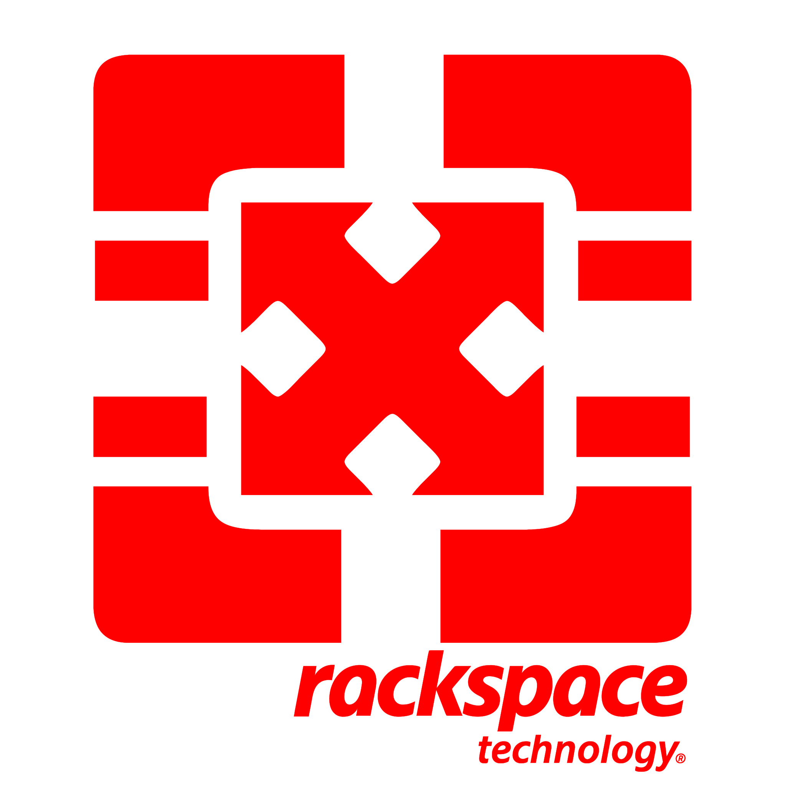

---
hide:
  - navigation
  - toc
---

# Welcome to the Rackspace Cloud Documentation

-   :material-heart:{ .lg } __A Welcoming Community__

    { align=left : style="max-width:125px" }
    Rackspace would like to once again welcome you to the cloud. If you're developing applications,
    wanting to contribute to OpenStack, or just looking for a better platform; you're in the right place.

    [:octicons-comment-24: Join the Discord](https://discord.gg/2mN5yZvV3a)

-   :material-alpha:{ .xl .middle } - __Genestack__  __/dʒen.ə.stæk/__

    1. The Genesis of your Open-Infrastructure
    2. Your new favorite ecosystem
    3. Enterprise ready
    4. The cloud simplified
    5. Hybrid by design

-   :material-abacus:{ .xl .middle } __Rackspace Cloud Solutions__

    Where Kubernetes and OpenStack tango in the cloud. Imagine a waltz between systems that deploy what you need.
    Operators play the score, managing the complexity with a flick of their digital batons. They unify the chaos,
    making scaling and management a piece of cake. Think of it like a conductor effortlessly guiding a cacophony
    into a symphony.

-   :material-cloud:{ .lg } __Simple Solutions__

    Learn about the components.

    [:octicons-diff-renamed-16: A complete list of Project Components](genestack-components.md)

    ---

    Start building now.

    [:octicons-play-24: Deployment Guide](genestack-getting-started.md)

---

## :octicons-quote-24: Rackspace OpenStack is not merely an alternative; it is a strategic enabler

Concerns related to vendor lock-in, limited environmental control, and potential performance issues at scale are essential considerations, especially when building an infrastructure expected to provide continual value for the lifetime of the deployment. Rackspace OpenStack is Open-Cloud powered by open-infrastructure has better efficiency and guaranteed business continuity across the public and private cloud landscape.

[:octicons-reply-24: Learn how we're solving tomorrow's cloud problems today](https://www.rackspace.com/solve/return-openstack)
