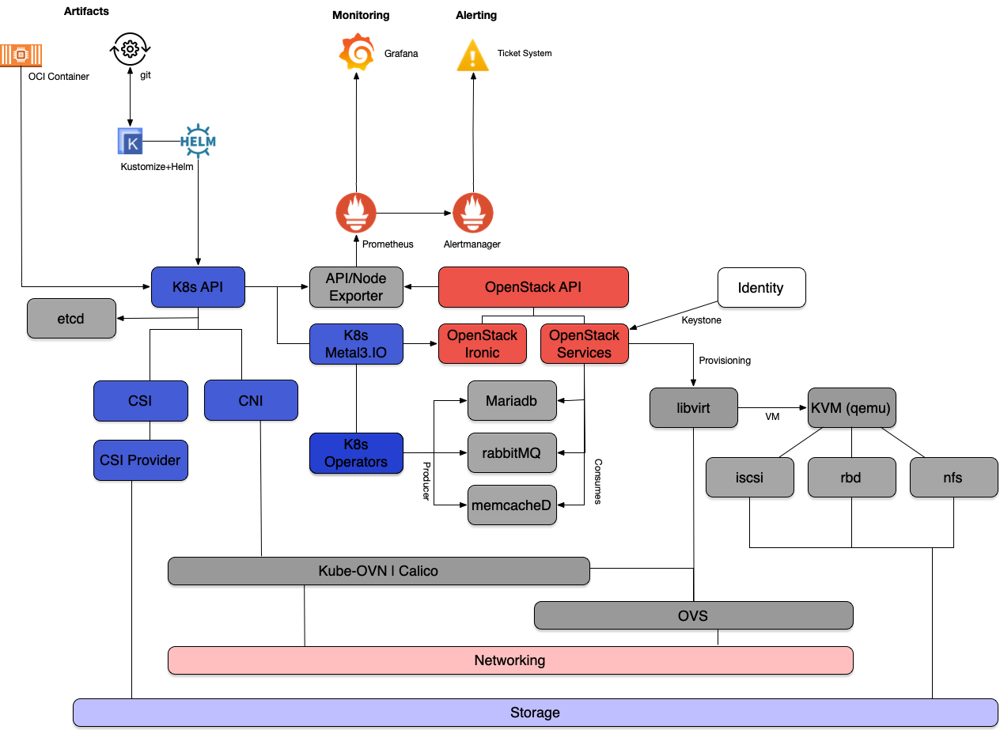

# Welcome to the Genestack Documentation

Genestack — where Kubernetes and OpenStack tango in the cloud. Imagine a waltz between systems that deploy
what you need. Operators play the score, managing the complexity with a flick of their digital batons. They
unify the chaos, making scaling and management a piece of cake. Think of it like a conductor effortlessly
guiding a cacophony into a symphony.

## Environment Architecture

Genestack is making use of some homegrown solutions, community operators, and OpenStack-Helm. Everything
in Genestack comes together to form cloud in a new and exciting way; all built with opensource solutions
to manage cloud infrastructure in the way you need it.

They say a picture is worth 1000 words, so here's a picture.

---

Building our cloud future has never been this simple.

## 0.Getting Started
  * [Getting Started](getting-started.md)
  * [Building Virtual Environments for Testing](build-test-envs.md)

## 1.Kubernetes
  * [Building Your Kubernetes Environment](build-k8s.md)
  * [Retrieve kube config](kube-config.md)

## 2.Storage
  * [Create Persistent Storage](Create-Persistent-Storage.md)

## 3.Infrastructure
  * [Deploy Required Infrastructure](deploy-required-infrastructure.md)
  * [Deploy Prometheus](prometheus.md)
  * [Deploy Vault](vault.md)

## 4.Openstack Infrastructure
  * [Deploy Openstack on k8s](Deploy-Openstack.md)

## Post Deployment
  * [Post Deploy Operations](post-deploy-ops.md)
  * [Building Local Images](build-local-images.md)
  * [OVN Database Backup](ovn-db-backup.md)

## Upgrades
  * [Running Genestack Upgrade](genestack-upgrade.md)
  * [Running Kubernetes Upgrade](k8s-upgrade.md)

## Monitoring
  * [Deploy Prometheus](prometheus.md)
  * [MySQL Exporter](prometheus-mysql-exporter.md)
