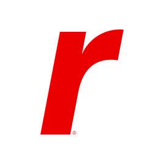

---
hide:
  - navigation
  - toc
---

# Welcome to the Rackspace Cloud Documentation

-   :material-abacus:{ .xl .middle } __Rackspace Cloud Solutions__

    Where Kubernetes and OpenStack tango in the cloud. Imagine a waltz between systems that deploy what you need.
    Operators play the score, managing the complexity with a flick of their digital batons. They unify the chaos,
    making scaling and management a piece of cake. Think of it like a conductor effortlessly guiding a cacophony
    into a symphony.

-   :material-alpha:{ .xl .middle } - __Genestack__  __/dʒen.ə.stæk/__

    1. The Genesis of your Open-Infrastructure
    2. Your new favorite ecosystem
    3. Enterprise ready
    4. The cloud simplified

-   :material-cloud:{ .lg } __Simple Solutions__

    Learn more about running the cloud infrastructure of Tomorrow, [Today](k8s-overview.md).

-   :material-heart:{ .lg } __A Welcoming Community__

    { align=left : style="filter:drop-shadow(#3c3c3c 0.5rem 0.5rem 10px);max-width:125px" }
    Rackspace would like to once again welcome you to the cloud. If you're developing applications,
    wanting to contribute to OpenStack, or just looking for a better platform; you're in the right place.

---

{ align=left : style="filter:drop-shadow(#3c3c3c 0.5rem 0.5rem 10px);" }

## What is Genestack?

Genestack is a complete operations and deployment ecosystem for Kubernetes and OpenStack. The purpose is of
this project is to allow hobbyists, operators, and cloud service providers the ability to build, scale, and
leverage Open-Infrastructure in new and exciting ways.

Genestack’s inner workings are a blend dark magic — crafted with [Kustomize](https://kustomize.io) and
[Helm](https://helm.sh). It’s like cooking with cloud. Want to spice things up? Tweak the
`kustomization.yaml` files or add those extra 'toppings' using Helm's style overrides. However, the
platform is ready to go with batteries included.

Genestack is making use of some homegrown solutions, community operators, and OpenStack-Helm. Everything
in Genestack comes together to form cloud in a new and exciting way; all built with opensource solutions
to manage cloud infrastructure in the way you need it.
