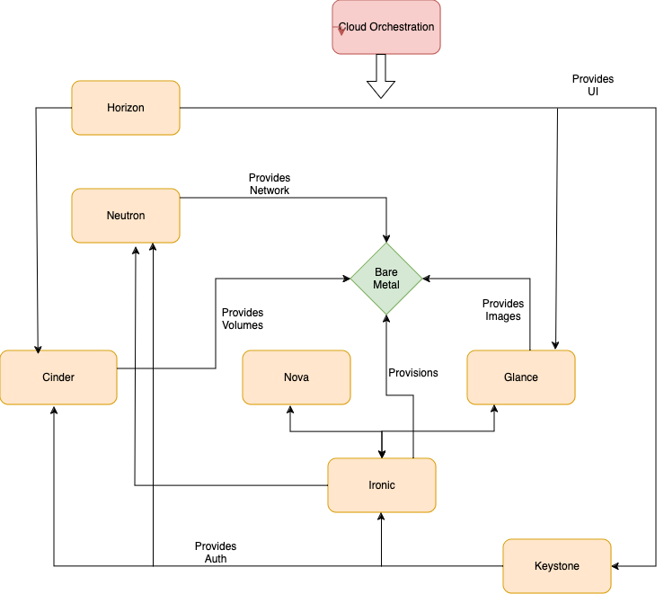
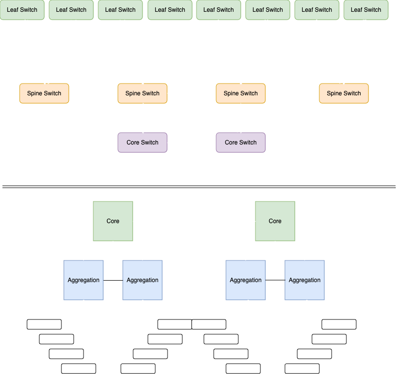

## Genestack Infrastructure Design Notes 

### Ironic for bare-metal provisioning  

Our internal deployment team uses OpenStack bare metal provisioning, a.k.a **Ironic**, which provides bare metal machines instead of virtual machines, forked from the Nova baremetal driver. It is best thought of as a bare metal hypervisor API and a set of plugins which interact with the bare metal hypervisors. By default, it will use PXE and IPMI in order to provision and turn on/off machines, but Ironic also supports vendor-specific plugins which may implement additional functionality. 

After switch and firewall configuration, deployment nodes are created with in the environment which host the required Ironic services:

- PXE
- DHCP
- NBP
- TFTP
- IPMI

### Ironic Diagram

#### Benefits of Ironic

​	With a standard API and lightweight footprint, Ironic can serve as a driver for a variety of bare metal infrastructure. Ironic allows users to manage bare metal infrastructure like they would virtual  machines and provides ideal infrastructure to run container  orchestration frameworks like Kubernetes to optimize performance.  

#### Integration Methods and Use-Case

​	Ironic is being used today to deploy the infrastructure for Rackspace's Openstack public cloud in an internal product known as Undercloud. Undercloud is agnostic to tooling making it flexible to use in local or remote datacenters.

​	For example, a customer in their own datacenter can stand up the reference architecture hardware for Rackspace Clouds and, granting ingress access to DRAC or iLO, allow our engineers to create the Ironic environment and flavors required for the compute hardware.  The servers are identified their first PXE boot and the proper server flavor and image are applied.  When a server goes offline to due hardware or drive failures, it can be re-provisioned after repair back to its original operating system and added back to the Openstack environment through Flex automation.

### Leaf-Spline Network Architecture

#### Overview

​	Spine-leaf, or leaf-spine, is a two-layer network topology composed of spine and leaf switches. A spine-leaf architecture helps data center networks reduce network latency and hop count and improve network efficiency.  This two-layer full-mesh network topology was designed as an alternative to three-tier architectures and is suitable for modern data centers  that experience more east-west network traffic than north-south or switch-to-switch traffic. East-west traffic flows transfer data packets from server to server within a data center.

- **Spine switches.** Leaf switches connect to spine switches and mesh into the spine, forming the access layer that delivers network connection points for servers.
- **Leaf switches.** Servers and storage connect to leaf  switches and consist of access switches that aggregate traffic from  servers. They connect directly to the spine.

#### Advantages of Leaf-Spline Architecture

- **Redundancy.** Each leaf switch connects to every spine  switch, which increases the amount of redundancy while also reducing  potential bottlenecks.
- **Lower latency.** Spine-leaf minimizes latency and bottlenecks because each payload only has to travel to a spine switch and to another leaf switch (two hops) to reach its endpoint.
- **Performance.** Protocols such as Shortest Path Bridging  (SPB) and Transparent Interconnection of Lots of Links (TRILL) aid in  avoiding traffic congestion.
- **Scalability.** Additional spine switches can be added to help avoid oversubscriptionand increase scalability.
- **Reduces spending.** A spine-leaf architecture increases  the number of connections each switch can handle, so data centers  require fewer devices to deploy.

#### Network Design Details 

​	Rackspace utilizes Spline-leaf network architecture where server to server traffic (east-west) has higher importance than external connectivity of the deployed application.  This is ideal for single or multi tenant deployments that process large workloads of internal data kept in **block** or **object** storage.

### Commodity Storage Solutions

​	Commodity storage hardware, sometimes known as off-the-shelf storage, is relatively inexpensive storage systems utilizing standard hard rives that are widely available  and basically interchangeable with other drives of its type.  These drives are housed in simple JBOD (just a bunch of disks) chassis or in smarter storage solutions such as Dell EMC or NetApp enclosures.  

#### Cost effectiveness

​	A major advantage of using commodity storage is for data resilience and reduced storage costs.  Because of their ability to spread data across spans of inexpensive disks, data loss risk is greatly reduced when a drive inevitably fails.  Data is automatically rebalanced to healthy drives before a degraded drive is removed from the cluster to be replaced as time permits by support staff.  

#### Genestack Storage Integrations

​	Genestack easily integrates commodity storage into its cloud solutions by leveraging it for Ceph (block/object storage) and Swift (object storage) storage targets.  

​	**Ceph** is an open source software-defined storage solution designed to address the  block, file and object storage needs of modern enterprises. Its  highly scalable architecture sees it being adopted as the new norm for  high-growth block storage, object stores, and data lakes. 

- **Scalability**: Ceph can scale to support hundreds of petabytes of data and tens of billions of objects.
- **Self-managed**: Ceph is designed to be self-healing and self-managing, so it can handle failures without interruption.
- **Fault-tolerant**: Ceph replicates data to make it fault-tolerant.
- **Uses commodity hardware**:  Ceph runs on commodity hardware, such as servers, switches, hard drives, and device drives.

**Swift,** or Openstack Object Storage, is a software-based, open-source storage system that allows users to store and retrieve large amounts of data:

- **Data storage:** Swift is used to store unstructured data, such as images, text files, photos, documents, email, and video files.
- **Cost-effectiveness:**  Swift can use inexpensive **commodity hard drives** and servers instead of more expensive equipment.
- **Scalability:**  Swift uses a distributed architecture with no central point of control, which allows for greater scalability, redundancy, and permanence.
- **API-accessible:**  Swift provides an API-accessible storage platform that can be integrated directly into applications.

