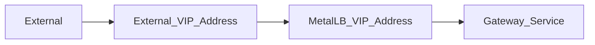

# Gateway API

Gateway API is L4 and L7 layer routing project in Kubernetes. It represents next generation of k8s Ingress, LB and Service Mesh APIs. For more information on the project see: [Gateway API SIG.](https://gateway-api.sigs.k8s.io/)

## Move from Ingress to Gateway APIs

Since Gateway APIs are successor to Ingress Controllers there needs to be a one time migration from Ingress -> GW API resources. To learn more about it refer to: [Ingress Migration](https://gateway-api.sigs.k8s.io/guides/migrating-from-ingress/#migrating-from-ingress)

## Resource Models in Gateway API

There are 3 main resource models in gateway apis:

1. GatewayClass - Mostly managed by a controller.
2. Gateway - An instance of traffic handling infra like a LB.
3. Routes - Defines HTTP-specific rules for mapping traffic from a Gateway listener to a representation of backend network endpoints.

!!! warning "k8s Gateway API is NOT the same as API Gateways"

While both sound the same, API Gateway is a more of a general concept that defines a set of resources that exposes capabilities of a backend service but also provide other functionalities like traffic management, rate limiting, authentication and more. It is geared towards commercial API management and monetisation.

From the gateway api sig:

!!! note

    Most Gateway API implementations are API Gateways to some extent, but not all API Gateways are Gateway API implementations.

## Controller Selection

There are various implementations of the Gateway API. In this document, we will cover two of them:

* [NGINX Gateway Fabric](https://github.com/nginxinc/nginx-gateway-fabric)
* [Envoyproxy](https://gateway.envoyproxy.io/)

=== "NGINX Gateway Fabric _(Recommended)_"

    [NGINX Gateway Fabric](https://github.com/nginxinc/nginx-gateway-fabric)
    is an open-source project that provides an implementation of the Gateway
    API using nginx as the data plane.

    **First, create the Namespace**

    ``` shell
    kubectl create ns nginx-gateway
    ```

    **Then, install the Gateway API Resource from Kubernetes**

    ``` shell
    kubectl kustomize "https://github.com/nginxinc/nginx-gateway-fabric/config/crd/gateway-api/standard?ref=v1.3.0" | kubectl apply -f -
    ```

    **Next, install the NGINX Gateway Fabric controller**

    !!! tip

        If attempting to perform an **upgrade** of an existing Gateway API deployment, note that the Helm install does not automatically upgrade the CRDs for this resource. To upgrade them, refer to the process outlined by the [Nginx upgrade documentation](https://docs.nginx.com/nginx-gateway-fabric/installation/installing-ngf/helm/#upgrade-nginx-gateway-fabric-crds). You can safely ignore this note for new installations.

    ``` shell
    cd /opt/genestack/submodules/nginx-gateway-fabric/charts/nginx-gateway-fabric

    helm upgrade --install nginx-gateway-fabric . \
                 --namespace=nginx-gateway \
                 -f /opt/genestack/base-helm-configs/nginx-gateway-fabric/helm-overrides.yaml

    kubectl rollout restart deployment cert-manager --namespace cert-manager
    ```

    **Finally, create the shared gateway resource**

    ``` shell
    kubectl kustomize /opt/genestack/base-kustomize/gateway/nginx-gateway-fabric | kubectl apply -f -
    ```

=== "Envoyproxy"

    [Envoyproxy](https://gateway.envoyproxy.io/) is an open-source project that provides an implementation of the Gateway API using Envoyproxy as the data plane.

    **Installation**

    - Update the `/opt/genestack/base-kustomize/envoyproxy-gateway/base/values.yaml` file according to your requirements.

    - Apply the configuration using the following command:

    ``` shell
    kubectl kustomize --enable-helm /opt/genestack/base-kustomize/envoyproxy-gateway/base | kubectl apply -f -
    ```

    **After installation, you need to create Gateway and HTTPRoute resources based on your requirements.**

    **Example to expose an application using Gateway API (Envoyproxy)**

    - In this example, we will demonstrate how to expose an application through a gateway.

    - Apply the Kustomize configuration which will create `Gateway` resource:

    ``` shell
    kubectl kustomize /opt/genestack/base-kustomize/gateway/envoyproxy | kubectl apply -f -
    ```

    - Once gateway is created, user can expose an application by creating `HTTPRoute` resource.
      - Sample `HTTPRoute` resource:

    ``` shell
    apiVersion: gateway.networking.k8s.io/v1
    kind: HTTPRoute
    metadata:
    name: test_application
    namespace: test_app
    spec:
    parentRefs:
    - name: flex-gateway
      sectionName: http
      namespace: envoy-gateway-system
    hostnames:
    - "test_application.sjc.ohthree.com"
    rules:
      - backendRefs:
        - name: test_application
          port: 8774
    ```

## Deploy with Let's Encrypt Certificates

By default, certificates are issued by an instance of the
selfsigned-cluster-issuer. This section focuses on replacing that with a
Let's Encrypt issuer to ensure valid certificates are deployed in our cluster.

[](https://asciinema.org/a/h7npXnDjkSpn3uQtuQwWG9zju)

### Apply the Let's Encrypt Cluster Issuer

Before we can have Cert Manager start coordinating Let's Encrypt certificate
requests for us, we need to add an ACME issuer with a valid, monitored
email (for expiration reminders and other important ACME related information).

``` yaml
read -p "Enter a valid email address for use with ACME: " ACME_EMAIL; \
cat <<EOF | kubectl apply -f -
apiVersion: cert-manager.io/v1
kind: ClusterIssuer
metadata:
  name: letsencrypt-prod
spec:
  acme:
    server: https://acme-v02.api.letsencrypt.org/directory
    email: ${ACME_EMAIL}
    privateKeySecretRef:
      name: letsencrypt-prod
    solvers:
      - http01:
          gatewayHTTPRoute:
            parentRefs:
            - group: gateway.networking.k8s.io
              kind: Gateway
              name: flex-gateway
              namespace: nginx-gateway
EOF
```

### Patch Gateway with valid listeners

By default, a generic Gateway is created using a hostname of `*.cluster.local`. To add specific hostnames/listeners to the gateway, you can either
create a patch or update the gateway YAML to include your specific hostnames and then apply the patch/update.  Each listener must have a
unique name.  An example patch file you can modify to include your own domain name can be found at `/etc/genestack/gateway-api/gateway-patches.json`.

!!! example "Modify and apply the patch"

    ``` shell
    mkdir -p /etc/genestack/gateway-api
    sed 's/your.domain.tld/<YOUR_DOMAIN>/g' /opt/genestack/etc/gateway-api/gateway-patches.json > /etc/genestack/gateway-api/gateway-patches.json
    kubectl patch -n nginx-gateway gateway flex-gateway \
                  --type='json' \
                  --patch-file /etc/genestack/gateway-api/gateway-patches.json
    ```

### Apply Related Gateway routes

Another example with most of the OpenStack services is located at
`/etc/genestack/gateway-api/gateway-routes.yaml`. Similarly, you must modify
and apply them as shown below, or apply your own.

!!! example "Modify and apply the routes"

    ``` shell
    mkdir -p /etc/genestack/gateway-api
    sed 's/your.domain.tld/<YOUR_DOMAIN>/g' /opt/genestack/etc/gateway-api/gateway-routes.yaml > /etc/genestack/gateway-api/gateway-routes.yaml
    kubectl apply -f /etc/genestack/gateway-api/gateway-routes.yaml
    ```

### Patch Gateway with Let's Encrypt Cluster Issuer

``` shell
kubectl patch -n nginx-gateway --type merge gateway flex-gateway -p "$(cat <<EOF
apiVersion: gateway.networking.k8s.io/v1
kind: Gateway
metadata:
  name: flex-gateway
  namespace: nginx-gateway
  annotations:
    acme.cert-manager.io/http01-edit-in-place: "true"
    cert-manager.io/cluster-issuer: letsencrypt-prod
EOF
)"
```

## Example Implementation with Prometheus UI (NGINX Gateway Fabric)

In this example we will look at how Prometheus UI is exposed through the gateway. For other services the gateway kustomization file for the service.

First, create the shared gateway and then the httproute resource for prometheus.

``` yaml
apiVersion: gateway.networking.k8s.io/v1
kind: Gateway
metadata:
  name: flex-gateway
spec:
  gatewayClassName: nginx
  listeners:
  - name: http
    port: 80
    protocol: HTTP
    hostname: "*.sjc.ohthree.com"
```

then

``` yaml
apiVersion: gateway.networking.k8s.io/v1
kind: HTTPRoute
metadata:
  name: prometheus-gateway-route
spec:
  parentRefs:
  - name: flex-gateway
    sectionName: http
  hostnames:
  - "prometheus.sjc.ohthree.com"
  rules:
    - backendRefs:
      - name: kube-prometheus-stack-prometheus
        port: 9090
```

Rackspace specific gateway kustomization files can be applied like so

``` shell
kubectl kustomize /opt/genestack/base-kustomize/gateway/nginx-gateway-fabric | kubectl apply -f -
```

At this point, flex-gateway has a listener pointed to the port 80 matching *.sjc.ohthree.com hostname. The HTTPRoute resource configures routes
for this gateway. Here, we match all path and simply pass any request from the matching hostname to kube-prometheus-stack-prometheus backend service.

### Exposing Flex Services

We have a requirement to expose a service

 1. Internally for private consumption (Management and Administrative Services)
 2. Externally to customers (mostly Openstack services)


For each externally exposed service, example: keystone endpoint, we have a GatewayAPI resource setup to use listeners on services with matching rules based on hostname, for example keystone.sjc.api.rackspacecloud.com. When a request comes in to the f5 vip for this the vip is setup to pass the traffic to the Metallb external vip address. Metallb then forwards the traffic to the appropriate service endpoint for the gateway controller which matches the hostname and passes the traffic onto the right service. The same applies to internal services. Anything that matches ohthree.com hostname can be considered internal and handled accordingly.



This setup can be expended to have multiple MetalLB VIPs with multiple Gateway Services listening on different IP addresses as required by your setup.

!!! tip

    The metalLB speaker wont advertise the service if :
    1. There is no active endpoint backing the service
    2. There are no matching L2 or BGP speaker nodes
    3. If the service has external Traffic Policy set to local you need to have the running endpoint on the speaker node.

### Cross Namespace Routing

Gateway API has support for multi-ns and cross namespace routing. Routes can be deployed into different Namespaces and Routes can attach to Gateways across Namespace boundaries. This allows user access control to be applied differently across Namespaces for Routes and Gateways, effectively segmenting access and control to different parts of the cluster-wide routing configuration.

See: https://gateway-api.sigs.k8s.io/guides/multiple-ns/ for more information on cross namespace routing.
