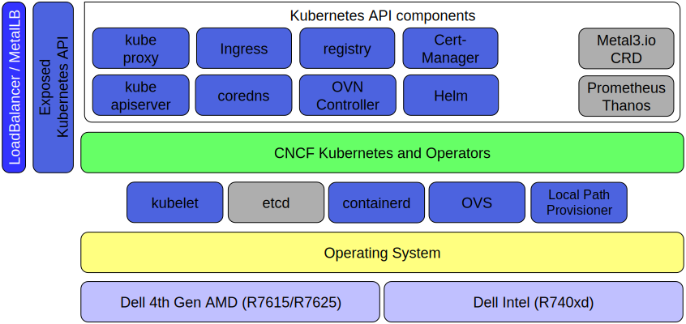

# Infrastructure Deployment Demo

## Infrastructure Overview

The full scale Genestack infrastructure is bound to change over time, however, the idea is to keep things simple and transparent. The above graphic highlights how we deploy our environments and what the overall makeup of our platforms are expected to look like.

!!! tip

    The infrastructure deployment can almost all be run in parallel. The above demo does everything serially to keep things consistent and easy to understand but if you just need to get things done, feel free to do it all at once.
