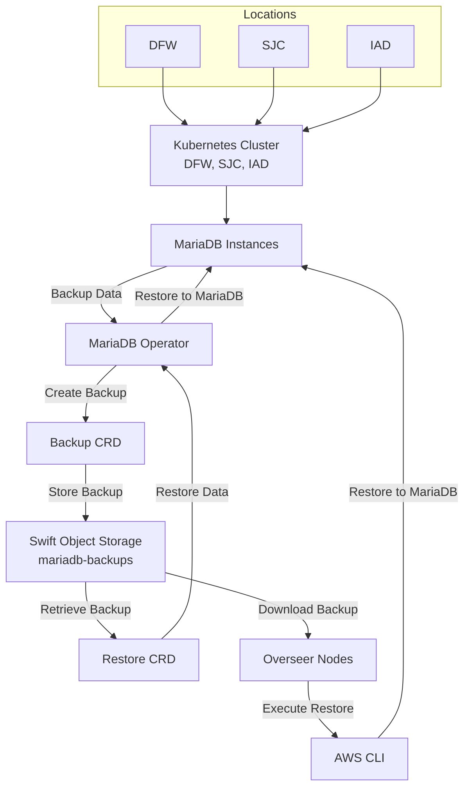

# MariaDB Restore Procedures with Swift Tempauth

This document provides procedures to restore MariaDB backups stored in Rackspace's Swift object storage with tempauth for the production environments: DFW, SJC, and IAD as part of Jira:OSPC-1141. It details two methods: using theKubernetes Restore CRD with the MariaDB Operator and a manual restore using AWS S3 commands. These procedures ensure recovery from backups in the mariadb-backups container, based on the reference document present.

## 1. Prerequisites 
  ### Software:
  - Kubernetes CLI (`kubectl`) installed and configured with access to the respective production   cluster (DFW, SJC, IAD).
  - AWS CLI installed on the overseer node for each production environment (`pip install awscli awscli-plugin-endpoint`).
  ### Credentials:
  - Kubernetes secret (e.g., `dfw-credentials`, `sjc-credentials`, `iad-credentials`) with `access-key-id` and `secret-access-key` keys, generated via `openstack ec2 credentials create`.
  - AWS CLI profiles (e.g., `dfw_admin`, `sjc_admin`, `iad_admin`) configured on the respective overseers.
  ### Environment:
  - Access to the Kubernetes cluster and overseer node for each production region.
  - Network access to the region-specific Swift endpoint.
  - MariaDB Operator deployed in each cluster with a `mariadb` resource.

## 2. Backup/Restore Flow


## 3. Restore Using Kubernetes `Restore` CRD
### CRD(Custom Resource Definition)
- The Restore CRD is a Custom Resource Definintion, a kubernetes feature that extend the API to define custom resources for managing restore operations. For detailed information on CRD, refers to the [Kubernetes Documentation on Custom Resources.](https://kubernetes.io/docs/concepts/extend-kubernetes/api-extension/custom-resources/).

This method automates the restore process using the MariaDB Operator, applicable to all production regions.

 ### 3.1 Backup and Restore of Specific Databases
    Backup Context: Backups are created with the Backup resource, which by default includes all logical databases. To back up specific databases, the databases field can be used (e.g., db1, db2, db3), influencing the content available for restoration. For detailed backup creation, refer to the backup documentation or administrator.

    Restore Configuration: By default, all databases in the backup are restored. To restore a single database, specify the database field in the Restore resource:
 
   ``` yaml
   apiVersion: k8s.mariadb.com/v1alpha1
   kind: Restore
   metadata:
     name: restore
   spec:
     mariaDbRef:
       name: mariadb
     backupRef:
       name: backup
     database: db1
   ```
 ### 3.2 Procedure
 #### 1. Configure the Restore CRD:
      Create a file named `restore.yaml` with the following content, adjusting the region-specific details:

      ``` yaml
      apiVersion: k8s.mariadb.com/v1alpha1
      kind: Restore
      metadata:
        name: maria-restore
        namespace: <namespace>  # Replace with the actual namespace (e.g., default or mariadb)
      spec:
        mariaDbRef:
          name: mariadb  # Must match the existing MariaDB resource name
        s3:
          bucket: mariadb-backups
          prefix: cron
          endpoint: <region-endpoint>  # See table below
          accessKeyIdSecretKeyRef:
            name: <region-credentials>  # e.g., dfw-credentials
            key: access-key-id
          secretAccessKeySecretKeyRef:
            name: <region-credentials>  # e.g., dfw-credentials
            key: secret-access-key
        database: <database_name>  # e.g., nova
      ```

      Replace <namespace> and <region-credentials> with the appropriate values for each environment.
      Use the following region-specific endpoints:

      | Region | Environment | Endpoint                                      | Profile   | Credential Secret |
      |--------|-------------|-----------------------------------------------|-----------|-------------------|
      | DFW    | DFW         | https://swift.api.dfw3.rackspacecloud.com     | dfw_admin | dfw-credentials   |
      | SJC    | SJC         | https://swift.api.sjc3.rackspacecloud.com     | sjc_admin | sjc-credentials   |
      | IAD    | IAD         | https://swift.api.iad3.rackspacecloud.com     | iad_admin | iad-credentials   |

  #### 2. Apply the CRD:
     Execute the deployement:
     ```shell
     kubectl apply -f restore.yaml
     ```
  #### 3. Monitor the Restore:
    Check the status:
    ```shell
    kubectl describe restore maria-restore -n <namespace>.
    ```
    Here the resource type : restore
    resource name : maria-restore
    
    Monitor logs:
    ```shell
    kubectl logs -f <operator-pod-name> -n <namespace> .
    ```
    Identify the pod with kubectl get pods
    Wait for the status to change to Succeeded.
  #### 4. Verify Restore:
    Access the mariadb Pod:
    ```shell
    kubectl exec -it <mariadb-pod-name> -n <namespace> -- mysql -u root -p.
    ```
    Run a query: SELECT COUNT(*) FROM <table_name>; (e.g., nova.instances) to confirm data.
  
  **Notes:**
    Ensure the region-specific credentials secret exists: kubectl get secret <region-credentials> -n <namespace> -o yaml.
  
  **Note:** This procedure some reference present in <https://github.com/rackerlabs/genestack/blob/55dedc9b4217967e1efc2ec3182e67758cc056d4/docs/infrastructure-mariadb-ops.md?plain=1>

## 4. Manual Restore Using AWS S3 Commands
  This method retrieves the backup from the overseer and restores it manually, applicable to all production regions as a fallback.
  
  ### Steps:
  #### 1. Access the Region-Specific Overseer:
          Log in to the overseer node (e.g., ssh user@dfw-prod-overseer-ip or any available method which is allowed to login into DFW Prod in a secured manner).
  #### 2.Verify AWS CLI Configuration:
          Ensure the region-specific profile is set up (e.g., dfw_admin for DFW):
          ```yaml
          [profile dfw_admin]
          region = dfw
          s3 =
          endpoint_url = https://swift.api.dfw.rackspacecloud.com
          signature_version = s3v4
         ```
         ```yaml
         [dfw_admin]
         aws_access_key_id = YOUR_ACCESS_KEY
         aws_secret_access_key = YOUR_SECRET_KEY
        ```
        Adjust for SJC (sjc_admin), IAD (iad_admin) with their endpoints (see table above).
        Test with below command to list backups:
        ```shell
        aws --profile <region>_admin s3 ls s3://mariadb-backups/ .
        ```
   #### 3. Retrieve the Backup:
        List available backups: aws --profile <region>_admin s3 ls s3://mariadb-backups/cron/.
        Download a specific backup:
        As a example given here:
        ```shell
         aws --profile dfw_admin s3 cp s3://mariadb-backups/cron/backup.2025-02-04T19:05:57Z.gzip.sql /tmp/backup.2025-02-04T19:05:57Z.gzip.sql
        ```
        Note: Need to replace the particular file to download as per the requirement. 
   #### 4. Restore the Backup:
        Access a test MariaDB instance (e.g., via kubectl exec or a local DB): mysql -u user -p < backup.2025-02-04T19:05:57Z.gzip.sql.
  #### 5. Single Database Restore:
        If the backup contains multiple databases, extract the desired database (e.g., nova) using a tool like sed or mysql filters, then restore: mysql -u user -p nova < nova_backup.sql.
  #### 6. Verify:
        Check the return code: echo $? (0 indicates success).
        Query the database: mysql -u user -p -e "SELECT COUNT(*) FROM <table_name>;".
    
  **Notes:**
     Ensure the overseer has network access to the region-specific Swift endpoint.

 **Before applying/executing into Production, First need to apply these commands on DEV or staging environment.**

## 5. References
  ### https://github.com/mariadb-operator/mariadb-operator/blob/main/docs/BACKUP.md
  ### https://docs.rackspacecloud.com/storage-object-store-s3-cli/
  ### https://mariadb.com/docs/server/server-usage/backup-and-restore/backup-and-restore-overview
 
## 6. Escalation:
  If validation fails, coordinate with Admin Team or Data Base team to resolve network or any related configuration  issues.\
  **Note: This step might be extended further**
