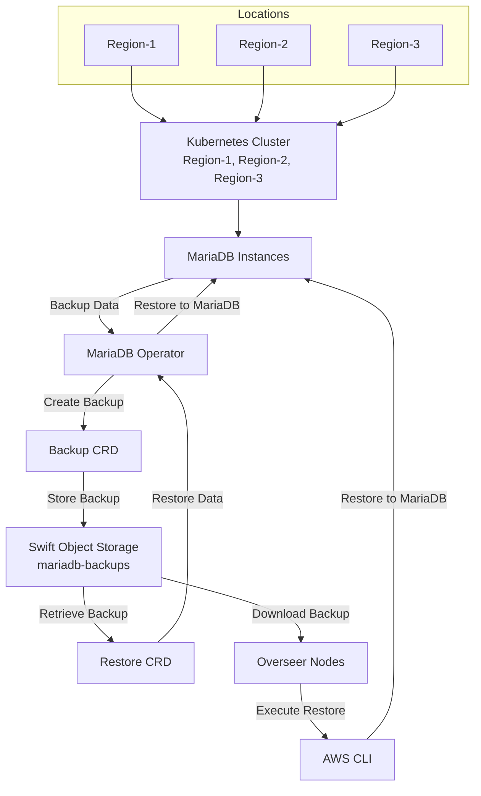

# MariaDB Restore Procedures with Swift Tempauth

This document provides procedures to restore MariaDB backups stored in Swift object storage with tempauth. It details two methods: using the Kubernetes Restore CRD with the MariaDB Operator and a manual restore using AWS S3 commands.

!!! abstract "Overview"
    These procedures ensure recovery from backups in the `mariadb-backups` container for production environments (`Region-1`, `Region-2`, `Region-3`).

---

## :material-check-decagram: Prerequisites

### :material-application: Software

- Kubernetes CLI (`kubectl`) installed and configured with access to the respective production cluster
- AWS CLI installed on the overseer node:

    ```bash
    pip install awscli awscli-plugin-endpoint
    ```

### :material-key: Credentials

!!! note "Information about the secrets used"

    The `mariadb-backup-secrets` secret is automatically created with placeholder values when you run the `create-secrets.sh` script located in `/opt/genestack/bin`. However, you still need to populate the empty keys (`access-key-id`, `secret-access-key`, `S3_ENDPOINT`) with your region-specific values. You can use `/etc/genestack/secrets.yaml` to store these per-region values.

    ??? example "Example secret generation"

        If you haven't run `create-secrets.sh`, you can create the secret manually:

        ``` shell
        kubectl --namespace openstack \
            create secret generic mariadb-backup-secrets \
            --type Opaque \
            --from-literal=access-key-id="<YOUR_ACCESS_KEY>" \
            --from-literal=secret-access-key="<YOUR_SECRET_KEY>" \
            --from-literal=S3_ENDPOINT="<SWIFT_S3_ENDPOINT_URL>" \
            --from-literal=S3_REGION="<S3_REGION>" \
            --from-literal=S3_BUCKET="mariadb-backups"
        ```

- Kubernetes secret (e.g., `region-1-credentials`, `region-2-credentials`, `region-3-credentials`) from cluster with `access-key-id` and `secret-access-key` keys, generated via:

    ```bash
    openstack ec2 credentials create
    ```

- AWS CLI profiles (e.g., `region-1_admin`, `region-2_admin`, `region-3_admin`) configured on the respective overseers

    !!! info "Why AWS CLI for Swift?"
        OpenStack Swift exposes an S3-compatible API (via `s3api` middleware), allowing the standard
        AWS CLI to interact with Swift object storage. Each profile in `~/.aws/credentials` and
        `~/.aws/config` stores the EC2-style access key, secret key, and the region-specific Swift
        endpoint URL. The profile name encodes the site and role. From each overseer, use the
        matching profile (`--profile <aws_cli_profile_name>`) to reach the local Swift endpoint.

### :material-server-network: Environment

- Access to the Kubernetes cluster and overseer node for each production region
- Network access to the region-specific Swift endpoint
- MariaDB Operator deployed in each cluster with a `mariadb` resource

---

## :material-swap-horizontal: Backup and Restore Flow


```mermaid
graph TD

    subgraph Locations
        I[Region-1]
        J[Region-2]
        K[Region-3]
    end

    A["Kubernetes Cluster<br>Region-1, Region-2, Region-3"] --> B[MariaDB Instances]
    B -->|Backup Data| C[MariaDB Operator]
    C -->|Create Backup| D[Backup CRD]
    D -->|Store Backup| E["Swift Object Storage<br>mariadb-backups"]
    E -->|Retrieve Backup| F[Restore CRD]
    F -->|Restore Data| C
    C -->|Restore to MariaDB| B
    E -->|Download Backup| G[Overseer Nodes]
    G -->|Execute Restore| H[AWS CLI]
    H -->|Restore to MariaDB| B

    I --> A
    J --> A
    K --> A
```

---

## :material-database-import: Restore Using Kubernetes Restore CRD

This method automates the restore process using the MariaDB Operator, applicable to all production regions.

!!! info "What is a Restore CRD?"
    The Restore CRD is a Custom Resource Definition — a Kubernetes feature that extends the API to define custom resources for managing restore operations. For detailed information, refer to the [Kubernetes Documentation on Custom Resources](https://kubernetes.io/docs/concepts/extend-kubernetes/api-extension/custom-resources/).

### :material-database-search: Backup and Restore of Specific Databases

Backups are created with the Backup resource, which by default includes all logical databases. To back up specific databases, the `databases` field can be used (e.g., `db1`, `db2`, `db3`), influencing the content available for restoration.

By default, all databases in the backup are restored. To restore a single database, specify the `database` field in the Restore resource:

```yaml
apiVersion: k8s.mariadb.com/v1alpha1
kind: Restore
metadata:
  name: restore
spec:
  mariaDbRef:
    name: mariadb
  backupRef:
    name: backup
  database: db1
```

### :material-cog: Procedure

#### Step 1: Configure the Restore CRD

Create a file named `restore.yaml` with the following content, adjusting the region-specific details:

```yaml
apiVersion: k8s.mariadb.com/v1alpha1
kind: Restore
metadata:
  name: maria-restore
  namespace: <namespace>  # Replace with the actual namespace (e.g., default or mariadb)
spec:
  mariaDbRef:
    name: mariadb  # Must match the existing MariaDB resource name
  s3:
    bucket: mariadb-backups
    prefix: cron
    endpoint: <region-endpoint>  # See table below
    accessKeyIdSecretKeyRef:
      name: <region-credentials>  # e.g., Region-1 credentials
      key: access-key-id
    secretAccessKeySecretKeyRef:
      name: <region-credentials>  # e.g., Region-1 credentials
      key: secret-access-key
  database: <database_name>  # e.g., nova
```

Replace `<namespace>` and `<region-credentials>` with the appropriate values for each environment.

#### Step 2: Apply the CRD

```bash
kubectl apply -f restore.yaml
```

#### Step 3: Monitor the Restore

=== "Check Status"

    ```bash
    kubectl describe restore maria-restore -n <namespace>
    ```

=== "Monitor Logs"

    ```bash
    kubectl logs -f <operator-pod-name> -n <namespace>
    ```

    Identify the pod with `kubectl get pods`. Wait for the status to change to `Succeeded`.

#### Step 4: Verify Restore

```bash
kubectl exec -it <mariadb-pod-name> -n <namespace> -- mysql -u root -p
```

Run a query to confirm data:

```sql
SELECT COUNT(*) FROM <table_name>;
```

!!! note
    Ensure the region-specific credentials secret exists:

    ```bash
    kubectl get secret <region-credentials> -n <namespace> -o yaml
    ```

!!! tip "Reference"
    This procedure references the [MariaDB operations guide](https://github.com/rackerlabs/genestack/blob/main/docs/infrastructure-mariadb-ops.md).

---

## :material-console: Manual Restore Using AWS S3 Commands

This method retrieves the backup from the overseer and restores it manually, applicable to all production regions as a fallback.

!!! warning
    Before applying or executing in production, first test these commands in a DEV or staging environment.

### Step 1: Access the Region-Specific Overseer

Log in to the overseer node for your region:

```bash
ssh user@<region>-overseer-ip
```

### Step 2: Verify AWS CLI Configuration

Ensure the region-specific profile is set up:

=== "Config (~/.aws/config)"

    ```ini
    [profile region-1_admin]
    region = region-1
    s3 =
      endpoint_url = https://swift.api.region-1.rackspacecloud.com
      signature_version = s3v4
    ```

=== "Credentials (~/.aws/credentials)"

    ```ini
    [region-1_admin]
    aws_access_key_id = YOUR_ACCESS_KEY
    aws_secret_access_key = YOUR_SECRET_KEY
    ```

Adjust for Region-2 (`region-2_admin`) and Region-3 (`region-3_admin`) with their respective endpoints from the table above.

Test by listing backups:

```bash
aws --profile <region>_admin s3 ls s3://mariadb-backups/
```

### Step 3: Retrieve the Backup

List available backups:

```bash
aws --profile <region>_admin s3 ls s3://mariadb-backups/cron/
```

Download a specific backup:

```bash
aws --profile region-1_admin s3 cp \
  s3://mariadb-backups/cron/backup.2025-02-04T19:05:57Z.gzip.sql \
  /tmp/backup.2025-02-04T19:05:57Z.gzip.sql
```

!!! note
    Replace the filename with the specific backup you need to restore.

### Step 4: Restore the Backup

```bash
mysql -u user -p < /tmp/backup.2025-02-04T19:05:57Z.gzip.sql
```

### Step 5: Single Database Restore (Optional)

If the backup contains multiple databases, extract the desired database (e.g., `nova`) using `sed` or mysql filters, then restore:

```bash
mysql -u user -p nova < nova_backup.sql
```

### Step 6: Verify

```bash
# Check return code (0 indicates success)
echo $?

# Query the database
mysql -u user -p -e "SELECT COUNT(*) FROM <table_name>;"
```

!!! note
    Ensure the overseer has network access to the region-specific Swift endpoint.

---

## :material-book-open-variant: References

- [MariaDB Operator Backup Documentation](https://github.com/mariadb-operator/mariadb-operator/blob/main/docs/BACKUP.md)
- [Rackspace Object Storage S3 CLI](https://docs.rackspacecloud.com/storage-object-store-s3-cli/)
- [MariaDB Backup and Restore Overview](https://mariadb.com/docs/server/server-usage/backup-and-restore/backup-and-restore-overview)

---

## :material-phone: Escalation

!!! danger "Validation Failure"
    If validation fails, coordinate with the Admin Team or Database Team to resolve network or configuration issues.

    This escalation step may be extended further as procedures evolve.
