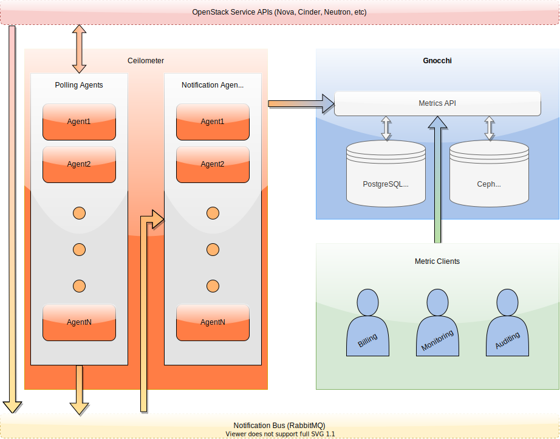

# Metering Overview

Metering in OpenStack involves collecting, tracking, and analyzing the
usage data of various resource types within your cloud environment (_crucial
for billing, monitoring, and performance optimization_). This functionality
is achieved by leveraging the [Ceilometer](metering-ceilometer.md) and
[Gnocchi](metering-gnocchi.md) projects.

Ceilometer and Gnocchi work together to provide a powerful solution for
resource tracking in environments of all sizes. Their combined importance
lies in their complementary roles such as collecting, storing, and
processing of telemetry data at scale.

Once processed and stored, these resource data can be queried through Gnocchi,
also known as the Metrics API. This data serves a wide range of use cases,
including auditing, billing, monitoring, and more.

<figure>
  <figcaption>Metering Architecture - © Luke Repko, Rackspace Technology</figcaption>
</figure>
