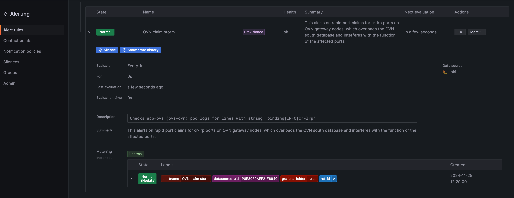
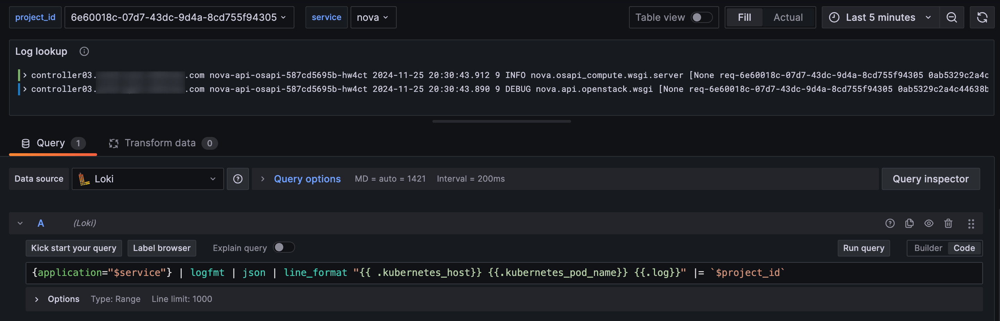

# Genestack Observability

Genestack is made up of a vast array of components working away to provide a Kubernetes and OpenStack cloud infrastructure
to serve our needs. Here we'll discuss in a bit more detail about how we observe and visualize our Genestack operations.

## Overview

In this document we'll dive a bit deeper into Genestack observability by exploring the tooling deployed as part of the Genestack workflow that helps us monitor, alert, log and visualize metrics of our Genestack environment.

Observability is often described as the ability to gather data about complex systems via monitoring, logging and performance metrics to better understand the state of the system as a whole.
In modern systems, especially cloud computing, where there are many components and various services distributed across clusters and even regions observability plays a crucial role toward maintaining performance reliability and even security of your systems.
With a robust observability platform complex systems become manageable and provides various stakeholders the tools needed to forecast and predict potential issues before they arise, resolve and discover root cause of problems that do arise and provide better means of analyzing the health and growth of their environments.

Observability components used in Genestack that we'll discuss a bit further are as follows:

  * Fluentbit and Loki
    * Log collection and aggregation
  * Prometheus
    * Systems monitoring
  * Alert Manager
    * Alert aggregator and notification router
  * Grafana
    * Visualization platform

## Logging

Logging is key to better understanding the health and performance of your systems. Logging gives insights into system events, errors and even security concerns.
Logging in Genestack as part of its default workflow is handled by [Fluentbit](https://fluentbit.io/) and [Loki](https://grafana.com/oss/loki/) which takes care of collection, processing and aggregation of Genestack's system and service logs.
You can view the [Fluentbit](https://github.com/rackerlabs/genestack/tree/main/base-helm-configs/fluentbit) and [Loki](infrastructure-loki.md) installation docs to get an idea of how we're deploying it in the Genestack infrastructure.
You can view their source code at [Fluentbit Github](https://github.com/fluent/fluent-bit) and [Loki Github](https://github.com/grafana/loki/tree/main).

Fluentbit is deployed as the log collector, processor and forwarder. It is configured and deployed across the system to gather logs from Kubernetes pods and the various OpenStack services.
Once collected and processed it then forwards, or ships the logs off for consumption to Loki. Loki can then take care of long term storage as well as handling log accessability.
Loki can tag and label the logs for easy lookup using Loki [LogQL](https://grafana.com/docs/loki/latest/query/).

The logs can be queried via a [logcli](https://grafana.com/docs/loki/latest/query/logcli/) command line tool for lookups or as a [Loki Datasource](https://grafana.com/docs/grafana/latest/datasources/loki/) in Grafana.

An example that we use in our [project lookup](https://github.com/rackerlabs/genestack/blob/main/etc/grafana-dashboards/project_lookup.json) dashboard that allows us to query the logs for a specific service and project_id would look something like below.
!!! example "Example LokiQL lookup query"

    ```shell
    {application="$service"} | logfmt | json | line_format "{{ .kubernetes_host}} {{.kubernetes_pod_name}} {{.log}}" |= `$project_id`
    ```
We can do something similar using the [logcli](https://grafana.com/docs/loki/latest/query/logcli/).

!!! example "Example logcli lookup query"

    ```shell
    logcli-parallel --since=15m '{application=~"nova|placement"} |~ `<my-project-id-here>`' | jq -r '.log'
    ```
You can view more information about logging in Genestack at the [Logging Overview](genestack-logging.md) documentation page.

## Monitoring and Alerting with Prometheus

Monitoring and alerting are two crucial components for observability within the Genestack infrastructure.
By default, in Genestack we make use of Prometheus, an open-source monitoring system with a dimensional data model, flexible query language, efficient time series database and modern alerting approach.
As well as the AlertManager, a tooling that provides alert aggregation, grouping, deduplication and notification routing, which is conveniently packaged together with Prometheus in the [kube-prometheus-stack](https://github.com/prometheus-community/helm-charts/tree/main/charts/kube-prometheus-stack) for easy installation and configuration.
Prometheus and the related components fits Genestack open-source ethos and is easily integrated into Kubernetes and OpenStack systems and services. With easy means of installation, service discovery and configuration Prometheus is a top tier choice for the Genestack platform.

The below diagram shows how all these monitoring and alerting components tie together:


We have covered Prometheus, Prometheus alerting and the AlertManager in greater detail in the [Monitoring](monitoring-info.md) and [Alerting](alerting-info.md) documentation.

## Visualization

Now that we have the logging, monitoring, metrics and alerting portions of our observability platform mapped out we need a way to visualize all this data being provided.
For that we use [Grafana](https://grafana.com/) as our default visualization platform in Genestack. Grafana is an open-sourced, feature rich and highly pluggable visualization system that aligns well with Genestack.
Prometheus, Alertmanager and even Loki can easily plug right in and integrate with Grafana so that we can build out the visualization layer of our observability platform.

As noted in the [Prometheus Alerting](alerting-info.md) documentation we can configure alerts via Prometheus configurations and alert on any metric collected.
It's also possible to set up alerting through Grafana, see Grafana's [alerting docs](https://grafana.com/docs/grafana/latest/alerting/) for more details.

This comes in handy in the context of Loki and logs. Grafana with the  [Loki datasource](https://grafana.com/docs/grafana/latest/datasources/loki/) allows us to configure alerts based on logging queries and the information returned.
One example in Genestack would be the [OVN Claimstorm alerts](ovn-alert-claim-storm.md). Below we can see an example of how this is configured.


As noted above we can also use Loki and Grafana to display logs for our services. The following example and image shows what that would look like.
An example that we use in our [project lookup](https://github.com/rackerlabs/genestack/blob/main/etc/grafana-dashboards/project_lookup.json) dashboard that allows us to query the logs for a specific service and project_id would look something like below.
!!! example "Example LokiQL lookup query"

    ```shell
    {application="$service"} | logfmt | json | line_format "{{ .kubernetes_host}} {{.kubernetes_pod_name}} {{.log}}" |= `$project_id`
    ```


For additional information view the [Grafana](monitoring-info.md#visualization) portion of the [Monitoring Info](monitoring-info.md) documentation.

## Datadog

Fluentbit, Loki and Grafana makes for a powerful combination of log collection, aggregation and visualization and while these tools and the related components are the default choice in a Genestack deployment there are other solutions that may better suit your needs.
Genestack offers examples and basic configurations to deploy Grafana, Loki, Prometheus, etc... in a self-hosted and self-maintained manner which requires effort and costs to host and maintain the observability platfom and to store the logs.
This may not always be desirable and in such case something like [Datadog](https://www.datadoghq.com/) may be preferred to allieviate some of the burdens of hosting these solutions yourself.

[Datadog](https://www.datadoghq.com/) offers many of the features we've discussed in this documentation and much more via agents that you install and configure within your systems.

Datadog can work as a replacement or with our existing tools to form a hybrid approach for our observability platform.
There are plugins and agents that give you the flexibility you may desire. For example, [Fluentbit plugin](https://docs.datadoghq.com/integrations/fluentbit/) can act as the log collection service while instead of using the [Datadog logging agents](https://docs.datadoghq.com/containers/kubernetes/log/?tab=datadogoperator).
You can also use the [Prometheus Datadog plugins](https://docs.datadoghq.com/integrations/guide/prometheus-host-collection/) to provide additional metrics as you see fit.

An example of installing Datadog in [Rackspace Flex](https://www.rackspace.com/resources/rackspace-openstack-flex) can be found in the [Running Datadog on OpenStack Flex](https://blog.rackspacecloud.com/blog/2024/11/12/running_datadog_on_openstack-flex/#deploying-datadog-on-our-openstack-flex-server) blog post.
Integrating Datadog in your Genestack installation is just as simple and can be accommplished by installing various agents to fit your goals.
View the [Datadog Kubernetes](https://docs.datadoghq.com/containers/kubernetes/installation/?tab=datadogoperator) installation instructions for more information.

While Genestack provides a relatively comprehensive set of tooling and instructions for a production grade Kubernetes and OpenStack deployment, Datadog may be the right solution for your needs if you desire a little less hands on solution to your observability platform.
