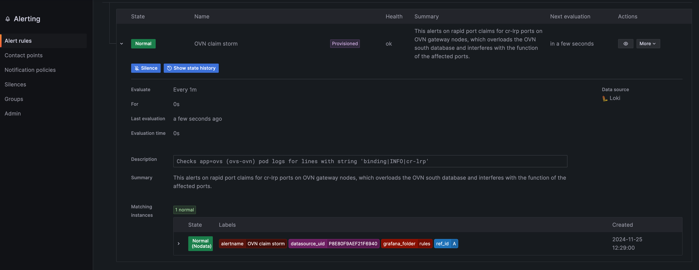
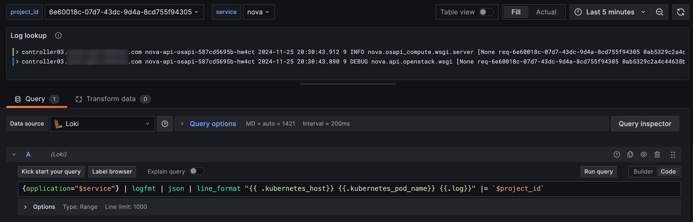

# Genestack Observability

Genestack is made up of a vast array of components working away to provide a Kubernetes and OpenStack cloud infrastructure
to serve our needs. Here we'll discuss in a bit more detail about how we observe and visualize our Genestack operations.

## Overview

In this document we'll dive a bit deeper into Genestack observability by exploring the tooling deployed as part of the Genestack workflow that helps us monitor, alert, log and visualize metrics of our Genestack environment.

Observability is often described as the ability to gather data about complex systems via monitoring, logging and performance metrics to better understand the state of the system as a whole.
In modern systems, especially cloud computing, where there are many components and various services distributed across clusters and even regions observability plays a crucial role toward maintaining performance reliability and even security of your systems.
With a robust observability platform complex systems become manageable and provides various stakeholders the tools needed to forecast and predict potential issues before they arise, resolve and discover root cause of problems that do arise and provide better means of analyzing the health and growth of their environments.

Observability components used in Genestack that we'll discuss a bit further are as follows:

  * OpenTelemetry
    * Universal telemetry collection and processing (metrics, logs, traces)
  * Loki
    * Log aggregation and querying
  * Tempo
    * Distributed tracing backend
  * Prometheus
    * Time-series metrics storage and monitoring
  * Alert Manager
    * Alert aggregator and notification router
  * Grafana
    * Unified visualization platform

## Telemetry Collection with OpenTelemetry

[OpenTelemetry](https://opentelemetry.io/) is the foundation of Genestack's observability platform, providing unified collection and processing of metrics, logs, and traces. As a vendor-neutral, open-source standard backed by the Cloud Native Computing Foundation (CNCF), OpenTelemetry offers future-proof telemetry collection without vendor lock-in.

### Why OpenTelemetry?

OpenTelemetry provides several key advantages over traditional collection tools:

- **Unified Collection**: Single agent for metrics, logs, and traces
- **Vendor Neutral**: Industry standard with broad ecosystem support
- **Flexible Processing**: Transform, filter, and enrich telemetry data
- **Multi-Protocol Support**: OTLP, Jaeger, Zipkin, Prometheus, and more
- **Kubernetes Native**: Automatic metadata enrichment and service discovery

### Architecture

OpenTelemetry in Genestack is deployed with two collector types:

**Daemon Collectors (DaemonSet)**
- One pod per Kubernetes node
- Collects container logs from `/var/log/pods`
- Gathers host metrics (CPU, memory, disk, network)
- Receives OTLP traces from applications
- Captures Kubernetes events
- Exports to Prometheus, Loki, and Tempo

**Deployment Collector (Single Pod)**
- Runs on control plane nodes
- Collects infrastructure service metrics:
  - MySQL/MariaDB (connections, queries, locks)
  - PostgreSQL (backends, deadlocks, transactions)
  - RabbitMQ (messages, queues, consumers)
  - Memcached (hit ratio, evictions)
  - HTTP endpoint health checks

### Data Flow

```
Sources → OpenTelemetry Collectors → Storage → Visualization
──────    ────────────────────────    ───────    ─────────────
K8s Pods  ┐                           Prometheus  Grafana
Services  ├─► OTel Daemon     ───────► Loki       Dashboards
Hosts     │   (DaemonSet)              Tempo      Alerts
Events    ┘                                       Explore

Databases ┐
Queues    ├─► OTel Deployment
Cache     │   (Single Pod)
APIs      ┘
```

You can view the [OpenTelemetry installation documentation](monitoring-getting-started.md#step-4-install-opentelemetry) for detailed deployment instructions.

### Configuration

OpenTelemetry collectors are configured to:

- **Process telemetry** with built-in processors (batching, filtering, enrichment)
- **Enrich with Kubernetes metadata** (pod names, namespaces, labels)
- **Export to backends** in the `monitoring` namespace:
  - Metrics → Prometheus (remote write)
  - Logs → Loki (OTLP/HTTP)
  - Traces → Tempo (OTLP/gRPC)

For more information, see the [Observability Stack Overview](monitoring-info.md).

## Logging

Logging is key to better understanding the health and performance of your systems. Logging gives insights into system events, errors and even security concerns.

Logging in Genestack is handled by [OpenTelemetry](https://opentelemetry.io/) for collection and [Loki](https://grafana.com/oss/loki/) for storage and querying. This provides a modern, scalable approach to log management with powerful querying capabilities.

### Log Collection with OpenTelemetry

OpenTelemetry's `filelog` receiver collects logs from:

- **Kubernetes containers** - All pod logs from `/var/log/pods/*/*/*.log`
- **OpenStack services** - Service-specific logs with custom parsing
- **Kubernetes events** - Cluster events via `k8sobjects` receiver

The collector automatically:
- Parses CRI (Container Runtime Interface) log format
- Extracts Kubernetes metadata (pod, namespace, labels)
- Handles multiline log messages (Java stack traces, OpenStack logs)
- Enriches logs with resource attributes

### Log Storage and Querying with Loki

[Loki](https://grafana.com/oss/loki/) provides cost-effective log aggregation and querying. Unlike traditional log systems, Loki only indexes labels (not log content), making it highly efficient for large-scale deployments.

You can view the [Loki installation documentation](infrastructure-loki.md) to get an idea of how we're deploying it in the Genestack infrastructure.
You can view the source code at [Loki Github](https://github.com/grafana/loki/tree/main).

Loki handles:
- **Long-term storage** - S3-compatible object storage for retention
- **Label-based indexing** - Fast queries without full-text indexing
- **LogQL queries** - Prometheus-like query language for logs

### Querying Logs

Logs can be queried via:

- **Grafana Explore** - Interactive log searching and filtering
- **Grafana Dashboards** - Embedded log panels alongside metrics
- **logcli** - Command-line tool for log queries
- **Loki API** - Programmatic access for automation

An example query for a specific service and project_id would look like:

!!! example "Example LogQL lookup query"

    ```shell
    {namespace="openstack", service_name="$service"} |= `$project_id`
    ```

We can do something similar using the [logcli](https://grafana.com/docs/loki/latest/query/logcli/):

!!! example "Example logcli lookup query"

    ```shell
    logcli --since=15m '{namespace="openstack", service_name=~"nova|placement"} |~ `<my-project-id-here>`' --output=raw
    ```

### Structured Logging

OpenTelemetry parsers extract structured data from logs:

- **OpenStack logs** - Timestamps, severity, components, request IDs
- **JSON logs** - Automatic parsing of JSON-formatted logs
- **Kubernetes metadata** - Pod, namespace, container information

This structured data becomes queryable labels in Loki, enabling powerful filtering and aggregation.

For more information about logging in Genestack, see the [Getting Started guide](monitoring-getting-started.md).

## Distributed Tracing with Tempo

[Tempo](https://grafana.com/oss/tempo/) provides distributed tracing capabilities, allowing you to track requests as they flow through your microservices architecture.

### What is Distributed Tracing?

Distributed tracing tracks a single request as it traverses multiple services, showing:

- **Request flow** - Which services were called and in what order
- **Timing breakdown** - How long each operation took
- **Error propagation** - Where errors originated and how they spread
- **Dependencies** - Service relationships and communication patterns

### Tempo Architecture

Tempo is deployed with these components:

- **Distributor** - Receives traces from OpenTelemetry collectors
- **Ingester** - Writes traces to storage
- **Query Frontend** - Serves trace queries
- **Compactor** - Optimizes trace storage

### Using Traces

Applications can be instrumented using OpenTelemetry SDKs:

- **Python** - OpenTelemetry Python SDK
- **Java** - OpenTelemetry Java agent
- **Go** - OpenTelemetry Go SDK
- **Node.js** - OpenTelemetry JavaScript

Traces are sent to OpenTelemetry collectors via OTLP (port 4317) and automatically forwarded to Tempo.

### Trace Visualization

Traces can be viewed in Grafana:

- **Trace search** - Find traces by service, duration, or tags
- **Trace view** - Waterfall diagram showing request flow
- **Service graph** - Visualize service dependencies
- **Metrics correlation** - Jump from metrics to related traces
- **Log correlation** - Link traces to log entries

For example, to debug a slow API request:
1. Query Tempo for traces with duration > 5s
2. Identify the slow span (e.g., database query)
3. Jump to logs from that span
4. Check Prometheus metrics for the database during that time

## Monitoring and Alerting with Prometheus

Monitoring and alerting are two crucial components for observability within the Genestack infrastructure.
By default, in Genestack we make use of Prometheus, an open-source monitoring system with a dimensional data model, flexible query language, efficient time series database and modern alerting approach.
As well as the AlertManager, a tooling that provides alert aggregation, grouping, deduplication and notification routing, which is conveniently packaged together with Prometheus in the [kube-prometheus-stack](https://github.com/prometheus-community/helm-charts/tree/main/charts/kube-prometheus-stack) for easy installation and configuration.
Prometheus and the related components fits Genestack open-source ethos and is easily integrated into Kubernetes and OpenStack systems and services. With easy means of installation, service discovery and configuration Prometheus is a top tier choice for the Genestack platform.

The below diagram shows how all these monitoring and alerting components tie together:


### Metrics Collection

Prometheus collects metrics from multiple sources:

**OpenTelemetry Collectors**
- Daemon collectors send host and container metrics via remote write
- Deployment collector sends infrastructure service metrics (databases, queues)

**ServiceMonitors (Prometheus Operator)**
- kube-state-metrics - Kubernetes cluster state
- node-exporter - Node hardware and OS metrics
- Operator-managed services - RabbitMQ, PostgreSQL, etc.

**Available Metrics**
- **Kubernetes** - 100+ metrics for nodes, pods, containers
- **OpenStack** - API performance, service health
- **Databases** - 25+ MySQL metrics, 30+ PostgreSQL metrics
- **Message Queues** - 20+ RabbitMQ metrics
- **Cache** - 15+ Memcached metrics

For a complete list, see the [Base Metrics Reference](otel-base-metrics.md) and [Additional Metrics Reference](otel-ext-metrics.md).

We have covered Prometheus, Prometheus alerting and the AlertManager in greater detail in the [Monitoring](monitoring-info.md) and [Alerting](alerting-info.md) documentation.

## Visualization

Now that we have the logging, monitoring, metrics and alerting portions of our observability platform mapped out we need a way to visualize all this data being provided.
For that we use [Grafana](https://grafana.com/) as our default visualization platform in Genestack. Grafana is an open-sourced, feature rich and highly pluggable visualization system that aligns well with Genestack.
Prometheus, Alertmanager, Loki and Tempo can easily plug right in and integrate with Grafana so that we can build out the visualization layer of our observability platform.

### Unified Visualization

Grafana provides a single interface for all telemetry types:

**Metrics (Prometheus Datasource)**
- Time-series dashboards
- PromQL queries
- Alert visualization
- Resource usage graphs

**Logs (Loki Datasource)**
- Log searching and filtering
- LogQL queries
- Log streaming
- Pattern detection

**Traces (Tempo Datasource)**
- Trace search
- Service dependency graphs
- Request flow visualization
- Performance analysis

### Correlation

One of Grafana's key strengths is correlating data across all three pillars:

1. **Metrics → Logs** - Click a metric spike to see related logs
2. **Logs → Traces** - Click a log entry to see the full trace
3. **Traces → Metrics** - View metrics for services in a trace
4. **Any → Any** - Jump between any telemetry type

Example workflow:
```
Notice CPU spike (metrics)
  ↓
Check logs for errors (logs)
  ↓
Find slow request (traces)
  ↓
Identify database bottleneck (metrics + logs)
```

### Alerting

As noted in the [Prometheus Alerting](alerting-info.md) documentation we can configure alerts via Prometheus configurations and alert on any metric collected.
It's also possible to set up alerting through Grafana, see Grafana's [alerting docs](https://grafana.com/docs/grafana/latest/alerting/) for more details.

This comes in handy in the context of Loki and logs. Grafana with the [Loki datasource](https://grafana.com/docs/grafana/latest/datasources/loki/) allows us to configure alerts based on logging queries and the information returned.
One example in Genestack would be the [OVN Claimstorm alerts](ovn-alert-claim-storm.md). Below we can see an example of how this is configured.


### Dashboards

Genestack includes pre-built dashboards for:

- **Kubernetes cluster monitoring** - Nodes, pods, resources
- **OpenStack services** - API performance, service health
- **Infrastructure services** - Database, queue, cache metrics
- **Custom dashboards** - Service-specific visualizations

An example dashboard showing project lookup across services:

!!! example "Example LogQL lookup query in dashboard"

    ```shell
    {namespace="openstack", service_name="$service"} |= `$project_id`
    ```


For additional information view the [Grafana](monitoring-info.md#grafana) portion of the [Monitoring Info](monitoring-info.md) documentation.

## The Three Pillars of Observability

Genestack's observability stack implements the "three pillars" approach:

### 1. Metrics (Prometheus)
- **What**: Numerical measurements over time
- **Use case**: Resource usage, performance trends, SLO monitoring
- **Example**: CPU utilization, request rate, error percentage

### 2. Logs (Loki)
- **What**: Event records with timestamps
- **Use case**: Debugging, audit trails, error investigation
- **Example**: Application errors, access logs, system events

### 3. Traces (Tempo)
- **What**: Request flow across services
- **Use case**: Performance analysis, dependency mapping, bottleneck identification
- **Example**: API request spanning 5 microservices, showing timing for each

### Why All Three?

Each pillar provides different insights:

- **Metrics** tell you *what* is happening (CPU is high)
- **Logs** tell you *why* it's happening (out of memory error)
- **Traces** tell you *how* it's happening (slow database query in checkout flow)

Together, they provide complete visibility into your systems.

## Architecture Summary

The complete Genestack observability stack:

```
┌─────────────────────────────────────────────────────────────┐
│                    Monitoring Namespace                     │
├─────────────────────────────────────────────────────────────┤
│                                                             │
│  ┌──────────────────────────────────────────────────────┐   │
│  │         OpenTelemetry Collectors                     │   │
│  │  (Daemon + Deployment)                               │   │
│  │                                                      │   │
│  │  Collect: Metrics, Logs, Traces                      │   │
│  │  Process: Filter, Transform, Enrich                  │   │
│  │  Export:  Prometheus, Loki, Tempo                    │   │
│  └───────────────────┬──────────────────────────────────┘   │
│                      │                                      │
│       ┌──────────────┼──────────────┬───────────────────┐   │
│       ▼              ▼              ▼                   ▼   │
│  ┌──────────┐  ┌──────────┐  ┌──────────┐  ┌────────────┐   │
│  │Prometheus│  │   Loki   │  │  Tempo   │  │AlertManager│   │
│  │(Metrics) │  │  (Logs)  │  │ (Traces) │  │  (Alerts)  │   │
│  └────┬─────┘  └────┬─────┘  └────┬─────┘  └─────┬──────┘   │
│       │             │             │              │          │
│       └─────────────┴─────────────┴──────────────┘          │
│                            │                                │
│                            ▼                                │
│                   ┌─────────────────┐                       │
│                   │    Grafana      │                       │
│                   │  (Dashboards)   │                       │
│                   └─────────────────┘                       │
│                                                             │
└─────────────────────────────────────────────────────────────┘
```

**Key Benefits:**
- ✅ Unified collection with OpenTelemetry
- ✅ All components in one namespace
- ✅ Simplified service discovery
- ✅ Correlated telemetry (metrics → logs → traces)
- ✅ Cost-effective storage (Loki labels, Tempo S3)
- ✅ Open-source and vendor-neutral

For detailed setup instructions, see the [Getting Started with Monitoring](monitoring-getting-started.md) guide.

## Datadog

OpenTelemetry, Loki, Tempo, Prometheus and Grafana make for a powerful combination of telemetry collection, storage and visualization. While these tools and the related components are the default choice in a Genestack deployment, there are other solutions that may better suit your needs.

Genestack offers examples and basic configurations to deploy Grafana, Loki, Prometheus, Tempo, and OpenTelemetry in a self-hosted and self-maintained manner which requires effort and costs to host and maintain the observability platform and to store the telemetry data.
This may not always be desirable and in such case something like [Datadog](https://www.datadoghq.com/) may be preferred to alleviate some of the burdens of hosting these solutions yourself.

[Datadog](https://www.datadoghq.com/) offers many of the features we've discussed in this documentation and much more via agents that you install and configure within your systems.

### Hybrid Approach

Datadog can work as a replacement or with our existing tools to form a hybrid approach for our observability platform.

**OpenTelemetry + Datadog**
- Use OpenTelemetry collectors to gather telemetry
- Export to Datadog using OTLP exporter
- Keep vendor-neutral instrumentation
- Benefit from Datadog's managed platform

**Example configuration:**
```yaml
exporters:
  datadog:
    api:
      key: ${DATADOG_API_KEY}
      site: datadoghq.com
  
  # Also export to local backends
  prometheusremotewrite:
    endpoint: http://prometheus:9090/api/v1/write
```

### Integration Options

There are plugins and agents that give you the flexibility you may desire:

- **OpenTelemetry Exporter** - Send OTLP data directly to Datadog
- **Prometheus Integration** - Forward Prometheus metrics to Datadog
- **Datadog Agent** - Replace OpenTelemetry with native Datadog agents
- **API Integration** - Send custom metrics programmatically

### Deployment

An example of installing Datadog in [Rackspace Flex](https://www.rackspace.com/resources/rackspace-openstack-flex) can be found in the [Running Datadog on OpenStack Flex](https://blog.rackspacecloud.com/blog/2024/11/12/running_datadog_on_openstack-flex/#deploying-datadog-on-our-openstack-flex-server) blog post.
Integrating Datadog in your Genestack installation is just as simple and can be accomplished by installing various agents to fit your goals.
View the [Datadog Kubernetes](https://docs.datadoghq.com/containers/kubernetes/installation/?tab=datadogoperator) installation instructions for more information.

### When to Consider Datadog

Consider Datadog if you want:
- ✅ Managed service (no infrastructure to maintain)
- ✅ Advanced analytics and APM features
- ✅ Commercial support and SLAs
- ✅ Reduced operational overhead

Stick with the open-source stack if you prefer:
- ✅ Full control over data and infrastructure
- ✅ No vendor lock-in
- ✅ Cost predictability (no per-metric pricing)
- ✅ On-premises data retention

While Genestack provides a relatively comprehensive set of tooling and instructions for a production grade Kubernetes and OpenStack deployment, Datadog may be the right solution for your needs if you desire a little less hands-on solution to your observability platform.

## Additional Resources

### Documentation

- [Getting Started with Monitoring](monitoring-getting-started.md) - Complete setup guide
- [Observability Stack Overview](monitoring-info.md) - Architecture details
- [Base Component Metrics Reference](otel-base-metrics.md) - K8s and related component metrics 
- [Additional Component Metrics Reference](otel-ext-metrics.md) - Database and additional component metrics 
- [Monitoring Info](monitoring-info.md) - Prometheus configuration
- [Alerting Info](alerting-info.md) - AlertManager setup
- [Loki Installation](infrastructure-loki.md) - Loki deployment

### External Resources

- [OpenTelemetry Documentation](https://opentelemetry.io/docs/)
- [Prometheus Documentation](https://prometheus.io/docs/)
- [Loki Documentation](https://grafana.com/docs/loki/)
- [Tempo Documentation](https://grafana.com/docs/tempo/)
- [Grafana Documentation](https://grafana.com/docs/grafana/)
- [CNCF Observability Landscape](https://landscape.cncf.io/card-mode?category=observability-and-analysis)

---

**Document Version**: 2.0  
**Last Updated**: 2026-03-17  
**Stack**: OpenTelemetry, Prometheus, Loki, Tempo, Grafana
