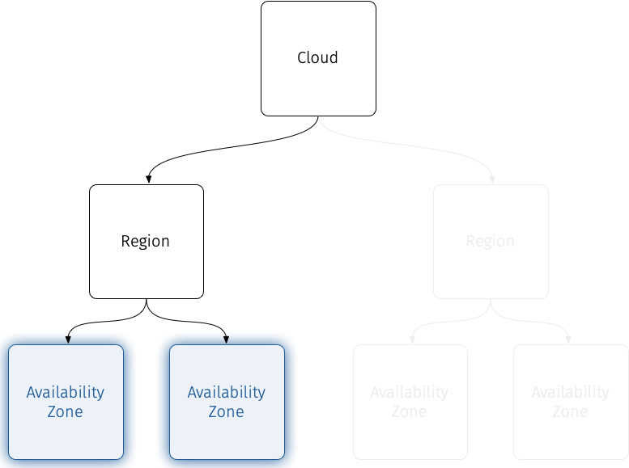

# Availability Zones

Availability Zones are one of the most arbitrary designed domains in a cloud.  In a large-scale cloud, they could be multiple data centers in the same geographical area, while in a smaller cloud they could be separate data halls in the same data center or separate racks in the same data hall.

Ultimately, because it has no set physical analogue, an Availability Zone becomes a fancy way of defining a failure domain.  What this allows you to do in your cloud design is define an Availability Zone to best suit how you want your users to to separate resources for resilience against failures.

Availability Zones are a logical abstraction for partitioning a cloud without knowing the physical infrastructure. They can be used to partition a cloud on arbitrary factors, such as location (country, data center, rack), network layout, or power source.



## The Use Case for Availability Zones

Typically, a [region](openstack-cloud-design-regions.md) encompasses at least two, ideally more, availability zones (AZs). All AZs are fully independent, featuring redundant power, cooling, and networking resources, and are interconnected within a region via dedicated high-bandwidth, low-latency links. Connectivity between AZs in-Region are typically extremely fast[^1].

!!! Genestack
    See the [data center](https://www.rackspace.com/about/data-centers){:target="_blank"} pages on the Rackspace website for information on how Rackspace deploys and manages data centers to deliver these capabilities.

There is no standard for quantifying distance between AZs.  What constitutes "in-Region" is defined by a the cloud provider, so when designing a cloud there is a lot of latitude.Distance between AZs depends on the region and the specific cloud provider[^2].

In all cases, distance between AZs are designed to have them strategically located a sufficient distance from one another to minimize the likelihood that a single event will impact multiple Availability Zones. At the same time, they are close enough to maintain low-latency connectivity for replication and failover scenarios.

In larger cases, this is to mitigate larger failure domains, such as a natural disaster or power outage, while in smaller cases (e.g. defining AZs as two separate data halls at the same data center) this would be to mitigate interruptions to one part of a data center campus from impacting other portions of the campus.

Availability Zones are often also used to distribute Region resources closer to the "edge" as organizations frequently choose the AZ closest to their physical location[^3].

The high-speed bandwidth means that applications and services can take advantage of multiple AZs to have built-in redundancy even in-Region. It is possible to run redundant workloads across geographically dispersed AZs to take advantage of the high availability and resiliency they offer.

### Availability Zone Scoping

One thing that needs to be decided early-on in cloud design, is the _scope_ of Availability Zones and what their intended usage pattern is.

If Availability Zones are intended to be a more "global" construct, then having identically named AZs in Nova, Cinder, and Neutron makes sense.  The user will (correctly) assume that the AZ applies equally across all the services.

If Availability Zones are meant to be uniquely used inside each service, then naming them identically will lead to user configuration.  In this case, it would be advised to name your AZs with the service name or type as a part of the naming scheme.

## Availability Zones in Nova

Availability Zones in Nova can essentially be qualified as migration boundaries.  You cannot migrate or move instances from one AZ to another[^4].

It is not allowed to move instances between Availability Zones. If adding a host to an aggregate or removing a host from an aggregate would cause an instance to move between Availability Zones, including moving from or moving to the default AZ, then the operation will be rejected. The administrator should drain the instances from the host first then the host can be moved.

!!! Note
    It is important to understand that Nova AZs in OpenStack are not a database-level construct.  They are defined by adding metadata to a [Host Aggregate](openstack-cloud-design-ha.md).

### Availability Zones vs. Host Aggregates

The addition of this specific metadata to an aggregate makes the aggregate visible from an end-user perspective and consequently allows users to schedule instances to a specific set of hosts, the ones belonging to the aggregate. There are a few additional differences to note when comparing availability zones and host aggregates:

- A host can be part of multiple aggregates but it can only be in one Availability Zone.

- By default a host is part of a default Availability Zone even if it doesn’t belong to a host aggregate. The name of this default availability zone can be configured using the `default_availability_zone` config option.

!!! Note
    See [Host Aggregates](openstack-cloud-design-ha.md) for more information.

### Availability Zones and Placement

In order for [Placement](https://docs.openstack.org/placement/latest/){:target="_blank"} to use to honor Availability Zone requests, there must be placement aggregates that match the membership and UUID of Nova Host Aggregates that you assign as availability zones. An aggregate metadata key is used to controls this function. As of OpenStack 28.0.0 (Bobcat), this is the only way to schedule instances to availability-zones.

Administrators can configure a default availability zone where instances will be placed when the user fails to specify one. For more information on how to do this, refer to [Availability Zones](https://docs.openstack.org/nova/latest/reference/glossary.html#term-Availability-Zone){:target="_blank"}.

## Availability Zones in Cinder

OpenStack block storage – [Cinder](https://docs.openstack.org/cinder/latest/){:target="_blank"} – also supports the concept of Availability Zones (AZs.) Creating availability zones in Cinder is accomplished by setting a configuration parameter in `cinder.conf`, on the nodes where the `cinder-volume` service runs.

!!! Note
    You can only set the availability zone to one value. This is consistent with availability zones in the other OpenStack projects that do not allow for the notion of overlapping failure domains.

In Cinder, AZs should not be confused with storage types, either stated as explicit technologies (NVMe, SSD, HDD) or as different SLAs (commodity, performance.)  However, storage backends, storage drivers, and storage architecture may affect how you set up Availability Zones.

You will want to have the same Availability Zone criteria for storage as you do for compute resources and set up Availability Zones in Cinder to match what has been defined in Nova.

!!! Warning
    If you are not going to provide each storage type (NVMe/SSD/HDD) or (commodity/performance) in each AZ, you may have users end-up running into scheduler errors as they try to construct parallel environments for HA in different AZs.

This matching includes naming of Availability Zones.  If your AZs don't match, it can cause problems when Nova makes API calls to Cinder. For example, when performing a Boot from Volume API call through Nova, if Nova decided to provision your VM in an AZ called _name_, it will tell Cinder to provision a boot volume in an AZ also called _name_.  If  Cinder doesn’t have an AZ called _name_, this API call will fail.

!!! Tip
    You can prevent this from happening by setting the following parameter in `cinder.conf` the nodes running the `cinder-api` service:
    ```
    [DEFAULT]
    allow_availability_zone_fallback=True
    ```
    This parameter prevents the API call from failing, because if the AZ _name_ does not exist, Cinder will fallback to another availability zone (whichever you defined as the `default_availability_zone` parameter or in the `storage_availability_zone` parameter.)

The Cinder multi-backend feature allows you to configure multiple storage backends in the same `cinder.conf` (for the same `cinder-volume` service), but Cinder Availability Zones can only be defined _once_ per `cinder-volume` service, and not per-backend per-cinder-volume service.

!!! Note
    Even if you define multiple backends in one `cinder.conf` they will all inherit the same availability zone.

If you’re using a third party storage appliances[^5], or are making use of software-defined storage solutions like [Ceph](https://docs.ceph.com/en/latest/rbd/rbd-openstack/){:target="_blank"}, then these systems typically have their own built-in redundancy that exist outside of OpenStack.

### Using Cinder and Nova Availability Zones Together

As mentioned [above](openstack-cloud-design-az.md#availability-zone-scoping), if not Availability Zones for multiple services are not implemented carefully, the combination of Nova and Cinder AZ features can allow users to not have the desired effect.  Confusion about different AZ types will happen, and you can have the following scenarios occur, depending on how your AZs are configured in Nova and Cinder:

1. **There is only a single compute AZ and a single Cinder AZ and they have the same name:** This is the default configuration if you use “stock” OpenStack: Nova’s default AZ is `nova` and Cinder has the same default value.

2. **There are multiple Nova and Cinder AZs, there is the same number of both, and they share the same names:** In this case, users that use AZ information to configure both Nova instances as well as Cinder volumes using the same AZ name will “just work”.

3. **There are multiple Nova and Cinder AZs, there is either a different number of each or they have different names:** In this case, users must be careful to explicitly specify a correct AZ when creating Nova instances and/or Cinder volumes, and the OpenStack deployment must have Nova configured to allow attaching volumes in other AZs, or else users may not be able to achieve their desired configuration.

## Availability Zones in Neutron

Like with Nova, [Availability Zones](https://docs.openstack.org/neutron/latest/admin/config-az.html){:target="_blank"} are a way to provide separate failure domains. Availability Zones in Neutron are built around groups of network nodes that run the core network services.  Availability Zones are created by setting attributes to the agents on the network nodes.

Availability Zones allow Neutron to provide [high availability](https://docs.openstack.org/neutron/latest/admin/config-az.html#achieving-high-availability-with-availability-zone){:target="_blank"} for routers, L3 gateways, IPAM (DHCP) and other networking services.  This provides an extra layer of protection by segmenting networking service deployments into isolated failure domains. This allows you to group networking nodes that are in different locations, or that are attached to different power sources into separate Availability Zones and configure scheduling for resources with high availability so that they are scheduled on different Availability Zones.

By deploying HA nodes across different availability zones, it is guaranteed that network services remain available in face of zone-wide failures that affect the deployment.

### Neutron Availability Zones and OVN

!!! Genestack
    [Open Virtual Networking (OVN)](https://www.ovn.org/en/){:target="_blank"} is the networking fabric being used in [Genestack](infrastructure-ovn-setup.md).

Additional [special configuration](https://docs.openstack.org/neutron/latest/admin/ovn/availability_zones.html){:target="_blank"} is necessary to enable Availability Zones when using OVN.

## Sharing Keystone Across Availability Zones

Availability Zones are a subset of a Region.  Previously, we defined the scope of Keystone to be [regional](openstack-cloud-design-regions.md/#keystone).  This means that all of the services in an AZ can be serviced by the Region-level Keystone deployment.

## Sharing Glance Across Availability Zones

As with Keystone, Glance can also be shared across Availability Zones. The [Region-level Glance deployment](openstack-cloud-design-regions.md/#glance) can be used across all the AZs defined in the region.

[^1]: Typical speeds range from 10Gbps to 400Gbps in network throughput between AZs, with latencies as low as 1 to 2 milliseconds.
[^2]: For instance, for Azure Cloud Services [in Northern Virginia](https://dgtlinfra.com/amazon-aws-microsoft-data-centers-virginia/){:target="_blank"}, Microsoft has set a self-imposed requirement for its data centers to be located within approximately 12.5 miles (20 kilometers) of existing data centers in its regional network.
[^3]: This is typical for hybrid cloud deployments where there is a need to have customer data centers separate from cloud provider data centers, but still a need for high-speed connectivity, such as for fail-over, disaster recovery, or data access.
[^4]: The OpenStack [Placement](https://docs.openstack.org/placement/latest/){:target="_blank"} service and the scheduler work to prevent this from happening, but some actions can still attempt to do this, yielding unpredictable results.
[^5]: For example: [NetApp](https://www.netapp.com/hybrid-cloud/openstack-private-cloud/){:target="_blank"} or [Pure Storage](https://www.purestorage.com/content/dam/pdf/en/solution-briefs/sb-enhancing-openstack-deployments-with-pure.pdf){:target="_blank"}.
