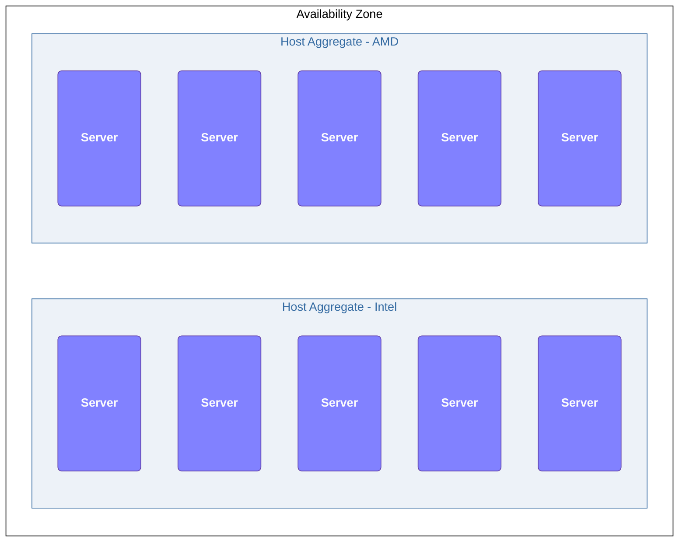
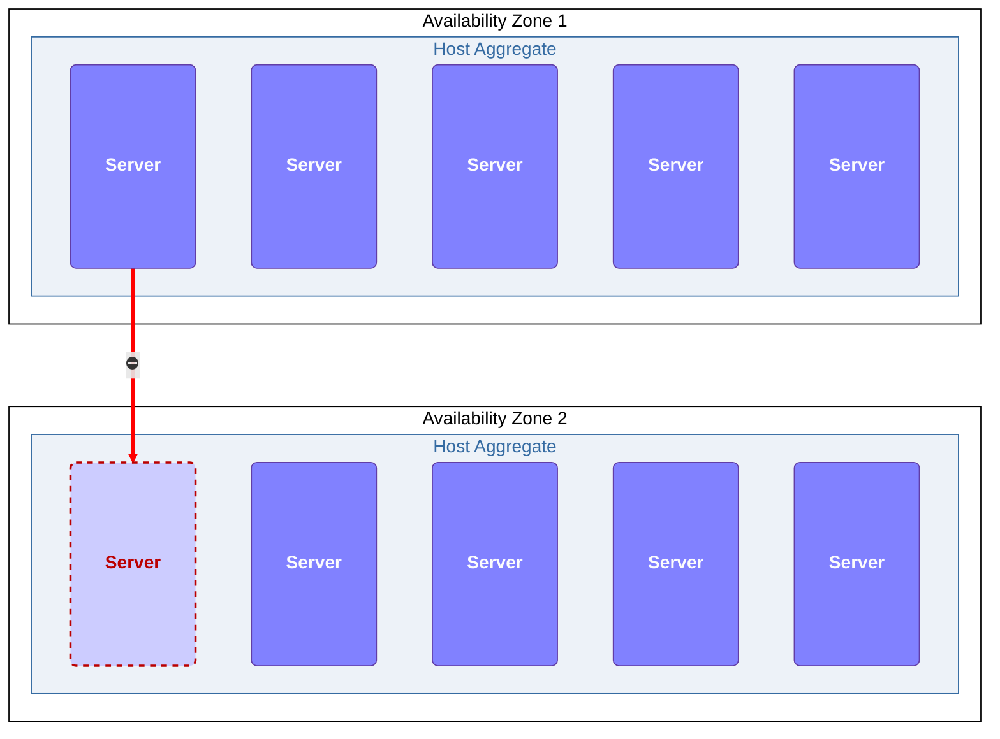

# Host Aggregates

[Host Aggregates](https://docs.openstack.org/nova/latest/admin/aggregates.html){:target="_blank"}  are a way of grouping hosts in an OpenStack cloud.  This allows you to create groups of certain types of hosts and then steer certain classes of VM instances to them.

Host Aggregates[^1] are a mechanism for partitioning hosts in an OpenStack cloud, or a [Region](openstack-cloud-design-regions.md) of an OpenStack cloud, based on arbitrary characteristics. Examples where an administrator may want to do this include where a group of hosts have additional hardware or performance characteristics.

### Host Aggregates vs. Availability Zones

While Host Aggregates themselves are hidden from OpenStack cloud users, Cloud administrators are able to optionally expose a host aggregate as an [Availability Zone](openstack-cloud-design-az.md). Availability zones differ from host aggregates in that they are explicitly exposed to the user, and hosts membership is exclusive -- hosts can only be in a single availability zone.

!!! Warning
    It is not allowed to move instances between Availability Zones. If adding a host to an aggregate or removing a host from an aggregate would cause an instance to move between Availability Zones (including moving from or moving to the default AZ) then the operation will be fail.

### Host Aggregates in Genestack

!!! Genestack
    Genestack is designed to use [Host Aggregates](openstack-host-aggregates.md) to take advantage of various compute host types.

## Aggregates and Placement

The [Placement](https://docs.openstack.org/placement/latest/){:target="_blank"} service also has a concept of [Aggregates](https://specs.openstack.org/openstack/nova-specs/specs/rocky/implemented/alloc-candidates-member-of.html).  However, these are not the same thing as Host Aggregates in Nova. Placement Aggregates are defined purely as groupings of related resource providers. As compute nodes in Nova are represented in Placement as resource providers, they can be added to a Placement Aggregate as well.

## Host Aggregates and Glance

The primary way that Glance can influence placement and work with Host Aggregates is via [Metadata](https://docs.openstack.org/glance/latest/user/metadefs-concepts.html){:target="_blank"}.

You can map flavors and images to Host Aggregates by setting metadata on the Host Aggregate, and then set Glance image metadata properties to correlate to the host aggregate metadata. Placement can then use this metadata to schedule instances when the required filters are enabled.

!!! Note
    Metadata that you specify in a Host Aggregate limits the use of that host to any instance that has the same metadata specified in its flavor or image.

[^1]: Host aggregates started out as a way to use Xen hypervisor resource pools, but have since been generalized to provide a mechanism to allow administrators to assign key-value pairs to groups of machines.
