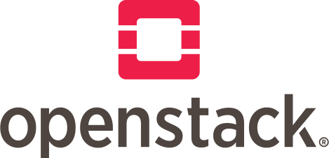

# Introduction

{align=right : style="max-width:250px"}

## Welcome to Genestack

[Genestack](index.md) is a new way of deploying [OpenStack](https://openstack.org){:target="\_blank"} and [Kubernetes](kttps://k8s.io){:target="\_blank"} together to create a new type of unified cloud infrastructure.  Before diving into the Genestack details and inner-workings, it will be important to decide how you want to structure your cloud.

{align=right : style="max-width:250px"}

This section of the documentation covers some basic OpenStack cloud design principles, and offers insight into how these can be realized when building a solution using OpenStack and Genestack.

!!! Genestack
    Watch for **Genestack** boxes like this one to show where various design decisions, technologies, or ideas that Genestack is using!
