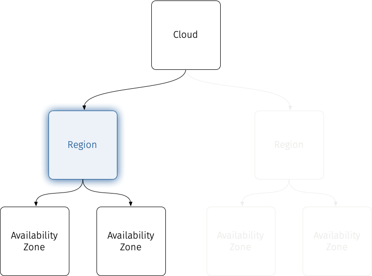

# Regions

Regions are separate physical locations served by a single cloud.  In terms of our taxonomy, a Cloud can contain several Regions.

In OpenStack, a Region is defined as an independently deployed cloud infrastructure, excepting authentication (Keystone) and possibly a dashboard (Horizon or Skyline.)  **_A Region should be able to operate autonomously from other Regions._** This means that a Region has it's own API endpoints for most services.  For the OpenStack CLI, this usually means a separate entry in
[`clouds.yaml`](https://docs.openstack.org/python-openstackclient/latest/configuration/index.html#clouds-yaml){:target="_blank"}
or a separate `openrc` file.

!!! tip

    For discoverability, you may elect to have "generic" DNS names for some services that use geo-IP or other context clues to direct user to the appropriate endpoint.

    For example, if you have an internal cloud that has geographic regions on continents or countries, "cloud.company.corp" may just direct user to their in-region Horizon or Keystone instance, like "us.cloud.company.corp" for North America or "apac.cloud.company.corp" for Asia.

## Designing Services for Multiple Regions

### Keystone

A unified [Keystone](https://docs.openstack.org/keystone/latest/){:target="_blank"} service is essentially what separates a Region deployment from a Cloud deployment.

In most cases, when you deploy a multi-region cloud, you first either deploy a global Keystone service first, either stand-alone or as a part of your primary region, and then deploy additional regions federating from it.

This is usually trivial, as you ought to be backing Keystone with some large-scale authentication (authn) and authorization (authz) infrastructure such as a [LDAP](https://docs.openstack.org/keystone/latest/admin/configuration.html#integrate-identity-with-ldap){:target="_blank"}[^1].  You can also use Keystone's built-in federation, as is done at [Rackspace](openstack-keystone-federation.md).

### Horizon/Skyline

The [Horizon](https://docs.openstack.org/horizon/latest/){:target="_blank"} and [Skyline](https://docs.openstack.org/skyline/latest/){:target="_blank"} web control panels are one of the primary ways that users interact with OpenStack.  Collectively, we usually refer to their functionality as the "Dashboard."

Regions can have their own dashboard logins[^2], or a cloud provider may want to create a landing page where there is the ability for the user to select the region into which they want to login.

OpenStack currently does not have any multi-region capability with the dashboards, so if a "single pane of glass" approach is desired, third-party tooling will need to be required.

!!! Example
    [ManageIQ](https://docs.openstack.org/horizon/latest/){:target="_blank"} is an open-source [Cloud Management Platform (CMP)](https://en.wikipedia.org/wiki/Cloud_management#Cloud_Management_Platforms_(CMP)){:target="_blank"} that is capable of managing multiple OpenStack clouds or regions.  ManageIQ has excellent support via it's [OpenStack provider](https://www.manageiq.org/docs/reference/latest/managing_providers/cloud_providers/openstack_providers.html){:target="_blank"} and multiple OpenStack API endpoints can be added to provide common management through the ManageIQ web interface and [API](https://www.manageiq.org/docs/api){:target="_blank"}.

### Nova

[Nova](https://docs.openstack.org/nova/latest/){:target="_blank"} is probably the easiest service to rationalize on a per-Region basis.  Cloud users generally have few issues understanding Regions as a cloud organization structure around compute resources.

Regions are generally assumed to be autonomous and self-contained with respect to compute.  In fact, Regions usually become one of the defining factors for how compute resources in a cloud are
organized.  This is no different in OpenStack.

When migrating compute resources from one region to another, it is generally assumed that users will export their instances from one region, and import them into another.  More likely, compute instances will be deployed in multiple regions simultaneously, using networking, load balancers, DNS, and other tools to steer traffic and divide workloads across various regions.

### Neutron

Connecting [Neutron](https://docs.openstack.org/neutron/latest/){:target="_blank"} across regions can be very useful for users.  In fact, having this capability can be essential for users to see your cloud as being viable for high-availability.

Inter-region connectivity is a key capability that can underlie various HA-enablement services such as data replication, automated disaster recovery, block device mirroring, service locality (e.g. GeoIP.)  That being said, building inter-region connectivity into Neutron proper would raise some questions that would be difficult to answer in terms of design:

1. Which region would "own" the resource being created?
2. If both regions "own" it, how is that synchronized?  Also, wouldn't that limit the autonomy of regions?

These kind of "existential questions" should always raise a red flag – the main goal of Region is to be able to operate autonomously, so the best solution will be to create something that isn't "owned" by either end -- a VPN.

!!! tip

    While it may seem like Neutron's [VPN as a Service (VPNaaS)](https://docs.openstack.org/neutron-vpnaas/latest/user/index.html){:target="_blank"} is a good fit for something like this, VPNaaS is primarily designed for client-server VPNs.  This application is better suited for point-to-point VPNs.

!!! example

    You may even want your cloud users to look at something like [Tailscale](https://tailscale.com/){:target="_blank"} or even just plain [Wireguard](https://www.wireguard.com/){:target="_blank"} to create their own site-to-site VPN overlay networks.

### Cinder

In most cases, [Cinder](https://docs.openstack.org/cinder/latest/){:target="_blank"}, like Nova, should be contained within it's region.  However, there are special cases like block-device replication that may make you want to consider how to accomplish this within the framework of Cinder.

As with Neutron, the key is designing services that can be put together with other building blocks to create the useful combinations that cloud users are looking to take advantage of.  For Cinder, this usually means some kind of cross-region replication.

!!! Note
    Currently, Cinder [replication](https://docs.openstack.org/cinder/latest/contributor/replication.html){:target="_blank"} is limited to in-region backend failure scenarios where volumes can be saved to multiple backends.

Replicating Cinder volumes from one Region to another is more complicated in the sense that not only does the actual volume storage need to be replicated, but both regions would need to have the metadata in sync for those volumes.  Ultimately, there would need to be a way to synchronize the _state_ of those volumes so that both Regions understand the local and the remote to be the _same volume_.  This is much more complex.

### Glance

If we strictly adhere to the definition that regions are separate physical locations served by a single cloud, then [Glance](https://docs.openstack.org/glance/latest/){:target="_blank"} should just be deployed on a per-region bases like most services.  However, Glance is one of the OpenStack services that can you may want to consider to deploy cloud-wide.

Glance provides a simple way to do with with [glance-replicator](https://docs.openstack.org/glance/latest/cli/glancereplicator.html){:target="_blank"}.  While this is good for bootstrapping a new glance instance, you will need to continuously keep your regions in sync for this to be useful.

A good way to do this is to have a shared Glance service with distributed backends – this is best if when OpenStack instances are located across several sites.

!!! Example
    One way to accomplish this would be to use a Glance backend on top of replicated storage.  Then, you can replicate the Glace storage backend across multiple regions and expose the service from a single IP in the service catalog.  That service IP could resolve to localized endpoints via geo-IP.

    Remember – your glance back-end does not necessarily need to be shared with Cinder or Swift or any other services, so using an existing storage backend with replication capabilities that you already deploy could be a economically-efficient way to achieve this goal.

[^1]:
    LDAP integration can also be used to [integrate Keystone with Active Directory](https://wiki.openstack.org/wiki/HowtoIntegrateKeystonewithAD){:target="_blank"}.

[^2]:
    Having your dashboard URL and API endpoint URL for regions follow a specific schema, like
    `<SERVICE>.region.cloud.corp` can make things easily discoverable for your users.
