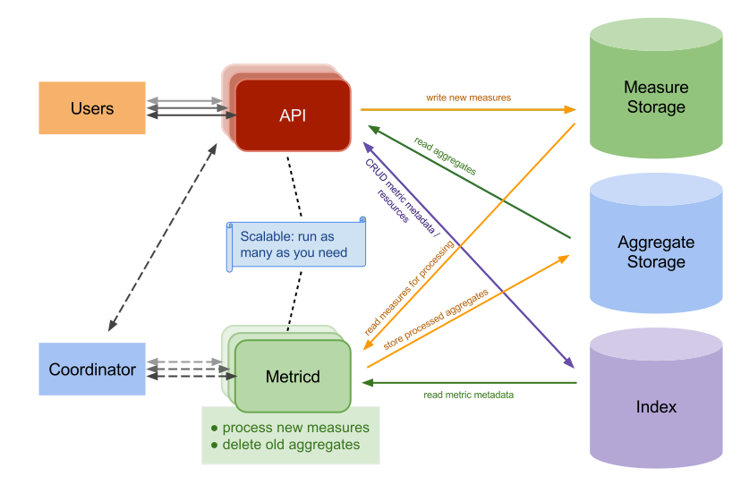

# Deploy Gnocchi

Gnocchi is used by [Ceilometer](openstack-ceilometer.md)
to aggregate and index metric data from various OpenStack services. It
consists of several components: a HTTP REST API, an optional
statsd-compatible daemon, and an asynchronous processing daemon (named
gnocchi-metricd).

[](openstack-gnocchi.md)

## Create Secrets

!!! note "Information about the secretes used"

    Manual secret generation is only required if you haven't run the `create-secrets.sh` script located in `/opt/genestack/bin`.

    ??? example "Example secret generation"

        ``` shell
        kubectl --namespace openstack create secret generic gnocchi-admin \
                --type Opaque \
                --from-literal=password="$(< /dev/urandom tr -dc _A-Za-z0-9 | head -c${1:-32};echo;)"
        kubectl --namespace openstack create secret generic gnocchi-db-password \
                --type Opaque \
                --from-literal=password="$(< /dev/urandom tr -dc _A-Za-z0-9 | head -c${1:-32};echo;)"
        kubectl --namespace openstack create secret generic gnocchi-pgsql-password \
                --type Opaque \
                --from-literal=password="$(< /dev/urandom tr -dc _A-Za-z0-9 | head -c${1:-32};echo;)"
        ```

## Object Storage Options

=== "Ceph Internal _(default)_"

    ### Create ceph-etc configmap

    While the below example should work fine for most environments, depending
    on your use case it may be necessary to provide additional client
    configuration options for ceph. The below simply creates the expected
    `ceph-etc` ConfigMap for the `ceph.conf` needed by Gnocchi to establish a
    connection to the mon host(s) via the rados client.

    ``` shell
    kubectl apply -n openstack -f - <<EOF
    apiVersion: v1
    kind: ConfigMap
    metadata:
      name: ceph-etc
      namespace: openstack
    data:
      ceph.conf: |
        [global]
        mon_host = $(for pod in $(kubectl get pods -n rook-ceph | grep rook-ceph-mon | awk '{print $1}'); do \
            echo -n "$(kubectl get pod $pod -n rook-ceph -o go-template --template='{{.status.podIP}}'):6789,"; done \
            | sed 's/,$//')
    EOF
    ```

    ### Verify the ceph-etc configmap is sane

    Below is an example of what you're looking for to verify the configmap was
    created as expected - a CSV of the mon hosts, colon seperated with default
    mon port, 6789.

    ``` shell
    kubectl get configmap -n openstack ceph-etc -o "jsonpath={.data['ceph\.conf']}"
    ```

    _Should yield output like_:

    ``` { .yaml .no-copy }
    [global]
        mon_host = 172.31.3.7:6789,172.31.1.112:6789,172.31.0.46:6789
    ```


=== "Ceph External"

    !!! note

        You will need the mon_host and client.admin keyring details for your
        external ceph cluster before proceeding.

    ### Create ceph-etc configmap

    **_Be sure to replace the mon_host value, `REPLACE_ME` below!_**

    ``` shell hl_lines="17"
    kubectl apply -n openstack -f - <<EOF
    apiVersion: v1
    kind: ConfigMap
    metadata:
      name: ceph-etc
      namespace: openstack
    data:
      ceph.conf: |
        [global]
        cephx = true
        cephx_cluster_require_signatures = true
        cephx_require_signatures = false
        cephx_service_require_signatures = false
        debug_ms = 0/0
        log_file = /dev/stdout
        mon_cluster_log_file = /dev/stdout
        mon_host = REPLACE_ME

        [client.admin]
        keyring = /etc/ceph/ceph.client.admin.keyring
    EOF
    ```

    ### Create the admin keyring secret

    **_Be sure to replace the key value, `REPLACE_ME` below!_**

    ```shell hl_lines="4"
    KEYRING=$(base64 -w0 <<EOF

    [client.admin]
        key = REPLACE_ME
        caps mds = "allow *"
        caps mgr = "allow *"
        caps mon = "allow *"
        caps osd = "allow *"
    EOF
    )
    kubectl get ns rook-ceph &> /dev/null || kubectl create ns rook-ceph
    kubectl apply -n rook-ceph -f - <<EOF
    apiVersion: v1
    kind: Secret
    type: Opaque
    metadata:
      name: rook-ceph-admin-keyring
      namespace: rook-ceph
    data:
      keyring: ${KEYRING}
    EOF
    unset KEYRING
    ```

=== "PVC Storage _(coming soon)_"

    Check back later for more information.

## Run the package deployment

!!! example "Run the Gnocchi deployment Script `/opt/genestack/bin/install-gnocchi.sh`"

    ``` shell
    --8<-- "bin/install-gnocchi.sh"
    ```

!!! tip

    You may need to provide custom values to configure your openstack services, for a simple single region or lab deployment you can supply an additional overrides flag using the example found at `base-helm-configs/aio-example-openstack-overrides.yaml`.
    In other cases such as a multi-region deployment you may want to view the [Multi-Region Support](multi-region-support.md) guide to for a workflow solution.

## Validate the metric endpoint

### Pip install gnocchiclient and python-ceilometerclient

``` shell
kubectl exec -it openstack-admin-client -n openstack -- /var/lib/openstack/bin/pip install python-ceilometerclient gnocchiclient
```

### Confirm healthcheck response

``` shell
curl http://gnocchi-api.openstack.svc.cluster.local:8041/healthcheck -D -
```

``` { .shell .no-copy }
HTTP/1.1 200 OK
Date: Fri, 09 Aug 2024 20:33:24 GMT
Server: Apache/2.4.52 (Ubuntu)
Content-Length: 0
Vary: Accept-Encoding
Content-Type: text/plain; charset=UTF-8
```

### Verify metric list functionality

``` shell
kubectl exec -it openstack-admin-client -n openstack -- openstack metric list --debug
```

``` { .shell .no-copy }
RESP BODY: []
```
