# OpenStack Ironic Operational Guide

This guide provides an operational workflow for provisioning bare metal servers with OpenStack Ironic. It covers the major steps required to prepare the environment, enroll hardware, validate node readiness, and launch instances using either PXE/iPXE or virtual media boot.

## Introduction

OpenStack Ironic is the bare metal provisioning service in OpenStack. It allows operators to manage physical servers in a way that is similar to virtual machine lifecycle management, while still preserving direct access to dedicated hardware.

This document is intended for operators who already have a working OpenStack environment and need a practical guide for day-to-day Ironic provisioning tasks.

## Scope And Assumptions

This guide assumes the following:

- The OpenStack control plane is already installed and operational.
- Administrative credentials have already been sourced.
- Required deployment, cleaning, and tenant images are already uploaded to Glance.
- The target node BMC is reachable from the Ironic conductor.
- For PXE or iPXE boot, the provisioning network and network boot services are already configured.
- For virtual media boot, the provisioning network is configured and the hardware supports a virtual media boot interface such as redfish-virtual-media.

Nova may not see a newly available node immediately after enrollment because the resource tracker updates periodically. In many environments this sync happens every 60 seconds, so a short delay is expected.

## High-Level Workflow

The provisioning flow typically follows this sequence:

```text
Create flavor
   ->
Set bare metal resource class mapping
   ->
Enroll node in Ironic
   ->
Set node properties / driver info / boot interface
   ->
Create port(s)
   ->
Validate node
   ->
Manage node
   ->
Provide node
   ->
Create server with matching flavor and required image
```

## Purpose

This guide walks through the following workflow:

1. Create a flavor for bare metal server
2. Set a resource class mapping so Nova can match the flavor to the correct Ironic node
3. Enroll the physical node into Ironic with the correct driver and interfaces
4. Set properties and driver details such as hardware specs, BMC credentials, and boot method
5. Create ports so the node can participate in provisioning and tenant networking
6. Validate step verifies that required fields are present and the interfaces such as power, management, deploy, boot, and others report valid/usable for the baremetal node
7. Manage step moves the bare metal node from enroll to manageable by starting verification and confirming that Ironic can control the node using the configured interfaces and credentials.
8. Provide the node to transition it into the available state, making it ready for scheduling.
9. Create a server with the matching flavor and image using either PXE/iPXE or virtual media boot.

Ironic supports multiple boot interfaces. PXE is the standard network boot mechanism, while virtual media typically relies on the BMC to mount boot media remotely instead of using traditional PXE infrastructure.

## Prerequisites

Before enrolling a node, ensure that the OpenStack environment and all required services are properly configured and available. Also create the dedicated provisioning network, if it does not already exist.

### Source Administrative Credentials

Source the administrative OpenStack RC file:

```bash
source admin-openrc
```

### Create The Ironic Provisioning Network

Ironic requires a provisioning network regardless of whether you use PXE/iPXE or virtual media. Create a dedicated Neutron network for provisioning traffic:

```bash
openstack network create \
  --mtu 1500 \
  --provider-physical-network physnet2 \
  --provider-network-type flat \
  --disable-port-security \
  ironic

openstack subnet create \
  --allocation-pool start=172.23.209.11,end=172.23.211.254 \
  --gateway 172.23.208.1 \
  --dns-nameserver 1.1.1.1 \
  --subnet-range 172.23.208.0/22 \
  --network ironic \
  ironic-subnet1
```

### Create Bare Metal Flavor

Bare metal flavors are used mainly for scheduling and user-facing size definitions. Standard resource properties are set to `0`, while a custom resource class is used for matching.

```bash
openstack flavor create \
  --ram 131072 \
  --vcpus 48 \
  --disk 480 \
  GP2.XL

openstack flavor set GP2.XL \
  --property resources:VCPU=0 \
  --property resources:MEMORY_MB=0 \
  --property resources:DISK_GB=0 \
  --property capabilities:boot_option="local" \
  --property resources:CUSTOM_GP2_XL=1
```

The `CUSTOM_GP2_XL` property must match the `CUSTOM_<FLAVOR_NAME>` naming pattern used for the resource class. The standard flavor values still help communicate expected capacity to users, and the disk value is also used to determine root disk sizing behavior.

Verify the flavor after creation:

```bash
openstack flavor show GP2.XL
```

Expected result:

- The flavor exists.
- It includes the custom resource class property.
- Standard scheduling resource properties are set to zero.

### Upload Ironic Deployment Agent Images

Ironic Python Agent images are required for deployment and cleaning operations.

```bash
curl -o ipa-centos9-stable-2025.2.initramfs https://tarballs.opendev.org/openstack/ironic-python-agent/dib/files/ipa-centos9-stable-2025.2.initramfs
curl -o ipa-centos9-stable-2025.2.kernel https://tarballs.opendev.org/openstack/ironic-python-agent/dib/files/ipa-centos9-stable-2025.2.kernel

openstack image create ipa-centos9-stable-2025.2-aki --public \
   --disk-format aki --container-format aki \
   --file ipa-centos9-stable-2025.2.kernel

openstack image create ipa-centos9-stable-2025.2-ari --public \
   --disk-format ari --container-format ari \
   --file ipa-centos9-stable-2025.2.initramfs
```

### Verify Core Resources

Verify that the expected OpenStack resources are available:

```bash
openstack flavor list
openstack image list
openstack network list
openstack keypair list
```

### Verify Ironic Services And Drivers

Confirm that the Ironic conductors are running and that the required drivers are active:

```bash
openstack baremetal conductor list
+-------------+-----------------+-------+
| Hostname    | Conductor Group | Alive |
+-------------+-----------------+-------+
| controller3 |                 | True  |
| controller2 |                 | True  |
| controller1 |                 | True  |
+-------------+-----------------+-------+

openstack baremetal driver list
+---------------------+---------------------------------------+
| Supported driver(s) | Active host(s)                        |
+---------------------+---------------------------------------+
| idrac               | controller3, controller2, controller1 |
| ipmi                | controller3, controller2, controller1 |
| redfish             | controller3, controller2, controller1 |
+---------------------+---------------------------------------+
```

## Enroll A Bare Metal Node

Node enrollment registers a physical server with Ironic. During enrollment you define the driver, boot interface, hardware properties, and network connectivity.

Choose one of the following methods:

1. PXE or iPXE boot
2. Virtual media boot

## Option A: Enroll A Node With PXE Or IPXE Boot

PXE is the standard network boot path for hardware that supports network booting. In this model, the node downloads boot artifacts over the provisioning network.



### Create The Node

This example uses the `idrac` driver, Redfish-based management, and the `ipxe` boot interface.

```bash
node=123456-compute1
node_mac="aa:bb:cc:dd:ee:ff" # MAC address of PXE interface
deploy_aki=ipa-centos9-stable-2025.2-aki
deploy_ari=ipa-centos9-stable-2025.2-ari
resource=GP2_XL
phys_arch=x86_64
phys_cpus=128
phys_ram=720896
phys_disk=960

openstack baremetal node create --driver idrac \
  --boot-interface ipxe \
  --driver-info redfish_username=root \
  --driver-info redfish_password=<password> \
  --driver-info redfish_address=<OOB IP> \
  --driver-info redfish_verify_ca=False \
  --driver-info redfish_system_id=/redfish/v1/Systems/System.Embedded.1 \
  --driver-info deploy_kernel=`openstack image show $deploy_aki -c id |awk '/id / {print $4}'` \
  --driver-info deploy_ramdisk=`openstack image show $deploy_ari -c id |awk '/id / {print $4}'` \
  --inspect-interface idrac-redfish \
  --management-interface idrac-redfish \
  --power-interface idrac-redfish \
  --property cpus=$phys_cpus \
  --property memory_mb=$phys_ram \
  --property local_gb=$phys_disk \
  --property cpu_arch=$phys_arch \
  --property capabilities='boot_option:local,disk_label:gpt' \
  --resource-class $resource \
  --network-interface flat \
  --name $node

openstack baremetal port create $node_mac \
  --node `openstack baremetal node show $node -c uuid |awk -F "|" '/ uuid  / {print $3}'`

openstack baremetal node validate $node
openstack baremetal node manage $node
openstack baremetal node show $node -c provision_state

openstack baremetal node clean --clean-steps '[{"interface": "deploy", "step": "erase_devices_metadata"}]' $node

openstack baremetal node provide $node
```

## Option B: Enroll A Node With Virtual Media

Virtual media boot uses the server BMC to attach temporary boot media instead of depending on PXE infrastructure. This is commonly used with Redfish-capable hardware and UEFI-based booting.

Even when virtual media is used, the Ironic provisioning network is still required so the deployment ramdisk can communicate with the conductor and supporting services.



### Create The Node

This example uses the `redfish` driver with the `redfish-virtual-media` boot interface.

```bash
node=123456-compute2
node_mac="aa:bb:cc:dd:ee:ff" # MAC address of PXE interface
deploy_aki=ipa-centos9-stable-2025.2-aki
deploy_ari=ipa-centos9-stable-2025.2-ari
deploy_bootloader=esp
resource=GP2_XL
phys_arch=x86_64
phys_cpus=128
phys_ram=720896
phys_disk=960

openstack baremetal node create --driver redfish \
  --driver-info redfish_address=https://${node_oob} \
  --driver-info redfish_username=root \
  --driver-info redfish_password='<idrac-password>' \
  --driver-info redfish_verify_ca=False \
  --name $node

openstack baremetal node set \
  --boot-interface redfish-virtual-media \
  $node

openstack baremetal node set \
  --driver-info bootloader=`openstack image show ${deploy_bootloader} -c id -f value` \
  --driver-info deploy_kernel=`openstack image show ${deploy_aki} -c id -f value` \
  --driver-info deploy_ramdisk=`openstack image show ${deploy_ari} -c id -f value` \
  --property cpu_arch=$phys_arch \
  --property cpus=$phys_cpus \
  --property memory_mb=$phys_ram \
  --property local_gb=$phys_disk \
  --property capabilities='boot_option:local,boot_mode:uefi' \
  --resource-class $resource \
  $node

openstack baremetal node set --property root_device='{"serial" : "CK0WW92CVXP0036P00NQ"}' \
  $node

openstack baremetal port create $node_mac \
  --node `openstack baremetal node show $node -c uuid |awk -F "|" '/ uuid  / {print $3}'`

openstack baremetal node validate $node
openstack baremetal node manage $node
openstack baremetal node show $node -c provision_state

openstack baremetal node clean --clean-steps '[{"interface": "deploy", "step": "erase_devices_metadata"}]' $node

openstack baremetal node provide $node
```

## Verify Node Availability

After enrollment, confirm that the bare metal node is visible in both Nova and Ironic. The node UUID shown in Nova should match the Ironic node UUID.

```bash
openstack hypervisor list |grep -v QEMU
+--------------------------------------+--------------------------------------+-----------------+--------------+-------+
| ID                                   | Hypervisor Hostname                  | Hypervisor Type | Host IP      | State |
+--------------------------------------+--------------------------------------+-----------------+--------------+-------+
| c260f8ae-ece5-4969-8bb4-3a1da7824578 | c260f8ae-ece5-4969-8bb4-3a1da7824578 | ironic          | None         | up    |
| a581f3cb-116b-43ff-b4f0-eb781f5550e9 | a581f3cb-116b-43ff-b4f0-eb781f5550e9 | ironic          | None         | up    |
+--------------------------------------+--------------------------------------+-----------------+--------------+-------+

openstack baremetal node list
+--------------------------------------+-----------------+---------------+-------------+--------------------+-------------+
| UUID                                 | Name            | Instance UUID | Power State | Provisioning State | Maintenance |
+--------------------------------------+-----------------+---------------+-------------+--------------------+-------------+
| c260f8ae-ece5-4969-8bb4-3a1da7824578 | 123456-compute1 | None          | power off   | available          | False       |
| a581f3cb-116b-43ff-b4f0-eb781f5550e9 | 123456-compute2 | None          | power off   | available          | False       |
+--------------------------------------+-----------------+---------------+-------------+--------------------+-------------+
```

Once the provisioning state is `available`, the node can be scheduled for deployment.

## Create A Bare Metal Server

Bare metal nodes frequently exceed default project quotas. Update quota values before creating an instance to avoid scheduling failures.

```bash
openstack quota set --cores -1 --ram -1 --instances 100 `openstack project show admin -c id -f value`

openstack server create \
  --flavor GP2.XL \
  --image ubuntu-jammy-metal-simple \
  --key-name <nova key name> \
  --network ironic $node

--hint query='["=", "$hypervisor_hostname", "<baremetal_node_UUID>"]'

openstack server list
+--------------------------------------+-----------------------+--------+-----------------------------------------------+----------------------+-----------+
| ID                                   | Name                  | Status | Networks                                      | Image                | Flavor    |
+--------------------------------------+-----------------------+--------+-----------------------------------------------+----------------------+-----------+
| c3f40ae6-b6ec-4c5d-a6e2-2e09cdfa1f7c | 123456-compute1       | ACTIVE | baremetal-provisioning-network=172.29.233.33  | ubuntu-jammy-metal-1 | GP2.XL    |
| f55b4119-528a-41c3-8907-956047cb6854 | 123456-compute2       | ACTIVE | baremetal-provisioning-network=172.29.234.61  | ubuntu-jammy-metal-1 | GP2.XL    |
+--------------------------------------+-----------------------+--------+-----------------------------------------------+----------------------+-----------+
```

If you need to target a specific bare metal host, use the scheduler hint shown in the example command.

## References

- [Drivers, hardware types, and hardware interfaces for Ironic](https://docs.openstack.org/ironic/latest/admin/drivers.html)
- [Enabling drivers and hardware types](https://docs.openstack.org/ironic/latest/install/enabling-drivers.html)
- [Boot interface](https://docs.openstack.org/ironic/latest/admin/interfaces/boot.html)
- [Bare Metal service features](https://docs.openstack.org/ironic/latest/admin/features.html)
- [Configuration and operation](https://docs.openstack.org/ironic/latest/admin/operation.html)
- [Architecture and implementation details](https://docs.openstack.org/ironic/latest/admin/architecture.html)
- [Create flavors](https://docs.openstack.org/ironic/latest/install/configure-nova-flavors.html)
- [Deploying with Bare Metal service](https://docs.openstack.org/ironic/latest/user/deploy.html)
- [Enrolling hardware with Ironic](https://docs.openstack.org/ironic/latest/install/enrollment.html)
- [Networking with the Baremetal service](https://docs.openstack.org/ironic/latest/admin/networking.html)