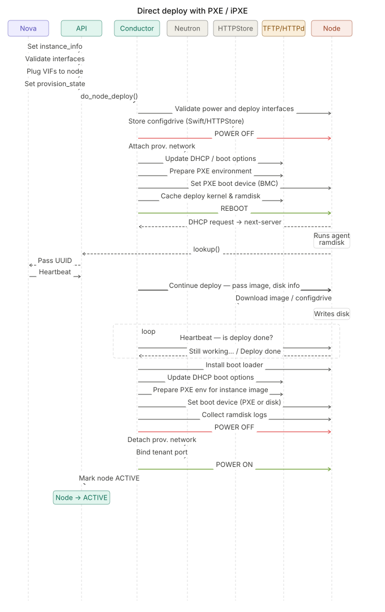
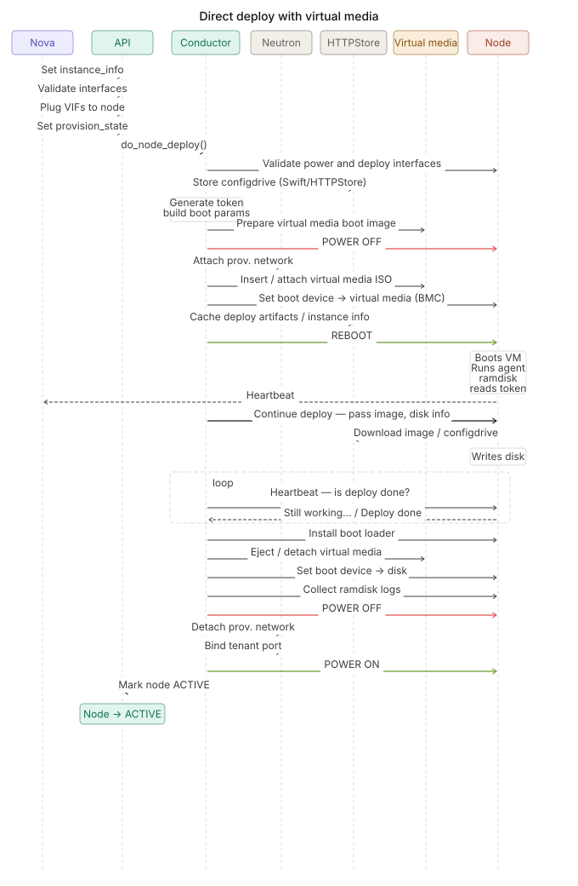

# OpenStack Ironic Operational Guide

OpenStack Ironic is the bare metal provisioning service in OpenStack. This guide provides a practical operational workflow for operators who already have a working OpenStack environment. It covers preparing the environment, enrolling hardware, validating node readiness, and launching instances using either PXE/iPXE or virtual media boot.

## Scope And Assumptions

This guide assumes the following:

- The OpenStack control plane, including Ironic and its supporting services, is installed and operational.
- An administrative OpenStack credentials file is available to the operator.
- The operator has permission to create networks, subnets, flavors, images, bare metal nodes, and instances.
- A deployable tenant operating system image is already available in Glance.
- The target node BMC is reachable from the Ironic conductor.
- Physical network connectivity between the Ironic services, bare-metal nodes, and their management controllers is available.
- For PXE or iPXE boot, the provisioning network and network-boot services are available.
- For virtual media boot, the provisioning network permits ramdisk connectivity and the hardware supports the `redfish-virtual-media` interface.

The prerequisites in this guide source the administrative credentials, create the provisioning network and bare metal flavor, upload the Ironic Python Agent images, and verify the required OpenStack resources.

## High-Level Workflow

The provisioning flow typically follows this sequence:

```text
Create provisioning network
   ->
Create flavor
   ->
Set bare metal resource class mapping
   ->
Enroll node in Ironic
   ->
Set node properties / driver info / boot interface
   ->
Create port(s)
   ->
Validate node
   ->
Manage node
   ->
Optionally perform manual cleaning
   ->
Provide node
   ->
Create server with matching flavor and required image
```

Ironic supports multiple boot interfaces. PXE is the standard network boot mechanism, while virtual media typically relies on the BMC to mount boot media remotely instead of using traditional PXE infrastructure.

## Prerequisites

Before enrolling a node, ensure that the OpenStack environment and all required services are properly configured and available.

### Source Administrative Credentials

Source the administrative OpenStack RC file:

```bash
source admin-openrc
```

### Create The Ironic Provisioning Network

Ironic requires a provisioning network regardless of whether you use PXE/iPXE or virtual media. Create a dedicated Neutron network for provisioning traffic:

```bash
openstack network create \
  --mtu 1500 \
  --provider-physical-network physnet2 \
  --provider-network-type flat \
  --disable-port-security \
  baremetal-provisioning-network

openstack subnet create \
  --allocation-pool start=172.23.209.11,end=172.23.211.254 \
  --gateway 172.23.208.1 \
  --dns-nameserver 1.1.1.1 \
  --subnet-range 172.23.208.0/22 \
  --network baremetal-provisioning-network \
  baremetal-provisioning-subnet
```

### Create Bare Metal Flavor

Bare metal flavors are used mainly for scheduling and user-facing size definitions. Standard resource properties are set to `0`, while a custom resource class is used for matching.

```bash
openstack flavor create \
  --ram 131072 \
  --vcpus 48 \
  --disk 480 \
  GP2.XL

openstack flavor set GP2.XL \
  --property resources:VCPU=0 \
  --property resources:MEMORY_MB=0 \
  --property resources:DISK_GB=0 \
  --property capabilities:boot_mode="uefi" \
  --property resources:CUSTOM_GP2_XL=1
```

The custom resource class must match the node's resource class. Nova represents an Ironic resource class by converting it to uppercase, replacing punctuation with underscores, and prefixing it with `CUSTOM_`. For example, the node resource class `GP2_XL` maps to `CUSTOM_GP2_XL`.

Verify the flavor after creation:

```bash
openstack flavor show GP2.XL
```

Expected result:

- The flavor exists.
- It includes the custom resource class property.
- Standard scheduling resource properties are set to zero.

### Upload Ironic Deployment Agent Images

Ironic Python Agent images are required for deployment and cleaning operations.

```bash
curl -o ipa-centos9-stable-2026.1.initramfs https://tarballs.opendev.org/openstack/ironic-python-agent/dib/files/ipa-centos9-stable-2026.1.initramfs
curl -o ipa-centos9-stable-2026.1.kernel https://tarballs.opendev.org/openstack/ironic-python-agent/dib/files/ipa-centos9-stable-2026.1.kernel

openstack image create ipa-centos9-stable-2026.1-aki --public \
   --disk-format aki --container-format aki \
   --file ipa-centos9-stable-2026.1.kernel

openstack image create ipa-centos9-stable-2026.1-ari --public \
   --disk-format ari --container-format ari \
   --file ipa-centos9-stable-2026.1.initramfs

openstack image create --container-format aki \
 --disk-format aki \
 --file </path/to/esp-image.img> \
 ubuntu-noble-esp
```

### Verify Core Resources

Verify that the expected OpenStack resources are available:

```bash
openstack flavor list
openstack image list
openstack network list
openstack keypair list
```

### Verify Ironic Services And Drivers

Confirm that the Ironic conductors are running and that the required drivers are active:

```bash
openstack baremetal conductor list
+-------------+-----------------+-------+
| Hostname    | Conductor Group | Alive |
+-------------+-----------------+-------+
| controller3 |                 | True  |
| controller2 |                 | True  |
| controller1 |                 | True  |
+-------------+-----------------+-------+

openstack baremetal driver list
+---------------------+---------------------------------------+
| Supported driver(s) | Active host(s)                        |
+---------------------+---------------------------------------+
| idrac               | controller3, controller2, controller1 |
| ipmi                | controller3, controller2, controller1 |
| redfish             | controller3, controller2, controller1 |
+---------------------+---------------------------------------+
```

## Enroll A Bare Metal Node

Node enrollment registers a physical server with Ironic. During enrollment you define the driver, boot interface, hardware properties, and network connectivity.

Choose one of the following methods:

1. PXE or iPXE boot
2. Virtual media boot

!!! warning "Redfish TLS certificate verification"
    The examples below set `redfish_verify_ca=False` to accommodate BMCs that use self-signed or otherwise untrusted certificates. This disables verification of the BMC's identity and can expose Redfish credentials and management operations to man-in-the-middle attacks. In production, leave this option unset or set it to `True` when the issuing CA is available in the conductor's trust store. Alternatively, set it to the path of a trusted CA certificate or certificate directory. Use `False` only as a documented exception on a controlled management network after assessing and accepting the risk.

### Option A: Enroll A Node With PXE Or IPXE Boot

PXE is the standard network boot path for hardware that supports network booting. In this model, the node downloads boot artifacts over the provisioning network.



#### Create The Node

This example uses the `redfish` driver, Redfish-based management, and the `ipxe` boot interface.

```bash
node=123456-compute1
node_mac="aa:bb:cc:dd:ee:ff" # MAC address of PXE interface
node_oob=x.x.x.x # Node ILO/IDRAC address
deploy_aki=ipa-centos9-stable-2026.1-aki
deploy_ari=ipa-centos9-stable-2026.1-ari
resource=GP2_XL
phys_arch=x86_64
phys_cpus=128
phys_ram=720896
phys_disk=960

openstack baremetal node create --driver redfish \
  --boot-interface ipxe \
  --driver-info redfish_username=root \
  --driver-info redfish_password=<REPLACE_WITH_PASSWORD> \
  --driver-info redfish_address=https://${node_oob} \
  --driver-info redfish_verify_ca=False \
  --driver-info redfish_system_id=/redfish/v1/Systems/System.Embedded.1 \
  --driver-info deploy_kernel=$(openstack image show "$deploy_aki" -c id -f value) \
  --driver-info deploy_ramdisk=$(openstack image show "$deploy_ari" -c id -f value) \
  --management-interface redfish \
  --power-interface redfish \
  --property cpus=$phys_cpus \
  --property memory_mb=$phys_ram \
  --property local_gb=$phys_disk \
  --property cpu_arch=$phys_arch \
  --property capabilities='boot_mode:uefi' \
  --resource-class $resource \
  --network-interface flat \
  --name $node

openstack baremetal port create $node_mac \
  --node `openstack baremetal node show $node -c uuid |awk -F "|" '/ uuid  / {print $3}'`

openstack baremetal node validate $node
openstack baremetal node manage $node
openstack baremetal node show $node -c provision_state

openstack baremetal node clean --clean-steps '[{"interface": "deploy", "step": "erase_devices_metadata"}]' $node

openstack baremetal node provide $node
```

### Option B: Enroll A Node With Virtual Media

Virtual media boot uses the server BMC to attach temporary boot media instead of depending on PXE infrastructure. This is commonly used with Redfish-capable hardware and UEFI-based booting.

Even when virtual media is used, the Ironic provisioning network is still required so the deployment ramdisk can communicate with the conductor and supporting services.



#### Create The Node

This example uses the `redfish` driver with the `redfish-virtual-media` boot interface.

```bash
node=123456-compute2
node_mac="aa:bb:cc:dd:ee:ff" # MAC address of provisioning interface
node_oob=x.x.x.x # Node ILO/IDRAC address
deploy_aki=ipa-centos9-stable-2026.1-aki
deploy_ari=ipa-centos9-stable-2026.1-ari
deploy_bootloader=ubuntu-noble-esp
resource=GP2_XL
phys_arch=x86_64
phys_cpus=128
phys_ram=720896
phys_disk=960

openstack baremetal node create --driver redfish \
  --driver-info redfish_address=https://${node_oob} \
  --driver-info redfish_username=root \
  --driver-info redfish_password=<REPLACE_WITH_PASSWORD> \
  --driver-info redfish_verify_ca=False \
  --name $node

openstack baremetal node set \
  --boot-interface redfish-virtual-media \
  $node

openstack baremetal node set \
  --driver-info bootloader=$(openstack image show ${deploy_bootloader} -c id -f value) \
  --driver-info deploy_kernel=$(openstack image show "$deploy_aki" -c id -f value) \
  --driver-info deploy_ramdisk=$(openstack image show "$deploy_ari" -c id -f value) \
  --property cpu_arch=$phys_arch \
  --property cpus=$phys_cpus \
  --property memory_mb=$phys_ram \
  --property local_gb=$phys_disk \
  --property capabilities='boot_mode:uefi' \
  --resource-class $resource \
  $node

openstack baremetal node set --property root_device='{"serial" : "<REPLACE_WITH_DISK_SERIAL>"}' \
  $node

openstack baremetal port create $node_mac \
  --node `openstack baremetal node show $node -c uuid |awk -F "|" '/ uuid  / {print $3}'`

openstack baremetal node validate $node
openstack baremetal node manage $node
openstack baremetal node show $node -c provision_state

openstack baremetal node clean --clean-steps '[{"interface": "deploy", "step": "erase_devices_metadata"}]' $node

openstack baremetal node provide $node
```

## Verify Node Availability

After enrollment, confirm that the bare metal node is visible in both Nova and Ironic. The node UUID shown in Nova should match the Ironic node UUID.

```bash
openstack hypervisor list |grep -v QEMU
+--------------------------------------+--------------------------------------+-----------------+--------------+-------+
| ID                                   | Hypervisor Hostname                  | Hypervisor Type | Host IP      | State |
+--------------------------------------+--------------------------------------+-----------------+--------------+-------+
| c260f8ae-ece5-4969-8bb4-3a1da7824578 | c260f8ae-ece5-4969-8bb4-3a1da7824578 | ironic          | None         | up    |
| a581f3cb-116b-43ff-b4f0-eb781f5550e9 | a581f3cb-116b-43ff-b4f0-eb781f5550e9 | ironic          | None         | up    |
+--------------------------------------+--------------------------------------+-----------------+--------------+-------+

openstack baremetal node list
+--------------------------------------+-----------------+---------------+-------------+--------------------+-------------+
| UUID                                 | Name            | Instance UUID | Power State | Provisioning State | Maintenance |
+--------------------------------------+-----------------+---------------+-------------+--------------------+-------------+
| c260f8ae-ece5-4969-8bb4-3a1da7824578 | 123456-compute1 | None          | power off   | available          | False       |
| a581f3cb-116b-43ff-b4f0-eb781f5550e9 | 123456-compute2 | None          | power off   | available          | False       |
+--------------------------------------+-----------------+---------------+-------------+--------------------+-------------+
```

Once the provisioning state is `available`, the node can be scheduled for deployment.

## Create A Bare Metal Server

Bare metal nodes frequently exceed default project quotas. Update quota values before creating an instance to avoid scheduling failures.

```bash
openstack quota set --cores -1 --ram -1 --instances 100 `openstack project show admin -c id -f value`

openstack server create \
  --flavor GP2.XL \
  --image ubuntu-noble-metal-1 \
  --use-config-drive \
  --key-name "<key_name>" \
  --hint query='["=", "$hypervisor_hostname", "<baremetal_node_UUID>"]' \
  --network baremetal-provisioning-network \
  $node

openstack server list
+--------------------------------------+-----------------------+--------+-----------------------------------------------+----------------------+-----------+
| ID                                   | Name                  | Status | Networks                                      | Image                | Flavor    |
+--------------------------------------+-----------------------+--------+-----------------------------------------------+----------------------+-----------+
| c3f40ae6-b6ec-4c5d-a6e2-2e09cdfa1f7c | 123456-compute1       | ACTIVE | baremetal-provisioning-network=172.29.233.33  | ubuntu-noble-metal-1 | GP2.XL    |
| f55b4119-528a-41c3-8907-956047cb6854 | 123456-compute2       | ACTIVE | baremetal-provisioning-network=172.29.234.61  | ubuntu-noble-metal-1 | GP2.XL    |
+--------------------------------------+-----------------------+--------+-----------------------------------------------+----------------------+-----------+
```

The scheduler hint shown in the example command is used to target a specific bare metal host.

## References

- [Drivers, hardware types, and hardware interfaces for Ironic](https://docs.openstack.org/ironic/latest/admin/drivers.html)
- [Enabling drivers and hardware types](https://docs.openstack.org/ironic/latest/install/enabling-drivers.html)
- [Boot interface](https://docs.openstack.org/ironic/latest/admin/interfaces/boot.html)
- [Bare Metal service features](https://docs.openstack.org/ironic/latest/admin/features.html)
- [Configuration and operation](https://docs.openstack.org/ironic/latest/admin/operation.html)
- [Architecture and implementation details](https://docs.openstack.org/ironic/latest/admin/architecture.html)
- [Create flavors](https://docs.openstack.org/ironic/latest/install/configure-nova-flavors.html)
- [Deploying with Bare Metal service](https://docs.openstack.org/ironic/latest/user/deploy.html)
- [Enrolling hardware with Ironic](https://docs.openstack.org/ironic/latest/install/enrollment.html)
- [Networking with the Baremetal service](https://docs.openstack.org/ironic/latest/admin/networking.html)
