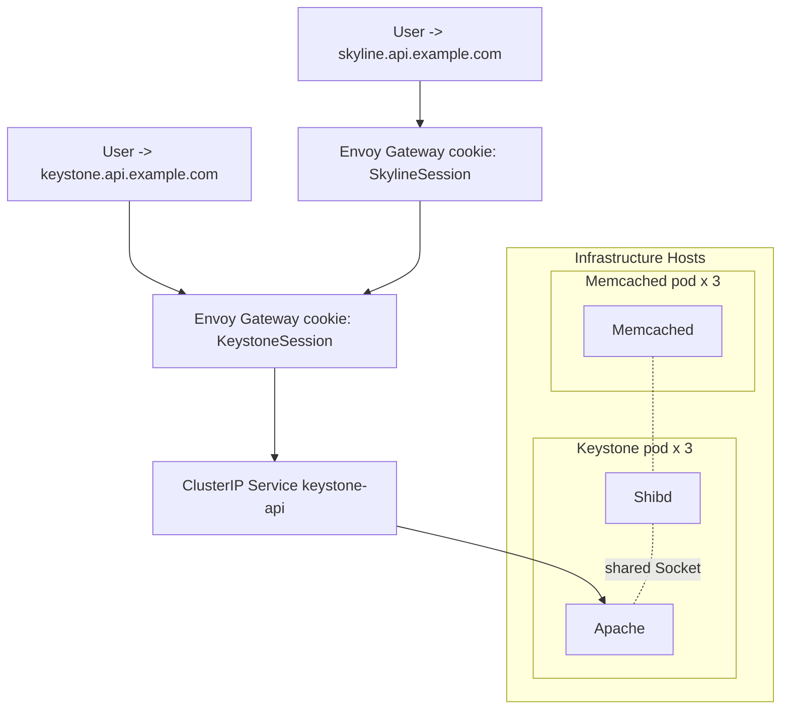
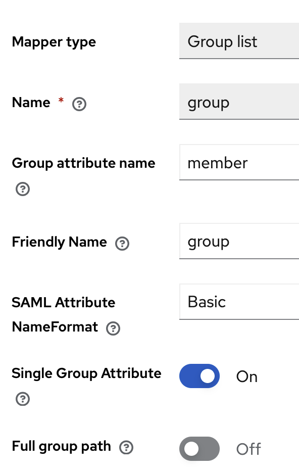
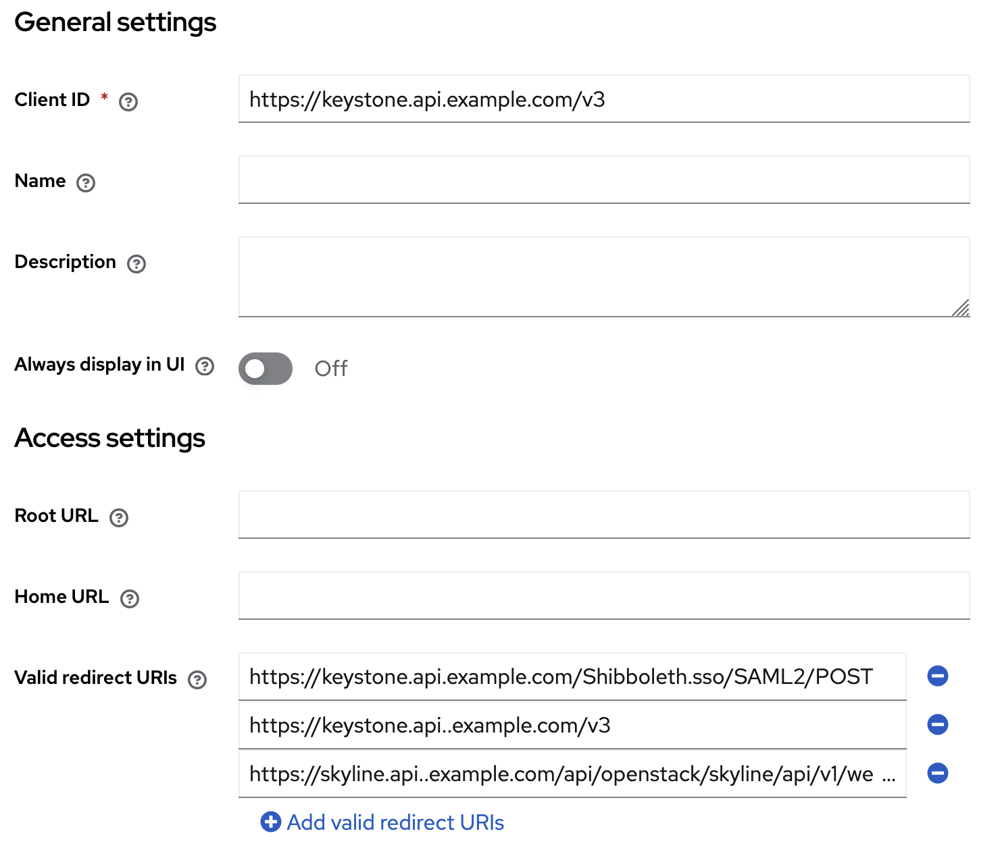

# Setup the Keystone Federation Plugins

## Create the Rackspace Domain

``` shell
openstack --os-cloud default domain create rackspace_cloud_domain
```

## Global Auth Identity Provider

First step is to create the identity provider and connect it to a domain.

``` shell
openstack --os-cloud default identity provider create --remote-id rackspace --domain rackspace_cloud_domain rackspace
```

### Create the Global Auth mapping for our identity provider

You're also welcome to generate your own mapping to suit your needs; however, if you want to use the example mapping (which is suitable for production) you can.

??? abstract "Example keystone `mapping.json` file"

    ``` json
    --8<-- "etc/keystone/mapping.json"
    ```

The example mapping **JSON** file can be found within the genestack repository at `/opt/genestack/etc/keystone/mapping.json`.

!!! tip "Creating the `creator` role"

    The creator role does not exist by default, but is included in the example
    mapping. One must create the creator role in order to prevent authentication
    errors if using the mapping "as is".

    ``` shell
    openstack --os-cloud default role create creator
    ```

### Register the Global Auth mapping within Keystone

``` shell
openstack --os-cloud default mapping create --rules /tmp/mapping.json --schema-version 2.0 rackspace_mapping
```

### Create the Global Auth federation protocol

``` shell
openstack --os-cloud default federation protocol create rackspace --mapping rackspace_mapping --identity-provider rackspace
```

### Rackspace Global Auth Configuration Options

The `[rackspace]` section can also be used in your `keystone.conf` to allow you to configure how to anchor on
roles.

| key | value | default |
| --- | ----- | ------- |
| `role_attribute` | A string option used as an anchor to discover roles attributed to a given user | **os_flex** |
| `role_attribute_enforcement` | When set `true` will limit a users project to only the discovered GUID for the defined `role_attribute` | **false** |

---

## SAML2 Service Provider

Before getting started with the SAML2 service provider setup, you will need to locate your SAML2 identity provider entity ID. This is the value
that will be used to configure the SAML2 identity provider within Keystone.

High level diagram of the SAML2 Service Provider environment



### Gather Shibboleth files

The following steps make the assumption that the system is running Docker and that the `docker` command is available. While these steps are useful,
they are not required. You can also use the `shibd` command directly on the host system or use file copies from the `shibboleth` package.

#### Retrieve the SAML2 files

A example *keystone-sp* configuration is provided under `/opt/genestack/etc/keystone-sp` and needs to be copied to the local configuration directory

``` shell
cp -r /opt/genestack/etc/keystone-sp /etc/genestack
```

??? "Extracting the configuration from the original source"

    Using the `docker` command and the shibd image, retrieve the SAML2 files from the container and place them in a local directory.

    ``` shell
    docker run -v /etc/genestack/keystone-sp:/mnt \
        ghcr.io/rackerlabs/genestack-images/shibd:latest \
        cp -R /etc/shibboleth /mnt/
    ```

#### Update the `shibboleth2.xml` file

The files will be created and stored in a kubernetes secret named `keystone-shib-etc` and mounted to `/etc/shibboleth` in the `keystone` pod. The files are:

Store the SAML metadata and configure the SAML identity provider at `/etc/genestack/keystone-sp/shibboleth/idp-metadata.xml`.

Before you can upload the secrets to the kubernetes cluster, you need to edit the `shibboleth2.xml` file.

!!! example "shibboleth2.xml file"

    ``` xml
    --8<-- "etc/keystone/shibboleth2.xml"
    ```

* The entity ID in the `SSO` field is the same value as the `EXAMPLE_ENTITY_ID_REPLACED_WITH_THE_ENTITY_ID_OF_THE_IDP` used when
  defining the OpenStack Identity provider.
* The references to `example.com` should be replaced with the actual domain name used within the cloud
* Take note of the memcached configuration in the `shibboleth2.xml` file. The `memcached` service is used to cache the SAML2
  responses and requests. The default configuration uses the `memcached` service running on the assumed cluster memcached environment
  using three different nodes: `memcached-{0,1,2}.memcached.openstack.svc.cluster.local:11211`. If the memcached service is on a
  different host or port, update the `shibboleth2.xml` file accordingly.

#### Update the logger to use the `console` logger"

The `shibd.logger` file is used to configure the logging for the SAML2 identity provider. The default logger is set to log to a
file which isn't ideal. It is recommended to update the logger to use the `console`.

``` shell
sed -i 's@fileName=.*@fileName=/dev/stdout@g' /etc/genestack/keystone-sp/shibboleth/shibd.logger
```

#### Update the Attribute Map

The `attribute-map.xml` file is used to configure the attribute mapping for the SAML2 identity provider. Every provider has a different
attribute mapping. The default attribute mapping is set to use the `urn:oid:` values. The `urn:oid:` values are the standard values
used by the SAML2 identity provider.

!!! genestack "Example `attribute-map.xml` configurations"

    === "Auth-0"

        The followig attributes are used by the Auth-0 identity provider. Add the following optins to the
        `attribute-map.xml` to have it compatible with the provided `saml-mapping.json` which will be used
        within keystone.

        ``` xml
        <!-- Auth-0 attributes -->
        <Attribute name="http://schemas.xmlsoap.org/ws/2005/05/identity/claims/emailaddress" id="REMOTE_EMAIL"/>
        <Attribute name="http://schemas.xmlsoap.org/ws/2005/05/identity/claims/name" id="uid"/>
        <Attribute name="http://schemas.xmlsoap.org/ws/2005/05/identity/claims/nameidentifier" id="REMOTE_UID"/>
        <Attribute name="http://schemas.auth0.com/email_verified" id="REMOTE_VERIFIED"/>
        <Attribute name="http://schemas.auth0.com/project_ids" id="REMOTE_PROJECT_NAME"/>
        <Attribute name="http://schemas.auth0.com/roles" id="REMOTE_ORG_PERSON_TYPE"/>
        ```

        Within the Auth-0 portal you can find the `project_ids` and `roles` attributes. The `project_ids` attribute
        is used to map the project name to the project ID. The `roles` attribute is used to map the roles to the user.

        !!! example "User Metadata"

            ``` json
            {
                "roles": [
                    "observer",
                    "creator",
                    "member"
                ],
                "project_ids": [
                    "project_id_1",
                    "project_id_2"
                ]
            }
            ```

    === "OKTA"

        The following attributes are used by the OKTA identity provider. Add the following options to the
        `attribute-map.xml` to have it compatible with the provided `saml-mapping.json` which will be used
        within keystone.

        ``` xml
        <!-- OKTA attributes -->
        <Attribute name="http://schemas.xmlsoap.org/ws/2005/05/identity/claims/emailaddress" id="REMOTE_EMAIL"/>
        <Attribute name="http://schemas.xmlsoap.org/ws/2005/05/identity/claims/name" id="uid"/>
        <Attribute name="http://schemas.xmlsoap.org/ws/2005/05/identity/claims/nameidentifier" id="REMOTE_UID"/>
        <Attribute name="http://schemas.okta.com/claims/email_verified" id="REMOTE_VERIFIED"/>
        <Attribute name="http://schemas.okta.com/claims/project_ids" id="REMOTE_PROJECT_NAME"/>
        <Attribute name="http://schemas.okta.com/claims/roles" id="REMOTE_ORG_PERSON_TYPE"/>
        ```

        Within the OKTA portal you can find the `project_ids` and `person_type` attributes. The `project_ids`
        attribute is used to map the project name to the project ID. The `person_type` attribute is used to map
        the roles to the user.

        !!! example "User Metadata"

            ``` json
            {
                "roles": [
                    "observer",
                    "creator",
                    "member"
                ],
                "project_ids": [
                    "project_id_1",
                    "project_id_2"
                ]
            }
            ```

    === "Rackspace"

        When using the Rackspace the `shibboleth2.xml` file must be updated to include signing for all requests and responses.

        The *shibboleth2.xml* file must be updated to include the following options, commonly the URLs of the entities

        ``` xml
        <ApplicationDefaults entityID="https://keystone.api.example.com/v3"
                             REMOTE_USER="eppn persistent-id targeted-id uid"
                             cipherSuites="DEFAULT:!EXP:!LOW:!aNULL:!eNULL:!DES:!IDEA:!SEED:!RC4:!3DES:!kRSA:!SSLv2:!SSLv3:!TLSv1:!TLSv1.1"
                             signing="true"
                             encryption="false"
                             signingAlg="http://www.w3.org/2001/04/xmldsig-more#rsa-sha256"
                             digestAlg="http://www.w3.org/2001/04/xmlenc#sha256"
                             NameIDFormat="urn:oasis:names:tc:SAML:2.0:nameid-format:entity">
        ```

        The `MetadataProvider` should be made dynamic.

        ``` xml
        <MetadataProvider type="XML"
                          validate="true"
                          url="https://example.com/idp.xml"
                          maxRefreshDelay="7200"
                          id="login.rackspace.com"
                          ignoreTransport="true"
                          cacheDirectory="rackspace">
            <MetadataFilter type="RequireValidUntil" maxValidityInterval="2419200"/>
        </MetadataProvider>
        ```

        Additionally the `Handler` for the `MetadataGenerator` must be updated to include signing:

        ``` xml
        <Handler type="MetadataGenerator"
                 Location="/Metadata"
                 signing="true"
                 signingAlg="http://www.w3.org/2001/04/xmldsig-more#rsa-sha256"
                 digestAlg="http://www.w3.org/2001/04/xmlenc#sha256"/>
        ```

        The following attributes are used by the Rackspace identity provider. Add the following options to the
        `attribute-map.xml` to have it compatible with the provided `mapping.json` which will be used
        within keystone.

        ``` xml
        <!-- Rackspace attributes -->
        <Attribute name="account_name" id="REMOTE_ACCOUNT_NAME"/>
        <Attribute name="auth_token" id="REMOTE_AUTH_TOKEN"/>
        <Attribute name="auth_url" id="REMOTE_AUTH_URL"/>
        <Attribute name="ddi" id="REMOTE_DDI"/>
        <Attribute name="domain" id="REMOTE_DOMAIN"/>
        <Attribute name="scoped_token" id="REMOTE_SCOPED_TOKEN"/>
        <Attribute name="session_creation_time" id="REMOTE_SESSION_CREATION"/>
        <Attribute name="urn:oid:1.2.840.113549.1.9.1.1" id="REMOTE_EMAIL"/>
        <Attribute name="user_id" id="uid"/>
        <Attribute name="username" id="REMOTE_USERNAME"/>
        ```

    === "Keycloak"

        The following attributes are an example of attributes exported through keycloak.
        The attributes name provided by keycloak depend on the backend configuration inside keycloak and how
        other identity provider are imported and mapped. Add the following options to the
        `attribute-map.xml` to have it compatible with the provided `saml-mapping.json` which will be used
        within keystone.

        ``` xml
        <!--- Keycloak provided attributes -->
        <Attribute name="urn:oasis:names:tc:SAML:1.1:nameid-format:unspecified" id="nameID"/>
        <Attribute name="username" nameFormat="urn:oasis:names:tc:SAML:2.0:attrname-format:basic" id="REMOTE_USERNAME"/>
        <Attribute name="member" nameFormat="urn:oasis:names:tc:SAML:2.0:attrname-format:basic" id="REMOTE_GROUP"/>
        <Attribute name="email" nameFormat="urn:oasis:names:tc:SAML:2.0:attrname-format:basic" id="REMOTE_EMAIL"/>
        <Attribute name="Role" nameFormat="urn:oasis:names:tc:SAML:2.0:attrname-format:basic" id="REMOTE_ROLE"/>
        ```

        The most simplest form of user mapping with Keycloak is to pass-through attributes and map to existing
        Keystone groups inside a domain. Those groups would inherit OpenStack roles such as *admin* or *member*


        !!! note
            By default Keycloak exports group names with a path prefix such as **/** and this behavior can be turned off
            with creating a mapping rule for a attribute such **group** and configure the option as shown below.
            In addition to disabling **Full Group Path** option, enable the **Single Group Attribute** option.

            Select your realm > Configure > User Federation > Provider (such as LDAP) > Mappers > Add Mapper

            {align=center : style="max-width:296px"}


        When using the Keycloak the *shibboleth2.xml* file must be updated to include signing for all requests and responses.

        The *shibboleth2.xml* file must be updated to include the following options, commonly the URLs marked with `example.com`.
        In this example the username attribute 

        ``` xml
        <ApplicationDefaults entityID="https://keystone.api.example.com/v3"
                             REMOTE_USER="username"
                             cipherSuites="DEFAULT:!EXP:!LOW:!aNULL:!eNULL:!DES:!IDEA:!SEED:!RC4:!3DES:!kRSA:!SSLv2:!SSLv3:!TLSv1:!TLSv1.1"
                             signing="true"
                             encryption="false"
                             signingAlg="http://www.w3.org/2001/04/xmldsig-more#rsa-sha256"
                             digestAlg="http://www.w3.org/2001/04/xmlenc#sha256"
                             NameIDFormat="urn:oasis:names:tc:SAML:2.0:nameid-format:entity">
        ```

        The `MetadataProvider` should be made dynamic, where *openstack* designates the created realm inside keycloak.

        ``` xml
        <MetadataProvider type="XML"
                          validate="true"
                          url="https://keycloak.example.com/realms/openstack/protocol/saml/descriptor"
                          maxRefreshDelay="7200"
                          backingFile="idp-metadata.xml">
            <MetadataFilter type="RequireValidUntil" maxValidityInterval="2419200"/>
        </MetadataProvider>
        ```

        Additionally the `Handler` for the `MetadataGenerator` must be updated to include signing:

        ``` xml
        <Handler type="MetadataGenerator"
                 Location="/Metadata"
                 signing="true"
                 signingAlg="http://www.w3.org/2001/04/xmldsig-more#rsa-sha256"
                 digestAlg="http://www.w3.org/2001/04/xmlenc#sha256"/>
        ```

        !!! note Configure Keystone SP inside keycloak
            Keystone SP must be introduced to keycloak as Client and entity ID among redirect URLs must be configured
            to enable the SAML protocol via *Client type* SAML

            {align=center}

#### Generate the SAML Keys

For **N** numbers of years. The keys are used to sign the SAML requests and responses.

``` shell
openssl req -x509 -newkey rsa:2048 -keyout sp-key.pem -out sp-cert.pem -days 1825 -nodes
```

!!! note "Define all values for the following options"

    | Name | Description |
    | ------ | ----------- |
    | Country Name | (2 letter code) |
    | State or Province Name | (full name) |
    | Locality Name | (eg, city) |
    | Organization Name | (eg, company) |
    | Organizational Unit Name | (eg, section) |
    | Common Name | (e.g. server FQDN or YOUR name) |
    | Email Address | (contact address) |

    The default filenames are:

    * sp-key.pem
    * sp-cert.pem

#### Upload the SAML2 files to the kubernetes cluster

Ingest all files into the kubernetes secret as a secrete, which will be mounted to the keystone pod.

``` shell
kubectl -n openstack create secret generic keystone-shibd-etc \
        --from-file=/etc/genestack/keystone-sp/shibboleth/attrChecker.html \
        --from-file=/etc/genestack/keystone-sp/shibboleth/attribute-map.xml \
        --from-file=/etc/genestack/keystone-sp/shibboleth/attribute-policy.xml \
        --from-file=/etc/genestack/keystone-sp/shibboleth/bindingTemplate.html \
        --from-file=/etc/genestack/keystone-sp/shibboleth/discoveryTemplate.html \
        --from-file=/etc/genestack/keystone-sp/shibboleth/globalLogout.html \
        --from-file=/etc/genestack/keystone-sp/shibboleth/idp-metadata.xml \
        --from-file=/etc/genestack/keystone-sp/shibboleth/localLogout.html \
        --from-file=/etc/genestack/keystone-sp/shibboleth/metadataError.html \
        --from-file=/etc/genestack/keystone-sp/shibboleth/partialLogout.html \
        --from-file=/etc/genestack/keystone-sp/shibboleth/postTemplate.html \
        --from-file=/etc/genestack/keystone-sp/shibboleth/protocols.xml \
        --from-file=/etc/genestack/keystone-sp/shibboleth/security-policy.xml \
        --from-file=/etc/genestack/keystone-sp/shibboleth/sessionError.html \
        --from-file=/etc/genestack/keystone-sp/shibboleth/shibboleth2.xml \
        --from-file=/etc/genestack/keystone-sp/shibboleth/shibd.logger \
        --from-file=/etc/genestack/keystone-sp/shibboleth/sp-cert.pem \
        --from-file=/etc/genestack/keystone-sp/shibboleth/sp-key.pem \
        --from-file=/etc/genestack/keystone-sp/shibboleth/sslError.html \
        --from-file=/etc/genestack/keystone-sp/shibboleth/sso_callback_template.html
```

### Create the SAML identity provider

Create the identity provider within Keystone. The `--remote-id` is the entity ID of the SAML identity provider. This is the value that will be used to configure the SAML2 `shibboleth2.xml` file.

``` shell
openstack --os-cloud default identity provider create \
          --remote-id EXAMPLE_ENTITY_ID_REPLACED_WITH_THE_ENTITY_ID_OF_THE_IDP \
          --domain rackspace_cloud_domain \
          IDENTITY_PROVIDER_NAME
```

#### Create the SAML auth mapping for our identity provider

You're also welcome to generate your own mapping to suit your needs; however, if you want to use the example mapping (which is suitable for production) you can.

!!! abstract "Example keystone `saml-mapping.json` file"

    === "Rackspace"

        ``` json
        --8<-- "etc/keystone/saml-mapping.json"
        ```

    === "Keycloak"

        ``` json
        [
            {
                "local": [
                    {
                        "user": {
                            "name": "{0}",
                            "email": "{1}",
                            "domain": {
                                "name": "KEYSTONE DOMAIN"
                            }
                        },
                            "group": {
                            "name": "{2}",
                            "domain": {
                                "name": "KEYSTONE DOMAIN"
                            }
                        }
                    }
                ],
                "remote": [
                    {
                        "type": "REMOTE_USERNAME"
                    },
                    {
                        "type": "REMOTE_EMAIL"
                    },
                    {
                        "type": "REMOTE_GROUP"
                    }
                ]
            }
        ]
        ```


The example mapping **JSON** file can be found within the genestack repository at `etc/keystone/saml-mapping.json`.

#### Register the SAML mapping within Keystone

``` shell
openstack --os-cloud default mapping create \
          --rules /opt/genestack/etc/keystone/saml-mapping.json \
          --schema-version 2.0 \
          saml_mapping
```

#### Create the SAML federation protocol

``` shell
openstack --os-cloud default federation protocol create saml2 \
          --mapping saml_mapping \
          --identity-provider IDENTITY_PROVIDER_NAME
```

### Redeploy the Keystone Helm Chart

Before running the deployment, you need to edit the `keystone-helm-overrides.yaml` file to include the following configuration options.

!!! example "keystone-helm-overrides.yaml"

    ``` yaml
    --8<-- "base-helm-configs/keystone/keystone-helm-overrides-saml.yaml.example"
    ```

    !!! note "Keystone Configuration Options"

        The above example is a sample configuration file that can be used to deploy Keystone with SAML2 support.
        The following options are important:

        * The `trusted_dashboard` configuration option in the above example must be updated to the public URL of the UI experience for the cloud
        * The references to `example.com` should be replaced with the actual domain name used within the cloud
        * The references to `IDENTITY_PROVIDER_NAME` should be replaced with the name of your identity provider (e.g., `Auth0`, `OKTA`)

Edit the Keystone Onverlay file at `/etc/genestack/kustomize/keystone/overlay/kustomization.yaml` to ensure that it is including the `federation` backend as the base.

``` yaml
kind: Kustomization
resources:
  - ../federation
```

Now run the helm deployment to update keystone to use the new federation setup.

``` shell
/opt/genestack/bin/install-keystone.sh
```

### Redeploy the Skyline UI with SSO Enabled

Finally update the Skyline configuration to use the SAML2 identity provider.

``` shell
echo sso-protocols: $(echo -n '["IDENTITY_PROVIDER_NAME"]' | base64)
echo sso-enabled: $(echo -n 'true' | base64)
echo sso-region: $(echo -n 'RegionOne' | base64)
echo keystone-endpoint: $(echo  -n 'https://keystone.api.example.com/v3' | base64)
```

!!! example "Output of the above command"

    ``` yaml
    sso-protocols: WyJJREVOVElUWV9QUk9WSURFUl9OQU1FIl0=
    sso-enabled: dHJ1ZQ==
    sso_region: UmVnaW9uT25l
    keystone-endpoint: aHR0cHM6Ly9rZXlzdG9uZS5hcGkuZXhhbXBsZS5jb20vdjM=
    ```

    !!! note "The Keystone Endpoint must be the public endpoint"

        The Keystone URL must be the URL of your Public Cloud Keystone service.

Edit the `skyline-apiserver-secrets` secret to include the new SSO configuration options.

``` shell
kubectl -n openstack edit secrets skyline-apiserver-secrets
```

Run the following command to update the skyline-apiserver deployment.

``` shell
kubectl -n openstack rollout restart deployment skyline
```

!!! genestack "Using the API with WebSSO and Federation"

    When the SAML driver is enabled, the OpenStack API will not permit authentication via username and password.
    To best leverage the OpenStack API, it is recommended to use an Application Credential to authenticate. This
    can be done by creating an Application Credential in the Skyline UI and then using the `openstack` CLI to
    authenticate. Once an Application Credential is created, the OpenStack Clouds YAML file can be updated to
    include the Application Credential ID and Secret, as show here.

    ``` yaml
    rxt-application-credential:
        auth_type: v3applicationcredential
        auth:
            auth_url: http://localhost:5000/v3
            application_credential_id: ${APP_CRED_ID}
            application_credential_secret: ${APP_CRED_SECRET}
        region_name: RegionOne
        interface: internal
        identity_api_version: "3"
    ```
