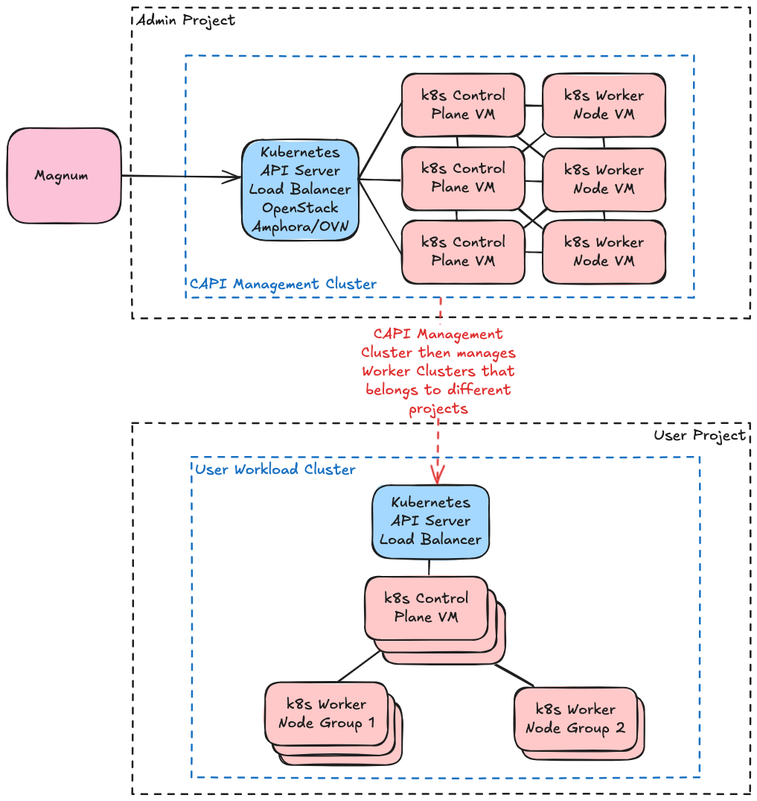

# Deploy Magnum

OpenStack Magnum is the container orchestration service within the OpenStack ecosystem, designed to provide an easy-to-use interface for deploying and managing container clusters, such as Kubernetes. Magnum enables cloud users to harness the power of containerization by allowing them to create and manage container clusters as first-class resources within the OpenStack environment. This service integrates seamlessly with other OpenStack components, enabling containers to take full advantage of OpenStack’s networking, storage, and compute capabilities. In this document, we will outline the deployment of OpenStack Magnum using Genestac. By utilizing Genestack, the deployment of Magnum is streamlined, allowing organizations to efficiently manage and scale containerized applications alongside traditional virtual machine workloads within their cloud infrastructure.

!!! note

    Before Magnum can be deployed, you must setup and deploy [Barbican](openstack-barbican.md) first.

## Create secrets

!!! note "Information about the secrets used"

    Manual secret generation is only required if you haven't run the `create-secrets.sh` script located in `/opt/genestack/bin`.

    ??? example "Example secret generation"

        ``` shell
        kubectl --namespace openstack \
                create secret generic magnum-rabbitmq-password \
                --type Opaque \
                --from-literal=username="magnum" \
                --from-literal=password="$(< /dev/urandom tr -dc _A-Za-z0-9 | head -c${1:-64};echo;)"
        kubectl --namespace openstack \
                create secret generic magnum-db-password \
                --type Opaque \
                --from-literal=password="$(< /dev/urandom tr -dc _A-Za-z0-9 | head -c${1:-32};echo;)"
        kubectl --namespace openstack \
                create secret generic magnum-admin \
                --type Opaque \
                --from-literal=password="$(< /dev/urandom tr -dc _A-Za-z0-9 | head -c${1:-32};echo;)"
        ```

## Run the package deployment

!!! example "Run the Magnum deployment Script `/opt/genestack/bin/install-magnum.sh`"

    ``` shell
    --8<-- "bin/install-magnum.sh"
    ```

!!! tip

    You may need to provide custom values to configure your openstack services, for a simple single region or lab deployment you can supply an additional overrides flag using the example found at `base-helm-configs/aio-example-openstack-overrides.yaml`.
    In other cases such as a multi-region deployment you may want to view the [Multi-Region Support](multi-region-support.md) guide to for a workflow solution.

## Validate functionality

``` shell
kubectl --namespace openstack exec -ti openstack-admin-client -- openstack coe cluster list
```

## Create a Public ClusterTemplate

User must have the admin role to create the public ClusterTemplate. For instructions on creating and using it to deploy a new Kubernetes cluster, please refer to the ClusterTemplate section in the [Magnum Kubernetes Cluster Setup Guide](https://docs.rackspacecloud.com/magnum-kubernetes-cluster-setup-guide/#clustertemplate).


# Deploying Magnum with Cluster API (CAPI) Driver

Magnum can use CAPI as the backend driver to spin up k8s clusters. Magnum CAPI Helm is one of the projects that provides an OpenStack Magnum driver which uses Helm to create the clustr with CAPI. The documentation below assume you are using magnum-capi-helm as your CAPI driver. Diver can be found [here.](https://opendev.org/openstack/magnum-capi-helm)

{ width="500" height=900}


### Prerequisites

Before deploying magnum with the CAPI Driver:

1. Ensure your magnum image has the magnum-capi-helm driver installed. See our [Magnum Containerfile.](https://github.com/rackerlabs/genestack-images/blob/main/ContainerFiles/magnum)
2. Ensure your magnum image has helm installed. See our [Magnum Containerfile.](https://github.com/rackerlabs/genestack-images/blob/main/ContainerFiles/magnum)
3. Ensure you are using magnum helm version 2025.1 or above, as CAPI functionality was added on openstack-helm during this release.
4. You will need a management cluster for CAPI. See [How CAPI Works](https://cluster-api.sigs.k8s.io) with mgt cluster to spin up worker nodes.
5. On your management cluster make sure you install cluster-addon. It is found [here.](https://github.com/azimuth-cloud/cluster-api-addon-provider)

### Magnum Helm Config

In order to switch to CAPI we need to make sure that magnum has the right config passed to it. Here is an example we can use:

```
conf:
  capi:
    enabled: true
    clusterName: k8s-managment-cluster
    apiServer: https://127.0.0.1:6443
    certificateAuthorityData: < k8s-managment-cluster CA Data > 
    contextName: k8s-management
    userName: admin@k8s-management
    clientCertificateData: < k8s-managment-cluster clientCert Data > 
    clientKeyData: < k8s-managment-cluster clientKey Data >
  magnum:
    capi_helm:
      kubeconfig_file: /etc/magnum/kubeconfig.conf
    barbican_client:
      endpoint_type: publicURL
      region_name: RegionOne
    cinder_client:
      endpoint_type: publicURL
      region_name: RegionOne
   ... 
```

First, make sure the capi section has the management cluster kubeconfig file content. This will be used by magnum to talk to managment cluster.
Next, under magnum add the capi_helm config to point to where we find the kubeconfig file. This is usually at `/etc/magnum/kubeconfig.con`.
Additionally we can make the driver point to specific helm charts. This is useful if you have made changes specific to your environment to the chart
and would like to use that. This can be done like so:

```
magnum:
    capi_helm:
      kubeconfig_file: /etc/magnum/kubeconfig.conf
      helm_chart_repo: https://rackerlabs.github.io/genestack-capi-helm-charts
      default_helm_chart_version: 0.1.0
```
