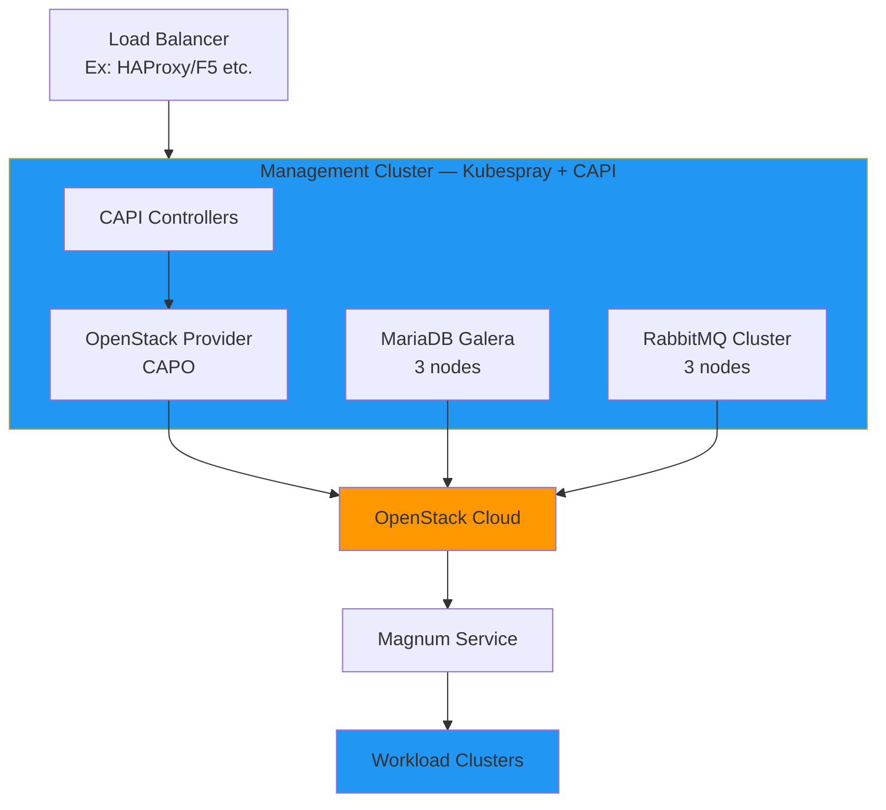

# Magnum Enablement

OpenStack Magnum is the container orchestration service within the OpenStack ecosystem, designed to provide an easy-to-use interface for deploying and managing container clusters, such as Kubernetes. Magnum enables cloud users to harness the power of containerization by allowing them to create and manage container clusters as first-class resources within the OpenStack environment. This service integrates seamlessly with other OpenStack components, enabling containers to take full advantage of OpenStack’s networking, storage, and compute capabilities. In this document, we will outline the deployment of OpenStack Magnum using Genestack. By utilizing Genestack, the deployment of Magnum is streamlined, allowing organizations to efficiently manage and scale containerized applications alongside traditional virtual machine workloads within their cloud infrastructure.

!!! abstract "Overview"
    This comprehensive guide covers the complete installation process from management cluster setup to workload cluster deployment using **Kubespray**, **Cluster API (CAPI)**, and **OpenStack Magnum**.

!!! note

    Before Magnum can be deployed, you must setup and deploy [Barbican](openstack-barbican.md) first.

---

## Management Cluster Installation

!!! info "What is a Management Cluster?"
    The management cluster is a **separate, dedicated Kubernetes cluster** that hosts Cluster API (CAPI) controllers. It manages the lifecycle of workload clusters, handling provisioning, scaling, and upgrades.

    This is **not** the existing Genestack Kubernetes cluster. The management cluster must be provisioned as a standalone cluster on dedicated infrastructure, typically VMs created by the **admin account** (not tenant accounts). These VMs serve as the CAPI control plane and should be treated as part of your cloud infrastructure, similar to how the Genestack controllers are managed.

    In summary:

    - You need to create **new VMs** (3 nodes recommended for HA) to host this cluster.
    - These VMs should be provisioned by the **admin**, not in tenant/user accounts.
    - The management cluster runs independently from the Genestack cluster and is responsible solely for managing CAPI-based workload clusters created through Magnum.
    - The Genestack cluster continues to run OpenStack services (Magnum API, conductor, etc.), while the management cluster runs the CAPI controllers that provision tenant workload clusters on OpenStack.

    More Info on concepts can be found at [cluster-api](https://cluster-api.sigs.k8s.io/user/concepts) site.

### :material-sitemap: Architecture Overview

A high-level overview of the architecture and flow.


```mermaid
graph TB
    G[Load Balancer<br/> Ex: HAProxy/F5 etc. ] --> A

    subgraph A["Management Cluster — Kubespray + CAPI"]
        B[CAPI Controllers]
        C[OpenStack Provider<br/>CAPO]
        H[MariaDB Galera<br/>3 nodes]
        I[RabbitMQ Cluster<br/>3 nodes]

        B --> C
    end

    C --> D[OpenStack Cloud]
    H --> D
    I --> D
    D --> E[Magnum Service]
    E --> F[Workload Clusters]

    style A fill:#2196F3
    style F fill:#2196F3
    style D fill:#FF9800
```

### :material-check-decagram: Prerequisites Check

#### Create Management Cluster VM's

The management cluster infrastructure (project, network, instances, load balancer, etc.) can be provisioned automatically using the `capi_cluster` Ansible role included in Genestack, or manually if you prefer full control.

=== "Automated (Recommended)"

    The `capi_cluster` Ansible role automates the entire infrastructure setup including:

    - OpenStack project and user creation (in the `service` domain)
    - Network, subnet, router, and security group provisioning
    - Flavor, image (Ubuntu 24.04), keypair, and volume creation
    - Octavia load balancer for the Kubernetes API
    - Boot-from-volume instance provisioning (3 nodes)
    - Kubespray-based Kubernetes cluster installation
    - CAPI component initialization and etcd backup configuration

    !!! warning "Prerequisites for the Ansible Role"
        - Cinder volume service must be enabled (role uses boot-from-volume instances)
        - A pre-created shared external Neutron network (flat or VLAN)
        - Keystone admin credentials
        - Octavia service enabled (role creates a load balancer)
        - DNS server reachable from the external network that can resolve OpenStack service endpoints
        - OpenStack SDK installed on the Ansible control node (the Genestack venv is sufficient)
        - Sufficient Glance storage for the Ubuntu 24.04 image upload
        - If OpenStack endpoints are behind a TLS gateway, certificates must be signed by a well-known CA (self-signed certs will cause failures)

    Run the playbook from the Genestack ansible playbooks directory:

    ```bash
    cd /opt/genestack/ansible/playbooks

    ansible-playbook capi-mgmt-cluster-main.yaml \
      -e os_admin_password=<keystone_admin_password> \
      -e os_user_password=<capi_mgmt_user_password> \
      -e ext_net_id='<external_network_uuid>'
    ```

    | Parameter | Description |
    |-----------|-------------|
    | `os_admin_password` | Keystone admin user password |
    | `os_user_password` | Password for the new CAPI management user |
    | `ext_net_id` | UUID of the pre-existing external Neutron network |

    ??? info "Key Role Variables (Customizable)"
        Override these via `-e` flags or by editing `ansible/roles/capi_cluster/defaults/main.yml`:

        | Variable | Default | Description |
        |----------|---------|-------------|
        | `capi_mgmt_subnet_cidr` | `172.16.51.0/24` | Subnet CIDR for management network |
        | `capi_mgmt_dns_servers` | `10.239.0.55` | DNS server for the management cluster |
        | `capi_mgmt_cluster_flavor.vcpus` | `4` | vCPUs per management VM |
        | `capi_mgmt_cluster_flavor.ram` | `4096` | RAM (MB) per management VM |
        | `capi_mgmt_cluster_volume_type` | `lvmdriver-1` | Cinder volume type for boot volumes |
        | `capi_mgmt_cluster_volumes[].size` | `15` | Boot volume size (GB) per instance |
        | `capi_mgmt_etcd_backup_volume.size` | `5` | etcd backup volume size (GB) |
        | `capi_boot_from_volume` | `true` | Boot instances from Cinder volumes |
        | `capi_mgmt_dns_forwarders` | `[10.239.0.55]` | DNS forwarders for CoreDNS |

        Refer to `ansible/roles/capi_cluster/defaults/main.yml` for the full list of variables.

    The playbook will:

    1. Create the `capi-mgmt-cluster-project` in the `service` domain with appropriate quotas
    2. Provision all OpenStack infrastructure (network, LB, instances, etc.)
    3. Install Kubernetes via Kubespray on the 3 management VMs
    4. Copy the kubeconfig to `/var/tmp/capi_mgmt_cluster.kubeconfig` on the control node

    !!! success "After Completion"
        Once the playbook finishes, skip ahead to [Install clusterctl](#install-clusterctl) to continue with CAPI initialization. The Kubespray installation, Python venv setup, and cluster configuration steps below are handled by the role.

=== "Manual"

    If you prefer to provision the management cluster VMs manually, follow the steps below.

    !!! note "OpenStack as a Platform for Creating Management VMs"
        If these VMs are to be created as admin tenant on OpenStack, a relevant flavor needs to be created with the following recommendations.

    - CPU: 12 vCPU per VM
    - Memory: 16 GB per VM
    - Disk: Minimum 100GB disk

    Following Disk Size/Partitioning is an example only:

    | Mount point      | Capacity | FS    | VG                       | LV           | Disk |
    |------------------|----------|-------|--------------------------|--------------|------|
    | `/boot`          | 1GB      | ext4  | -                        | -            | sda  |
    | `/boot/efi`      | 256MB    | fat32 | -                        | -            | sda  |
    | `/home`          | 10GB     | ext4  | vglocal00                | lv-home      | sda  |
    | `/`              | 100GB    | ext4  | vglocal00                | lv-root      | sda  |
    | `/opt`           | 10GB     | ext4  | vglocal00                | lv-opt       | sda  |
    | `/root`          | 20GB     | ext4  | vglocal00                | lv-home-root | sda  |
    | `/tmp`           | 10GB     | ext4  | vglocal00                | lv-tmp       | sda  |
    | `/var`           | 50GB     | ext4  | vglocal00                | lv-var       | sda  |
    | `/var/log`       | 50GB     | ext4  | vglocal00                | lv-log       | sda  |
    | `/var/lib/kubelet` | 50GB   | ext4  | vglocal00                | lv-kubelet   | sda  |
    | `/var/lib/etcd`  | 50GB     | ext4  | vglocal00                | -            | sdb  |

#### Verify Python 3 is installed on all master nodes in the management cluster.

=== "Command"

    ```bash
    python3 --version
    ```

=== "Expected Output"

    ```bash
    root@k8s-master01:~# python3 --version 
    Python 3.10.12

    root@k8s-master02:~# python3 --version 
    Python 3.10.12

    root@k8s-master03:~# python3 --version 
    Python 3.10.12
    ```

!!! success "Verification"
    - [x] Python 3.10+ installed on all nodes
    - [x] Consistent Python version across nodes

---

### :material-package-variant: Install Python Virtual Environment

Install the Python virtual environment package on `master-01`.

```bash
apt-get install python3.10-venv
```

---

### :material-console: Create Tmux Session

On `master-01` create a tmux session to ensure the installation continues even if the connection drops.

```bash
tmux new -s capi-mgmt-cluster
```

!!! tip "Tmux Benefits"
    Using tmux ensures your installation continues running even if your SSH connection drops. 
    You can reattach later with `tmux attach -t capi-mgmt-cluster`.

---

### :material-git: Clone Kubespray Repository

On `master-01` clone the Kubespray repository to `/opt/kubespray`.

=== "Command"

    ```bash
    git clone https://github.com/kubernetes-sigs/kubespray.git /opt/kubespray
    ```

=== "Expected Output"

    ```bash
    Cloning into '/opt/kubespray'...
    remote: Enumerating objects: 85588, done.
    remote: Counting objects: 100% (138/138), done.
    remote: Compressing objects: 100% (97/97), done.
    remote: Total 85588 (delta 88), reused 40 (delta 40), pack-reused 85450 (from 4)
    Receiving objects: 100% (85588/85588), 27.92 MiB | 9.75 MiB/s, done.
    Resolving deltas: 100% (48001/48001), done.
    ```

---

### :material-language-python: Setup Python Virtual Environment

On `master-01` : Create and activate a Python virtual environment for Kubespray.

```bash
python3 -m venv ~/.venvs/kubespray-venv
source ~/.venvs/kubespray-venv/bin/activate
```

---

### :material-download: Install Kubespray Dependencies

On `master-01` : Navigate to the Kubespray directory and install required Python packages.

=== "Command"

    ```bash
    cd /opt/kubespray/
    pip install -U -r requirements.txt
    ```
=== "Expected Output"

    ```bash
    Collecting ansible==10.7.0
    Downloading ansible-10.7.0-py3-none-any.whl (51.6 MB)
        ━━━━━━━━━━━━━━━━━━━━━━━━━━━━━━━━━━━━━━━━ 51.6/51.6 MB 29.5 MB/s eta 0:00:00
    Collecting cryptography==46.0.3
    Downloading cryptography-46.0.3-cp38-abi3-manylinux_2_34_x86_64.whl (4.5 MB)
        ━━━━━━━━━━━━━━━━━━━━━━━━━━━━━━━━━━━━━━━━ 4.5/4.5 MB 42.1 MB/s eta 0:00:00
    Collecting jmespath==1.0.1
    Downloading jmespath-1.0.1-py3-none-any.whl (20 kB)
    Collecting netaddr==1.3.0
    Downloading netaddr-1.3.0-py3-none-any.whl (2.3 MB)
        ━━━━━━━━━━━━━━━━━━━━━━━━━━━━━━━━━━━━━━━━ 2.3/2.3 MB 81.6 MB/s eta 0:00:00
    Collecting ansible-core~=2.17.7
    Downloading ansible_core-2.17.14-py3-none-any.whl (2.2 MB)
        ━━━━━━━━━━━━━━━━━━━━━━━━━━━━━━━━━━━━━━━━ 2.2/2.2 MB 75.7 MB/s eta 0:00:00
    Collecting typing-extensions>=4.13.2
    Downloading typing_extensions-4.15.0-py3-none-any.whl (44 kB)
        ━━━━━━━━━━━━━━━━━━━━━━━━━━━━━━━━━━━━━━━━ 44.6/44.6 KB 13.2 MB/s eta 0:00:00
    Collecting cffi>=2.0.0
    Downloading cffi-2.0.0-cp310-cp310-manylinux2014_x86_64.manylinux_2_17_x86_64.whl (216 kB)
        ━━━━━━━━━━━━━━━━━━━━━━━━━━━━━━━━━━━━━━━━ 216.5/216.5 KB 47.4 MB/s eta 0:00:00
    Collecting packaging
    Downloading packaging-26.0-py3-none-any.whl (74 kB)
        ━━━━━━━━━━━━━━━━━━━━━━━━━━━━━━━━━━━━━━━━ 74.4/74.4 KB 23.3 MB/s eta 0:00:00
    Collecting resolvelib<1.1.0,>=0.5.3
    Downloading resolvelib-1.0.1-py2.py3-none-any.whl (17 kB)
    Collecting jinja2>=3.0.0
    Downloading jinja2-3.1.6-py3-none-any.whl (134 kB)
        ━━━━━━━━━━━━━━━━━━━━━━━━━━━━━━━━━━━━━━━━ 134.9/134.9 KB 38.8 MB/s eta 0:00:00
    Collecting PyYAML>=5.1
    Downloading pyyaml-6.0.3-cp310-cp310-manylinux2014_x86_64.manylinux_2_17_x86_64.manylinux_2_28_x86_64.whl (770 kB)
        ━━━━━━━━━━━━━━━━━━━━━━━━━━━━━━━━━━━━━━━━ 770.3/770.3 KB 105.6 MB/s eta 0:00:00
    Collecting pycparser
    Downloading pycparser-3.0-py3-none-any.whl (48 kB)
        ━━━━━━━━━━━━━━━━━━━━━━━━━━━━━━━━━━━━━━━━ 48.2/48.2 KB 12.1 MB/s eta 0:00:00
    Collecting MarkupSafe>=2.0
    Downloading markupsafe-3.0.3-cp310-cp310-manylinux2014_x86_64.manylinux_2_17_x86_64.manylinux_2_28_x86_64.whl (20 kB)
    Installing collected packages: resolvelib, typing-extensions, PyYAML, pycparser, packaging, netaddr, MarkupSafe, jmespath, jinja2, cffi, cryptography, ansible-core, ansible
    Successfully installed MarkupSafe-3.0.3 PyYAML-6.0.3 ansible-10.7.0 ansible-core-2.17.14 cffi-2.0.0 cryptography-46.0.3 jinja2-3.1.6 jmespath-1.0.1 netaddr-1.3.0 packaging-26.0 pycparser-3.0 resolvelib-1.0.1 typing-extensions-4.15.0
    ```

=== "Key Packages Installed"

    | Package | Version | Purpose |
    |---------|---------|---------|
    | **ansible** | 10.7.0 | Automation engine |
    | **ansible-core** | 2.17.14 | Core Ansible functionality |
    | **cryptography** | 46.0.3 | Cryptographic operations |
    | **jinja2** | 3.1.6 | Template engine |
    | **netaddr** | 1.3.0 | Network address manipulation |

!!! check "Installation Complete"
    All dependencies installed successfully. Ready to configure inventory.

---

### :material-file-tree: Configure Kubespray Inventory

Copy the sample inventory to create a custom configuration.

```bash
(kubespray-venv) root@k8s-master01:/opt/kubespray# cp -rfp inventory/sample inventory/capi-mgmt-cluster
```

---

### :material-file-document-edit: Create Ansible Inventory File

On `master-01` : Create the `inventory.ini` file with your cluster node configuration.

=== "inventory.ini"

    ```ini
    # This inventory describes a HA topology with stacked etcd (== same nodes as control plane)
    # See https://docs.ansible.com/ansible/latest/inventory_guide/intro_inventory.html
    
    [all] 
    k8s-master01 ansible_host=192.168.1.1 etcd_member_name=k8s-master01
    k8s-master02 ansible_host=192.168.1.2 etcd_member_name=k8s-master02
    k8s-master03 ansible_host=192.168.1.3 etcd_member_name=k8s-master03
    
    [kube_control_plane]
    k8s-master01
    k8s-master02 
    k8s-master03
    
    [etcd:children]
    kube_control_plane
    
    [kube_node]
    k8s-master01
    k8s-master02 
    k8s-master03
    
    [calico_rr] 
     
    [k8s_cluster:children] 
    kube_control_plane 
    kube_node 
    calico_rr
    ```

=== "Configuration Notes"

    | Section | Purpose |
    |---------|---------|
    | `[all]` | All cluster nodes with IP addresses |
    | `[kube_control_plane]` | Control plane nodes (masters) |
    | `[etcd:children]` | etcd cluster members |
    | `[kube_node]` | Worker nodes (in this case, same as control plane) |

!!! note "HA Configuration"
    This configuration creates a 3-node HA cluster with stacked etcd, where control plane nodes also run etcd.

---

### :material-connection: Test Ansible Connectivity

On `master-01` : Verify that Ansible can reach all nodes.

=== "Command"

    ```bash
    ansible -i /opt/kubespray/inventory/capi-mgmt-cluster/inventory.ini all -m ping
    ```

=== "Expected Output"

    ```bash
    k8s-master01 | SUCCESS => {
        "ansible_facts": {
            "discovered_interpreter_python": "/usr/bin/python3.10"
        },
        "changed": false,
        "ping": "pong"
    }
    k8s-master02 | SUCCESS => { ... "ping": "pong" }
    k8s-master03 | SUCCESS => { ... "ping": "pong" }
    ```

!!! success "Connectivity Verified"
    All nodes are reachable via Ansible.

---

### :material-cog: Configure Cluster Variables

On `master-01` : Create the necessary configuration files for the cluster.

=== "capi-cluster-vars.yml"

    ```yaml
    ---
    kube_version: 1.32.0 
    apiserver_loadbalancer_domain_name: "capi-mgmt.cluster.local" 
    loadbalancer_apiserver: 
        address: 192.168.1.254
        port: 6443 
    loadbalancer_apiserver_localhost: false 
    loadbalancer_apiserver_port: 6443
    ```
    
    Location: `/opt/kubespray/inventory/capi-mgmt-cluster/group_vars/all/capi-cluster-vars.yml`

=== "capi-mgmt-vars.yml"

    ```yaml
    ---
    helm_enabled: true
    ```
    
    Location: `/opt/kubespray/inventory/capi-mgmt-cluster/group_vars/k8s_cluster/capi-mgmt-vars.yml`

!!! info "Configuration Details"
    - **Load Balancer:** 192.168.1.254:6443 (HAProxy or similar)
    - **Kubernetes Version:** 1.32.0
    - **Helm:** Enabled for package management

---

### :material-play-circle: Run Kubespray Playbook

On `master-01` : Execute the Kubespray playbook to deploy the Kubernetes cluster.

=== "Command"

    ```bash
    ansible-playbook -i inventory/capi-mgmt-cluster/inventory.ini cluster.yml
    ```

=== "Deployment Summary"

    ```
    PLAY RECAP *******************************************************************
    k8s-master01    : ok=640  changed=145  unreachable=0  failed=0  skipped=1006
    k8s-master02    : ok=556  changed=133  unreachable=0  failed=0  skipped=914
    k8s-master03    : ok=558  changed=134  unreachable=0  failed=0  skipped=912
    
    Total Time: 0:09:32.750
    ```

=== "Top Time-Consuming Tasks"

    | Task | Duration |
    |------|----------|
    | Download container images | 43.26s |
    | Join control plane nodes | 28.97s |
    | Initialize first control plane | 24.12s |
    | Wait for kube-controller-manager | 23.32s |

!!! success "Deployment Complete"
    The Kubernetes cluster has been successfully deployed in approximately 10 minutes.

---

### :material-check-circle: Verify Management Cluster Installation

On `master-01` : Check that all nodes are ready and running.

=== "Check Nodes"

    ```bash
    kubectl get nodes -o wide
    NAME            STATUS   ROLES           AGE     VERSION   INTERNAL-IP     EXTERNAL-IP   OS-IMAGE             KERNEL-VERSION       CONTAINER-RUNTIME
    k8s-master01   Ready    control-plane   3m46s   v1.32.0   192.168.1.1   <none>        Ubuntu 22.04.5 LTS   5.15.0-119-generic   containerd://2.2.1
    k8s-master02   Ready    control-plane   2m54s   v1.32.0   192.168.1.2   <none>        Ubuntu 22.04.5 LTS   5.15.0-119-generic   containerd://2.2.1
    k8s-master03   Ready    control-plane   2m43s   v1.32.0   192.168.1.3   <none>        Ubuntu 22.04.5 LTS   5.15.0-119-generic   containerd://2.2.1
    ```

=== "Check System Pods"

    ```bash
    kubectl get po -A
    ```
    
    Key pods to verify:
    
    - **Calico:** Network plugin (calico-kube-controllers, calico-node)
    - **CoreDNS:** DNS service (coredns)
    - **Control Plane:** API server, controller-manager, scheduler
    - **Kube-proxy:** Network proxy on each node
    - **NodeLocalDNS:** Local DNS cache

!!! success "Cluster Operational"
    All nodes are `Ready` and all system pods are `Running`.

---

### :material-remote-desktop: Configure Remote Access

On `master-01` : Prepare the kubeconfig file (`capi-mgmt-cluster.kubeconfig`) for remote access.

=== "Verify Remote Access"

    ```bash
    kubectl --kubeconfig=capi-mgmt-cluster.kubeconfig get nodes -o wide
    NAME            STATUS   ROLES           AGE     VERSION   INTERNAL-IP     EXTERNAL-IP   OS-IMAGE             KERNEL-VERSION       CONTAINER-RUNTIME
    k8s-master01   Ready    control-plane   7m10s   v1.32.0   192.168.1.1   <none>        Ubuntu 22.04.5 LTS   5.15.0-119-generic   containerd://2.2.1
    k8s-master02   Ready    control-plane   6m18s   v1.32.0   192.168.1.2   <none>        Ubuntu 22.04.5 LTS   5.15.0-119-generic   containerd://2.2.1
    k8s-master03   Ready    control-plane   6m7s    v1.32.0   192.168.1.3   <none>        Ubuntu 22.04.5 LTS   5.15.0-119-generic   containerd://2.2.1
    ```

=== "Verify API Endpoint"

    ```bash
    grep -i https capi-mgmt-cluster.kubeconfig
    server: https://192.168.1.254:6443
    ```

!!! warning "Kubeconfig Setup"
    Make sure you have pre-filled all relevant details in the `capi-mgmt-cluster.kubeconfig` file before testing remote access. The kubeconfig should look like the below example.

#### :material-ansible: Kubespray: kubeconfig generation flow

Kubespray is an Ansible playbook collection that installs a production-grade Kubernetes cluster on
your own hosts. As part of the management cluster creation and hence control-plane bootstrap process, it generates kubeconfig files on the
master/control-plane nodes and optionally on worker nodes.

##### :material-folder-key: Where kubeconfig lives within Kubespray

On each control-plane node, Kubespray (via `kubeadm`) creates:

| File | Purpose |
| :-- | :-- |
| `/etc/kubernetes/admin.conf` | :material-shield-crown: Admin kubeconfig (cluster-admin privileges) |
| `/etc/kubernetes/kubelet.conf` | :material-cog: Kubelet client config |
| `/etc/kubernetes/controller-manager.conf` | :material-rotate-3d: Controller manager config |
| `/etc/kubernetes/scheduler.conf` | :material-calendar-clock: Scheduler config |

!!! warning ":material-alert: Localhost-bound by default"
    Kubespray kubeconfigs generally point to `localhost` on control-plane nodes, or to a local nginx
    proxy / external load balancer if configured.

    > "The kubeconfig files generated will point to localhost (on kube_control_planes) and kube_node
    > hosts will connect either to a localhost nginx proxy or to a loadbalancer if configured."

Practically:

- :material-server: Control-plane nodes talk to the API server via `https://127.0.0.1:6443`.
- :material-server-network: Worker nodes may point at a local nginx proxy or a dedicated external load balancer.

##### :material-cogs: How Kubespray generates kubeconfig

1. **:material-play-circle: `kubeadm init` on the first control-plane node**

    `kubeadm` generates a CA and server/client certificates, then writes `admin.conf` and other
    component configs under `/etc/kubernetes/`.

2. **:material-file-sync: Ansible templates and copies kubeconfig**

    Kubespray's Ansible roles read `admin.conf` and adjust the `server:` field to point to either
    `https://127.0.0.1:6443` or an HA load balancer.

3. **:material-laptop: Expose kubeconfig to the operator machine (manual step)**

    Copy the file from the control-plane node to your workstation:

    ```bash
    scp ubuntu@cp-1:/etc/kubernetes/admin.conf ~/kubeconfigs/admin.conf
    export KUBECONFIG=~/kubeconfigs/admin.conf
    kubectl get nodes
    ```

    Or merge it into `~/.kube/config` using `kubectl config` commands.

4. **:material-console: Using kubeconfig on the control-plane node directly**

    SSH to a control-plane node and run:

    ```bash
    export KUBECONFIG=/etc/kubernetes/admin.conf
    kubectl get nodes
    ```

    This talks to the API server bound to `127.0.0.1:6443` on that host.

##### :material-check-decagram: Key characteristics of Kubespray kubeconfig

!!! note ""
    - :material-file-certificate: Source of truth is `admin.conf` produced by `kubeadm` on the first control-plane node.
    - :material-lock: Transport is `https` with client certs (cluster-admin credentials).
    - :material-map-marker: Endpoints are typically `localhost` or a configured load balancer.
    - :material-hand-pointing-right: Distribution to operators is a **manual step** — Kubespray does not write kubeconfig on your laptop.

??? abstract "Example: Precreated kubeconfig file"

    ```yaml
    ---
    apiVersion: v1
    clusters:
    - cluster:
        certificate-authority-data: <cert-authority-data>
        server: https://192.168.1.254:6443
    name: cluster.local
    contexts:
    - context:
        cluster: cluster.local
        user: kubernetes-admin
    name: kubernetes-admin@cluster.local
    current-context: kubernetes-admin@cluster.local
    kind: Config
    preferences: {}
    users:
    - name: kubernetes-admin
    user:
        client-certificate-data: <client-cert-data>
        client-key-data: <client-key-data>
    ```

---

### :material-dns: Test DNS Resolution

On `master-01` : Create a test pod to verify DNS functionality.

=== "Create Test Pod"

    ```bash
    cat <<EOF | kubectl apply -f -
    apiVersion: v1
    kind: Pod
    metadata:
      name: dns-test-pod
      namespace: default
    spec:
      containers:
      - image: busybox:1.36
        command:
          - sleep
          - "3600"
        imagePullPolicy: IfNotPresent
        name: busybox
      restartPolicy: Always
    EOF
    ```

=== "Test DNS"

    ```bash
    kubectl  exec dns-test-pod -it -- nslookup barbican.api.cluster.local
    Server:         169.254.25.10
    Address:        169.254.25.10:53

    Non-authoritative answer:
    barbican.api.cluster.local   canonical name = api.cluster.local
    Name:   api.cluster.local
    Address: 10.10.0.10

    kubectl  exec dns-test-pod -it -- nslookup cinder.api.cluster.local
    Server:         169.254.25.10
    Address:        169.254.25.10:53

    Non-authoritative answer:
    cinder.api.cluster.local     canonical name = api.cluster.local
    Name:   api.cluster.local
    Address: 10.10.0.10

    kubectl  exec dns-test-pod -it -- nslookup coredns.kube-system.svc.cluster.local
    Server:         169.254.25.10
    Address:        169.254.25.10:53

    Name:   coredns.kube-system.svc.cluster.local
    Address: 172.0.0.3
    ```

!!! success "DNS Working"
    DNS resolution is functioning correctly within the cluster.

---

### :material-download-circle: Install clusterctl

On `master-01` : Download and install the clusterctl CLI tool.

=== "Download & Install"

    ```bash
    curl -L https://github.com/kubernetes-sigs/cluster-api/releases/download/v1.11.3/clusterctl-linux-amd64 -o clusterctl

    install -o root -g root -m 0755 clusterctl /usr/local/bin/clusterctl
    ```

=== "Verify Installation"

    ```bash
    clusterctl version
    clusterctl version: &version.Info{Major:"1", Minor:"11", GitVersion:"v1.11.3", ...}
    ```

---

### :material-cloud-upload: Install OpenStack Resource Controller

On `master-01` : Deploy the OpenStack Resource Controller (ORC) to manage OpenStack resources from Kubernetes.

```bash
kubectl apply -f https://github.com/k-orc/openstack-resource-controller/releases/latest/download/install.yaml
```

??? info "What is ORC?"
    ORC (OpenStack Resource Controller) provides declarative OpenStack resource management through Kubernetes CRDs. It allows you to manage OpenStack resources (networks, servers, volumes, etc.) using kubectl.

Verify ORC controller is running:

```bash
kubectl get po -n orc-system -o wide
NAME                                      READY   STATUS    RESTARTS   AGE   IP              NODE
orc-controller-manager-5df9784df6-dhrwg   1/1     Running   0          30s   172.0.118.67   k8s-master02
```

---

### :octicons-container-16: Initialize Cluster API

On `master-01` : Initialize Cluster API with the OpenStack infrastructure provider.

=== "Initialize CAPI"

    ```bash
    clusterctl init --infrastructure openstack
    ```

=== "Installation Output"

    ```
    Fetching providers
    Installing cert-manager version="v1.19.1"
    Waiting for cert-manager to be available...
    Installing provider="cluster-api" version="v1.12.2" targetNamespace="capi-system"
    Installing provider="bootstrap-kubeadm" version="v1.12.2" targetNamespace="capi-kubeadm-bootstrap-system"
    Installing provider="control-plane-kubeadm" version="v1.12.2" targetNamespace="capi-kubeadm-control-plane-system"
    Installing provider="infrastructure-openstack" version="v0.11.7" targetNamespace="capo-system"
    
    Your management cluster has been initialized successfully!
    ```

#### Verify CAPI Components

On `master-01` : Check that all CAPI components are running:

=== "CAPI Core"

    ```bash
    kubectl get po -n capi-system -o wide
    NAME                                       READY   STATUS    RESTARTS   AGE
    capi-controller-manager-74df7b8bb6-gn45c   1/1     Running   0          62s
    ```

=== "OpenStack Provider"

    ```bash
    kubectl get po -n capo-system -o wide
    NAME                                      READY   STATUS    RESTARTS   AGE
    capo-controller-manager-fbdd7f4b8-w78ct   1/1     Running   0          67s
    ```

=== "Bootstrap & Control Plane"

    ```bash
    kubectl get po -n capi-kubeadm-bootstrap-system -o wide
    kubectl get po -n capi-kubeadm-control-plane-system -o wide
    ```

=== "Cert Manager"

    ```bash
    kubectl get po -n cert-manager -o wide
    ```
    
    All cert-manager pods should be `Running`.

!!! success "CAPI Initialized"
    All Cluster API components are operational and ready to manage workload clusters.

---

### :material-puzzle: Install Cluster API Addon Provider

On `master-01` : Add the CAPI addons Helm repository and install the addon provider.

=== "Add Helm Repo"

    ```bash
    helm repo add capi-addons https://azimuth-cloud.github.io/cluster-api-addon-provider

    helm repo list
    ```

=== "Install Addon Provider"

    ```bash
    helm upgrade --install cluster-api-addon-provider capi-addons/cluster-api-addon-provider 

    Release "cluster-api-addon-provider" does not exist. Installing it now.
    NAME: cluster-api-addon-provider
    LAST DEPLOYED: Sat Jan 24 10:51:36 2026
    NAMESPACE: default
    STATUS: deployed
    REVISION: 1
    ```

=== "Verify Installation"

    ```bash
    kubectl get po -o wide
    
    NAME                                          READY   STATUS    RESTARTS   AGE
    cluster-api-addon-provider-7776f468cd-nphg2   1/1     Running   0          21s
    ```

---

### :material-scale-balance: Verify Load Balancer

On `master-01` : Check the load balancer statistics to ensure all backend servers are healthy.

!!! note "Load Balancer Options"
    This example uses HAProxy, but any load balancer (NGINX, F5, cloud LB) can be used.

=== "HAProxy Stats"

    ```bash
    echo "show stat" | socat /run/haproxy/admin.sock stdio | cut -d ',' -f 1,2,8-10,18 | column -s, -t
    
    # pxname             svname        stot  bin    bout   status
    kubernetes-frontend  FRONTEND      24    14219  87567  OPEN
    kubernetes-backend   k8s-master01  8     6551   31072  UP
    kubernetes-backend   k8s-master02  8     3834   28248  UP
    kubernetes-backend   k8s-master03  8     3834   28247  UP
    kubernetes-backend   BACKEND       24    14219  87567  UP
    ```

!!! success "Management Cluster Complete"
    The management cluster is now fully configured and ready to provision workload clusters using Cluster API.

---

## Workload Cluster Prerequisites

!!! abstract "Transition to Workload Clusters"
    With the management cluster operational, we now verify the OpenStack environment and upgrade Magnum to support CAPI-based workload cluster provisioning.

### :material-kubernetes: Management Cluster Health Check

From `master-01` : Verify the management cluster nodes are ready and operational.

=== "Command"

    ```bash
    kubectl --kubeconfig=capi-mgmt-cluster.kubeconfig get nodes -o wide
    ```

=== "Expected Output"

    ```bash
    NAME            STATUS   ROLES           AGE   VERSION   INTERNAL-IP     EXTERNAL-IP   OS-IMAGE             KERNEL-VERSION       CONTAINER-RUNTIME
    k8s-master01   Ready    control-plane   45h   v1.32.0   192.168.1.1   <none>        Ubuntu 22.04.5 LTS   5.15.0-119-generic   containerd://2.2.1
    k8s-master02   Ready    control-plane   45h   v1.32.0   192.168.1.2   <none>        Ubuntu 22.04.5 LTS   5.15.0-119-generic   containerd://2.2.1
    k8s-master03   Ready    control-plane   45h   v1.32.0   192.168.1.3   <none>        Ubuntu 22.04.5 LTS   5.15.0-119-generic   containerd://2.2.1
    ```

!!! success "Health Check Criteria"
    - [x] All nodes show `STATUS: Ready`
    - [x] All nodes are in `control-plane` role
    - [x] Kubernetes version is consistent across nodes
    - [x] Container runtime is operational

---

### :octicons-container-16: Cluster API Components Check

From `master-01` : Verify all CAPI controllers are running in the management cluster.

=== "Command"

    ```bash
    kubectl --kubeconfig=capi-mgmt-cluster.kubeconfig get po -A
    ```

=== "Critical Components"

    | Component | Namespace | Purpose |
    |-----------|-----------|---------|
    | **CAPI Core Controller** | `capi-system` | Manages cluster lifecycle operations |
    | **[OpenStack Provider](https://github.com/kubernetes-sigs/cluster-api-provider-openstack)** | `capo-system` | Provisions infrastructure on OpenStack |
    | **Kubeadm Bootstrap** | `capi-kubeadm-bootstrap-system` | Generates bootstrap configurations |
    | **Kubeadm Control Plane** | `capi-kubeadm-control-plane-system` | Manages control plane nodes |
    | **Cert Manager** | `cert-manager` | Issues and manages TLS certificates |
    | **ORC** (2) | `orc-system` | Manages OpenStack resources as K8s CRDs |
    | **Addon Provider** | `default` | Manages cluster addons and extensions |

1.  :material-cloud: CAPO (Cluster API Provider OpenStack) enables provisioning on OpenStack infrastructure
2.  :material-database: ORC (OpenStack Resource Controller) provides declarative OpenStack resource management

---

### :material-cloud-check: OpenStack Services Health Check

From genestack control-plane node : Verify all OpenStack Helm releases are deployed and operational.

=== "Command"

    ```bash
    helm list -n openstack
    ```

=== "Expected Services"

    | Service | Purpose | Required |
    |---------|---------|----------|
    | :fontawesome-solid-key: **Keystone** | Identity and authentication | :material-check-circle:{ .success } |
    | :fontawesome-solid-server: **Nova** | Compute instance provisioning | :material-check-circle:{ .success } |
    | :fontawesome-solid-network-wired: **Neutron** | Network and security groups | :material-check-circle:{ .success } |
    | :fontawesome-solid-image: **Glance** | VM image storage | :material-check-circle:{ .success } |
    | :fontawesome-solid-fire: **Heat** | Orchestration templates | :material-check-circle:{ .success } |
    | :fontawesome-solid-hdd: **Cinder** | Persistent volume storage | :material-check-circle:{ .success } |
    | :fontawesome-solid-balance-scale: **Octavia** | Load balancer as a service | :material-check-circle:{ .success } |
    | :material-ship-wheel: **Magnum** | Container orchestration | :material-check-circle:{ .success } |

!!! info "Service Dependencies"
    All listed OpenStack services are critical for Magnum cluster provisioning.

---

### :material-database-check: MariaDB Galera Cluster Verification

From genestack control-plane node : Check MariaDB cluster health and synchronization status.

=== "Command"

    ```bash
    # Connect to MariaDB pod
    kubectl exec -it mariadb-cluster-0 -n openstack -- bash
    
    # Login to MariaDB
    mariadb -u root -p [PASSWORD]
    
    # Check cluster status
    show status like 'wsrep_cluster%';
    ```

=== "Expected Output"

    ```sql
    MariaDB [(none)]> show status like 'wsrep_cluster%';
    +----------------------------+--------------------------------------+
    | Variable_name              | Value                                |
    +----------------------------+--------------------------------------+
    | wsrep_cluster_weight       | 3                                    |
    | wsrep_cluster_capabilities |                                      |
    | wsrep_cluster_conf_id      | 5                                    |
    | wsrep_cluster_size         | 3                                    |
    | wsrep_cluster_state_uuid   | 2f7020b9-db98-11f0-9a48-43f32839df05 |
    | wsrep_cluster_status       | Primary                              |
    +----------------------------+--------------------------------------+
    ```

=== "Health Indicators"

    | Metric | Expected Value | Meaning |
    |--------|----------------|---------|
    | `wsrep_cluster_size` | **3** | All nodes are connected and participating |
    | `wsrep_cluster_status` | **Primary** | Cluster is healthy and can accept writes |
    | `wsrep_cluster_state_uuid` | Same across all nodes | Nodes are in the same cluster (no split-brain) |
    | `wsrep_cluster_conf_id` | Increments on changes | Tracks cluster topology modifications |

!!! danger "Critical Issues to Watch"
    - **`wsrep_cluster_size: 1`** → Other nodes are down or network-partitioned
    - **`wsrep_cluster_status: Non-Primary`** → Split-brain condition, read-only mode
    - **Different UUIDs** → Nodes are in separate clusters

---

### :material-rabbit: RabbitMQ Cluster Verification

From genestack control-plane node : Verify RabbitMQ cluster status and node connectivity.

=== "Command"

    ```bash
    # Connect to RabbitMQ pod
    kubectl exec -it rabbitmq-server-0 -n openstack -- bash
    
    # Check cluster status
    rabbitmqctl cluster_status
    ```

=== "Expected Output"

    ```bash
    Cluster status of node rabbit@rabbitmq-server-0.rabbitmq-nodes.openstack ...
    
    Cluster name: rabbitmq
    Total CPU cores available cluster-wide: 144
    
    Disk Nodes
    rabbit@rabbitmq-server-0.rabbitmq-nodes.openstack
    rabbit@rabbitmq-server-1.rabbitmq-nodes.openstack
    rabbit@rabbitmq-server-2.rabbitmq-nodes.openstack
    
    Running Nodes
    rabbit@rabbitmq-server-0.rabbitmq-nodes.openstack
    rabbit@rabbitmq-server-1.rabbitmq-nodes.openstack
    rabbit@rabbitmq-server-2.rabbitmq-nodes.openstack
    
    Versions
    rabbit@rabbitmq-server-0: RabbitMQ 4.0.5 on Erlang 27.2.2
    rabbit@rabbitmq-server-1: RabbitMQ 4.0.5 on Erlang 27.2.2
    rabbit@rabbitmq-server-2: RabbitMQ 4.0.5 on Erlang 27.2.2
    ```

!!! success "Health Check Criteria"
    - [x] All 3 nodes listed as **Running Nodes**
    - [x] All nodes are **Disk Nodes** (persistent storage enabled)
    - [x] Consistent RabbitMQ and Erlang versions
    - [x] No network partitions detected
    - [x] No cpu,memory,disk alarms detected

??? info "RabbitMQ in OpenStack"
    [RabbitMQ](https://www.rabbitmq.com) serves as the message broker for OpenStack services, enabling asynchronous communication, task queuing, and event notifications across the control plane.

---

### :material-ship-wheel: Magnum Service Verification

From genestack control-plane node : Check Magnum API and conductor pods are running.

=== "Check Pods"

    ```bash
    kubectl get po -n openstack -o wide | grep -i magnum
    magnum-api-7bf7d688bf-64w57        1/1     Running   0   77d   172.0.169.121   controller-03
    magnum-api-7bf7d688bf-dh6fw        1/1     Running   0   38d   172.0.224.154   controller-02
    magnum-conductor-0                 1/1     Running   0   38d   172.0.3.16      controller-02
    magnum-conductor-1                 1/1     Running   0   46d   172.0.25.119    controller-03
    ```

=== "Verify Images (Before Upgrade)"

    ```bash
    kubectl describe po -n openstack magnum-api-7bf7d688bf-64w57 | grep -i image
    Image: quay.io/rackspace/rackerlabs-magnum:2024.1-ubuntu_jammy
    ```

---

### :material-api: Magnum API Endpoint Verification

From genestack control-plane node : Verify Magnum API is properly exposed.

=== "HTTPRoute"

    ```bash
    kubectl get httproute -n openstack | grep -i magnum

    custom-magnum-gateway-route   ["magnum.api.cluster.local"]   232d
    ```

=== "Gateway Config"

    ```bash
    kubectl get gateway -n envoy-gateway flex-gateway -o yaml | grep -i magnum -C2

      namespaces:
        from: All
    hostname: magnum.api.cluster.local
    name: magnum-https
    port: 443
    protocol: HTTPS
    ```

=== "Endpoint Config (magnum-helm-overrides)"

    ```yaml
    container_infra:
      host_fqdn_override:
        public:
          host: magnum.api.cluster.local
      port:
        api:
          public: 443
      scheme:
        public: https
    ```

### Create Required Magnum Secrets

!!! note "Information about the secrets used"

    Manual secret generation is only required if you haven't run the `create-secrets.sh`.
    Script located in `/opt/genestack/bin`.

    ??? example "Example secret generation"

        From genestack control-plane node:

        ```shell
        kubectl --namespace openstack \
                create secret generic magnum-rabbitmq-password \
                --type Opaque \
                --from-literal=username="magnum" \
                --from-literal=password="$(< /dev/urandom tr -dc _A-Za-z0-9 | head -c${1:-64};echo;)"

        kubectl --namespace openstack \
                create secret generic magnum-db-password \
                --type Opaque \
                --from-literal=password="$(< /dev/urandom tr -dc _A-Za-z0-9 | head -c${1:-32};echo;)"

        kubectl --namespace openstack \
                create secret generic magnum-admin \
                --type Opaque \
                --from-literal=password="$(< /dev/urandom tr -dc _A-Za-z0-9 | head -c${1:-32};echo;)"
        ```

---

### :material-key-chain: Inject Management Cluster Kubeconfig into Magnum

!!! warning "Critical Step"
    This step is **required** before deploying or upgrading Magnum with CAPI support. Without it,
    the Magnum conductor cannot communicate with the CAPI controllers on the management cluster,
    and workload cluster provisioning will fail.

The Magnum CAPI Helm driver needs a kubeconfig file mounted inside the Magnum conductor pods
so it can talk to the management cluster's Kubernetes API. The openstack-helm Magnum chart
handles the secret creation and volume mount automatically — you just need to populate the
CAPI overrides file with the management cluster credentials.

#### Extract Credentials and Generate the CAPI Helm Overrides File

From the management cluster `master-01` (or wherever you have the kubeconfig), run the
following script to extract credentials and generate the overrides file in one step.

```bash
# If using the kubeconfig generated by Kubespray
export KUBECONFIG=/etc/kubernetes/admin.conf

# Or if using the copied kubeconfig
export KUBECONFIG=/var/tmp/capi_mgmt_cluster.kubeconfig
```

Extract the four required values into shell variables:

```bash
CAPI_API_SERVER=$(kubectl config view --raw -o jsonpath='{.clusters[0].cluster.server}')
CAPI_CA_DATA=$(kubectl config view --raw -o jsonpath='{.clusters[0].cluster.certificate-authority-data}')
CAPI_CLIENT_CERT=$(kubectl config view --raw -o jsonpath='{.users[0].user.client-certificate-data}')
CAPI_CLIENT_KEY=$(kubectl config view --raw -o jsonpath='{.users[0].user.client-key-data}')
CAPI_CONTEXT=$(kubectl config view --raw -o jsonpath='{.contexts[0].name}')
CAPI_USER=$(kubectl config view --raw -o jsonpath='{.users[0].name}')
CAPI_CLUSTER=$(kubectl config view --raw -o jsonpath='{.clusters[0].name}')
```

Verify the extracted values are not empty:

```bash
echo "API Server:    ${CAPI_API_SERVER}"
echo "Context:       ${CAPI_CONTEXT}"
echo "User:          ${CAPI_USER}"
echo "Cluster:       ${CAPI_CLUSTER}"
echo "CA Data:       ${CAPI_CA_DATA:0:40}..."
echo "Client Cert:   ${CAPI_CLIENT_CERT:0:40}..."
echo "Client Key:    ${CAPI_CLIENT_KEY:0:40}..."
```

!!! warning "Verify Before Proceeding"
    All values must be non-empty. If any are blank, confirm `$KUBECONFIG` points to the
    correct file and that `kubectl` can reach the management cluster API.

#### Populate the CAPI Helm Overrides File

From the genestack control-plane node, generate the overrides file using a heredoc.
If you extracted the variables on the management cluster node, copy them over first
or run this block after SSH-ing to the genestack control-plane node with the values
exported.

```bash
mkdir -p /etc/genestack/helm-configs/magnum

cat > /etc/genestack/helm-configs/magnum/magnum-helm-overrides-capi.yaml <<EOF
conf:
  capi:
    enabled: true
    clusterName: ${CAPI_CLUSTER}
    apiServer: ${CAPI_API_SERVER}
    certificateAuthorityData: ${CAPI_CA_DATA}
    contextName: ${CAPI_CONTEXT}
    userName: ${CAPI_USER}
    clientCertificateData: ${CAPI_CLIENT_CERT}
    clientKeyData: ${CAPI_CLIENT_KEY}
  magnum:
    capi_helm:
      kubeconfig_file: /etc/magnum/kubeconfig.conf
EOF
```

!!! note "Field Reference"
    | Field | Source |
    |-------|--------|
    | `apiServer` | Management cluster load balancer VIP and port (e.g., `https://192.168.1.254:6443`) |
    | `certificateAuthorityData` | `certificate-authority-data` from the kubeconfig |
    | `contextName` | Context name from the kubeconfig (e.g., `kubernetes-admin@cluster.local`) |
    | `userName` | User name from the kubeconfig (typically `kubernetes-admin`) |
    | `clientCertificateData` | `client-certificate-data` from the kubeconfig |
    | `clientKeyData` | `client-key-data` from the kubeconfig |

??? info "How This Works Under the Hood"
    When the Magnum Helm chart (2025.1+) sees `conf.capi.enabled: true`, it:

    1. Assembles a standard kubeconfig YAML from the `conf.capi` fields (cluster name, API server, CA data, client cert, client key)
    2. Stores the assembled kubeconfig as a Kubernetes Secret in the `openstack` namespace
    3. Mounts that secret as a volume at `/etc/magnum/kubeconfig.conf` inside the Magnum conductor pods
    4. The `conf.magnum.capi_helm.kubeconfig_file` setting in `magnum.conf` tells the CAPI driver to read the kubeconfig from that mount path

    This is why you don't need to manually create a secret or modify pod specs — the chart handles it all from the Helm values.

??? abstract "Optional: Point to Custom Helm Charts"
    If you maintain custom CAPI Helm charts for your environment, you can specify them:

    ```yaml
    conf:
      magnum:
        capi_helm:
          kubeconfig_file: /etc/magnum/kubeconfig.conf
          helm_chart_repo: https://rackerlabs.github.io/genestack-capi-helm-charts
          default_helm_chart_version: 0.1.0
    ```

#### Verify the Overrides File

Confirm the file is in place and referenced by the install script:

```bash
# Check the file exists
ls -la /etc/genestack/helm-configs/magnum/magnum-helm-overrides-capi.yaml

# Verify install-magnum.sh references it
grep "capi" /opt/genestack/bin/install-magnum.sh
```

The install script should include a `-f` flag pointing to this file:

```
-f /etc/genestack/helm-configs/magnum/magnum-helm-overrides-capi.yaml
```

---

## Installing Magnum on Genestack with CAPI Support

### :material-download: Deploy Magnum

This part should be followed on fresh/new installs only.

!!! note "Information about the secrets used"

    You have already followed [Getting the Genestack Repository](genestack-getting-started.md) to fetch the code in `/opt/genestack`

!!! example "Run the Magnum deployment Script `/opt/genestack/bin/install-magnum.sh`"

From genestack control-plane node :

    ``` shell
    --8<-- "bin/install-magnum.sh"
    ```

## (Optional) Upgrading Magnum with CAPI Support

!!! danger "Breaking Change"
    Upgrading Magnum to version 2025.1.4 enables the CAPI driver, which changes the cluster provisioning mechanism from Heat-based to CAPI-based. Ensure you have backups before proceeding.

!!! warning "Disclaimer"
    - Upgrade part is only applicable if you are running on an older version of magnum helm chart (2024.X.X) deployed in your openstack cluster.
    - By default newer version of magnum will be installed on running the `install-magnum.sh` script.

### :material-file-edit: Modify Installation Script

From genestack control-plane node: Modify the Magnum Helm chart version to enable CAPI support.

=== "View Changes"

    ```bash
    cd /opt/genestack/bin

    diff -s install-magnum.sh install-magnum.sh.bak
    ```
    
    ```diff
    7c7
    < HELM_CMD="helm upgrade --install magnum openstack-helm/magnum --version 2025.1.4+4d4d4e25c \
    ---
    > HELM_CMD="helm upgrade --install magnum openstack-helm/magnum --version 2024.2.157+13651f45-628a320c \
    ```

=== "Version Comparison"

    | Aspect | Old Version (2024.2.157) | New Version (2025.1.4) |
    |--------|--------------------------|------------------------|
    | **Driver** | Heat-based | CAPI-based |
    | **Cluster Management** | Heat stacks | CAPI resources |
    | **Upgrade Path** | Limited | Native K8s upgrades |
    | **Flexibility** | Template-based | CRD-based |
    | **Integration** | Heat API | CAPI ecosystem |

!!! info "What's New in 2025.1.4"
    - :material-new-box: Native Cluster API driver support
    - :material-speedometer: Faster cluster provisioning
    - :material-update: Seamless Kubernetes version upgrades
    - :material-cog: Better integration with CAPI ecosystem
    - :material-shield-check: Enhanced security and compliance

---

### :material-rocket: Execute Magnum Upgrade

Run the updated installation script `/opt/genestack/bin/install-magnum.sh` to upgrade Magnum.

=== "Command"

    ``` shell
    cd /opt/genestack/bin/

    ./install-magnum.sh
    ```

=== "Helm Command Details"

    The script executes a comprehensive Helm upgrade with:
    
    - **Chart Version:** 2025.1.4+4d4d4e25c
    - **Namespace:** openstack
    - **Timeout:** 120 minutes
    - **Configuration Files:**
        - Base Helm overrides
        - Global endpoint overrides
        - CAPI-specific overrides
        - Image overrides
    - **Secrets Integration:** Automatically retrieves passwords from Kubernetes secrets

=== "Output"

    ```bash
    "openstack-helm" already exists with the same configuration, skipping
    Hang tight while we grab the latest from your chart repositories...
    ...Successfully got an update from the "openstack-helm" chart repository
    Update Complete. ⎈Happy Helming!⎈

    Executing Helm command:
    helm upgrade --install magnum openstack-helm/magnum --version 2025.1.4+4d4d4e25c \
        --namespace=openstack \
        --timeout 120m \
        -f /opt/genestack/base-helm-configs/magnum/magnum-helm-overrides.yaml \
        -f /etc/genestack/helm-configs/global_overrides/endpoints.yaml \
        -f /etc/genestack/helm-configs/magnum/magnum-helm-overrides-capi.yaml \
        -f /etc/genestack/helm-configs/magnum/magnum-image-overrides.yaml \
        --set endpoints.identity.auth.admin.password="$(kubectl --namespace openstack get secret keystone-admin -o jsonpath='{.data.password}' | base64 -d)" \
        --set endpoints.identity.auth.magnum.password="$(kubectl --namespace openstack get secret magnum-admin -o jsonpath='{.data.password}' | base64 -d)" \
        --set endpoints.oslo_db.auth.admin.password="$(kubectl --namespace openstack get secret mariadb -o jsonpath='{.data.root-password}' | base64 -d)" \
        --set endpoints.oslo_db.auth.magnum.password="$(kubectl --namespace openstack get secret magnum-db-password -o jsonpath='{.data.password}' | base64 -d)" \
        --set endpoints.oslo_messaging.auth.admin.password="$(kubectl --namespace openstack get secret rabbitmq-default-user -o jsonpath='{.data.password}' | base64 -d)" \
        --set endpoints.oslo_messaging.auth.magnum.password="$(kubectl --namespace openstack get secret magnum-rabbitmq-password -o jsonpath='{.data.password}' | base64 -d)" \
        --set endpoints.oslo_cache.auth.memcache_secret_key="$(kubectl --namespace openstack get secret os-memcached -o jsonpath='{.data.memcache_secret_key}' | base64 -d)" \
        --set conf.magnum.keystone_authtoken.memcache_secret_key="$(kubectl --namespace openstack get secret os-memcached -o jsonpath='{.data.memcache_secret_key}' | base64 -d)" \
        --post-renderer /etc/genestack/kustomize/kustomize.sh \
        --post-renderer-args magnum/overlay

    Release "magnum" has been upgraded. Happy Helming!
    NAME: magnum
    LAST DEPLOYED: Mon Jan 26 08:51:38 2026
    NAMESPACE: openstack
    STATUS: deployed
    REVISION: 2
    TEST SUITE: None
    ```

!!! success "Upgrade Complete"
    The Magnum service has been successfully upgraded to version 2025.1.4 with CAPI support enabled.

---

### :material-check-all: Verify Magnum Upgrade

From genestack control-plane node: Confirm the upgrade was successful and new pods are running.

=== "Check Helm Release"

    ```bash
    helm list -n openstack | grep -i magnum

    magnum    openstack    5    2026-01-26 08:51:38 +0000 UTC    deployed    magnum-2025.1.4+0cd784591    v1.0.0
    ```

=== "Check Running Pods"

    ```bash
    kubectl get po -n openstack -o wide | grep -i magnum

    magnum-api-5b79d57d55-px6mb        1/1     Running     0   3m21s   172.0.16.122    controller-02
    magnum-api-5b79d57d55-z98tv        1/1     Running     0   3m22s   172.0.16.120    controller-01
    magnum-conductor-0                 1/1     Running     0   3m12s   172.0.3.16      controller-01
    magnum-conductor-1                 1/1     Running     0   3m8s    172.0.16.123    controller-02
    magnum-db-sync-679cz               0/1     Completed   0   3m22s   172.0.16.121    controller-01
    magnum-domain-ks-user-ggwsk        0/1     Completed   0   91s     172.0.16.127    controller-01
    magnum-ks-endpoints-9hllq          0/3     Completed   0   2m33s   172.0.16.125    controller-01
    magnum-ks-service-tbw5x            0/1     Completed   0   2m55s   172.0.16.124    controller-01
    magnum-ks-user-qtpcf               0/1     Completed   0   2m9s    172.0.16.126    controller-01
    ```

=== "Verify New Image Versions"

    Like discussed before anything 2025.1+ should have CAPI support

    **API Pod:**
    ```bash
    kubectl describe po -n openstack magnum-api-5b79d57d55-px6mb | grep -i image
    
    Image: ghcr.io/rackerlabs/genestack-images/magnum:2025.1-1754784791
    Image ID: ghcr.io/rackerlabs/genestack-images/magnum@sha256:ae58bd8f3645d3a88e6cb628680b8f53e5465358b235ef53d96594cddf5db867
    ```
    
    **Conductor Pod:**
    ```bash
    kubectl describe po -n openstack magnum-conductor-0 | grep -i image
    
    Image: ghcr.io/rackerlabs/genestack-images/magnum:2025.1-1754784791
    ```

!!! check "Verification Checklist"
    - [x] Helm release shows version `2025.1.4+0cd784591`
    - [x] All Magnum pods are in `Running` or `Completed` state
    - [x] New container images pulled successfully
    - [x] Database sync job completed
    - [x] Keystone endpoints updated

---

### Summary

!!! success "Installation Complete"
    You have successfully completed the full installation process from management cluster to CAPI-enabled Magnum. The environment is now ready to deploy Kubernetes workload clusters.

#### Components Verified

| Component | Status | Details |
|-----------|--------|---------|
| :material-kubernetes: **Management Cluster** | :material-check-circle:{ .success } | 3 control plane nodes operational |
| :octicons-container-16: **Cluster API** | :material-check-circle:{ .success } | CAPI, CAPO, bootstrap, control-plane controllers running |
| :material-cloud: **OpenStack Services** | :material-check-circle:{ .success } | Keystone, Nova, Neutron, Glance, Heat, Octavia, Magnum |
| :material-database: **MariaDB Galera** | :material-check-circle:{ .success } | 3 nodes, Primary status, synchronized |
| :material-rabbit: **RabbitMQ Cluster** | :material-check-circle:{ .success } | 3 nodes, all running, no partitions |
| :material-ship-wheel: **Magnum** | :material-check-circle:{ .success } | Upgraded to v2025.1.4 with CAPI support |
| :material-scale-balance: **Load Balancer** | :material-check-circle:{ .success } | All backends healthy and operational |

#### Next Steps

!!! tip "Ready to Deploy Workload Clusters"
    You can now proceed with creating Kubernetes workload clusters using the Magnum CAPI driver:
    
    1. **Create a cluster template** with CAPI driver configuration
    2. **Deploy a workload cluster** using the template via Magnum API
    3. **Access and manage** your cluster via kubectl
    4. **Scale and upgrade** clusters using native CAPI operations

---

### Troubleshooting

??? warning "Common Issues"
    
    **Issue: Magnum pods in CrashLoopBackOff**
    
    - Check database connectivity
    - Verify Keystone credentials
    - Review pod logs: `kubectl logs -n openstack <pod-name>`
    
    **Issue: CAPI controllers not ready**
    
    - Verify cert-manager is operational
    - Check controller logs for errors
    - Ensure management cluster has sufficient resources
    
    **Issue: MariaDB cluster size shows 1**
    
    - Check network connectivity between nodes
    - Verify Galera cluster configuration
    - Review MariaDB logs for split-brain indicators
    
    **Issue: RabbitMQ nodes not joining cluster**
    
    - Verify Erlang cookie is consistent across nodes
    - Check network connectivity and DNS resolution
    - Review RabbitMQ logs for connection errors
    
    **Issue: Load balancer backends showing DOWN**
    
    - Verify API server is running on backend nodes
    - Check firewall rules for port 6443
    - Review HAProxy configuration and logs

??? question "Need Help?"
    For additional support:
    
    - :material-book: [Kubespray Documentation](https://kubespray.io/)
    - :material-book: [Magnum Documentation](https://docs.openstack.org/magnum/latest/)
    - :material-github: [Cluster API Documentation](https://cluster-api.sigs.k8s.io/)
    - :material-forum: [OpenStack Discuss](https://lists.openstack.org/mailman3/lists/openstack-discuss.lists.openstack.org/)
    - :material-chat: [Kubernetes Slack](https://kubernetes.slack.com/)

---

## Creating Workload Clusters

!!! abstract "Overview"
    This guide walks you through creating Kubernetes workload clusters using **OpenStack Magnum** with **Cluster API (CAPI)** support. You'll learn how to create cluster templates and deploy production-ready Kubernetes clusters.

### Required Information

Before creating clusters, gather the following information from your OpenStack environment:

| Resource | Description | How to Find |
|----------|-------------|-------------|
| **External Network UUID** | Public network for floating IPs | `openstack network list --external` |
| **Flavor UUID** | Instance type for worker nodes | `openstack flavor list` |
| **Master Flavor UUID** | Instance type for control plane | `openstack flavor list` |
| **Image Name** | OS image for cluster nodes | `openstack image list` |
| **Keypair Name** | SSH key for node access | `openstack keypair list` |

---

### Step 1: Gather OpenStack Resources

### :material-network: List Available Networks

Find the external network UUID for your cluster.

=== "Command"

    ```bash
    openstack network list --external
    ```

=== "Example Output"

    ```bash
    +--------------------------------------+------------------+--------------------------------------+
    | ID                                   | Name             | Subnets                              |
    +--------------------------------------+------------------+--------------------------------------+
    | a1b2c3d4-5678-90ab-cdef-1234567890ab | public-network   | e5f6g7h8-9012-34ij-klmn-567890123456 |
    +--------------------------------------+------------------+--------------------------------------+
    ```

!!! tip "Network Selection"
    Choose a network with external connectivity to allow cluster API access and workload exposure.

---

### :material-server: List Available Flavors

Identify suitable flavors for your cluster nodes.

=== "Command"

    ```bash
    openstack flavor list
    ```

=== "Example Output"

    ```bash
    +--------------------------------------+----------------+-------+------+-----------+-------+-----------+
    | ID                                   | Name           |   RAM | Disk | Ephemeral | VCPUs | Is Public |
    +--------------------------------------+----------------+-------+------+-----------+-------+-----------+
    | 1a2b3c4d-5e6f-7g8h-9i0j-k1l2m3n4o5p6 | m1.small       |  2048 |   20 |         0 |     1 | True      |
    | 2b3c4d5e-6f7g-8h9i-0j1k-l2m3n4o5p6q7 | m1.medium      |  4096 |   40 |         0 |     2 | True      |
    | 3c4d5e6f-7g8h-9i0j-1k2l-m3n4o5p6q7r8 | m1.large       |  8192 |   80 |         0 |     4 | True      |
    | 4d5e6f7g-8h9i-0j1k-2l3m-n4o5p6q7r8s9 | m1.xlarge      | 16384 |  160 |         0 |     8 | True      |
    +--------------------------------------+----------------+-------+------+-----------+-------+-----------+
    ```

!!! info "Flavor Recommendations"
    - **Control Plane (Master):** Minimum 4 vCPUs, 8GB RAM (m1.large or higher)
    - **Worker Nodes:** Minimum 2 vCPUs, 4GB RAM (m1.medium or higher)

---

### :material-image: List Available Images

Find the Flatcar or other Kubernetes-compatible image.

=== "Command"

    ```bash
    openstack image list
    ```

=== "Example Output"

    ```bash
    +--------------------------------------+---------------------------+--------+
    | ID                                   | Name                      | Status |
    +--------------------------------------+---------------------------+--------+
    | 5e6f7g8h-9i0j-1k2l-3m4n-o5p6q7r8s9t0 | flatcar                   | active |
    | 6f7g8h9i-0j1k-2l3m-4n5o-p6q7r8s9t0u1 | ubuntu-22.04-k8s          | active |
    | 7g8h9i0j-1k2l-3m4n-5o6p-q7r8s9t0u1v2 | fedora-coreos-k8s         | active |
    +--------------------------------------+---------------------------+--------+
    ```

!!! note "Supported Images"
    Magnum supports various Kubernetes-ready images:
    
    - **Flatcar Container Linux** (recommended for CAPI)
    - **Fedora CoreOS**
    - **Ubuntu with Kubernetes**

---

### :material-key: List SSH Keypairs

Verify your SSH keypair exists for node access.

=== "Command"

    ```bash
    openstack keypair list
    ```

=== "Example Output"

    ```bash
    +---------------+-------------------------------------------------+------+
    | Name          | Fingerprint                                     | Type |
    +---------------+-------------------------------------------------+------+
    | test_keypair  | aa:bb:cc:dd:ee:ff:00:11:22:33:44:55:66:77:88:99 | ssh  |
    | admin_key     | 11:22:33:44:55:66:77:88:99:aa:bb:cc:dd:ee:ff:00 | ssh  |
    +---------------+-------------------------------------------------+------+
    ```

??? question "Don't Have a Keypair?"
    Create one with:
    
    ```bash
    openstack keypair create --public-key ~/.ssh/id_rsa.pub test_keypair
    ```

---

### Step 2: Create Cluster Template

!!! info "What is a Cluster Template?"
    A cluster template defines the configuration blueprint for Kubernetes clusters, including:
    
    - Container orchestration engine (COE)
    - Node images and flavors
    - Network configuration
    - Storage drivers
    - Kubernetes features and labels

### :material-file-document: Template Configuration

Create a reusable cluster template with your desired configuration.

=== "Command"

    ```bash
    openstack coe cluster template create flatcar-template \
      --coe kubernetes \
      --image flatcar \
      --external-network <network_uuid> \
      --dns-nameserver 8.8.8.8 \
      --flavor <flavor_uuid> \
      --master-flavor <flavor_uuid> \
      --network-driver calico \
      --volume-driver cinder \
      --master-lb-enabled \
      --floating-ip-enabled \
      --labels boot_volume_size=30,\
        kube_dashboard_enabled=false,\
        min_node_count=1,\
        auto_healing_enabled=true
    ```

=== "Example with Real Values"

    ```bash
    openstack coe cluster template create flatcar-template \
      --coe kubernetes \
      --image flatcar \
      --external-network a1b2c3d4-5678-90ab-cdef-1234567890ab \
      --dns-nameserver 8.8.8.8 \
      --flavor 2b3c4d5e-6f7g-8h9i-0j1k-l2m3n4o5p6q7 \
      --master-flavor 3c4d5e6f-7g8h-9i0j-1k2l-m3n4o5p6q7r8 \
      --network-driver calico \
      --volume-driver cinder \
      --master-lb-enabled \
      --floating-ip-enabled \
      --labels boot_volume_size=30,\
        kube_dashboard_enabled=false,\
        min_node_count=1,\
        auto_healing_enabled=true
    ```

=== "Expected Output"

    ```bash
    Request to create cluster template flatcar-template has been accepted.
    ```

### Template Parameters Explained

| Parameter | Value | Description |
|-----------|-------|-------------|
| `--coe` | `kubernetes` | Container orchestration engine |
| `--image` | `flatcar` | Base OS image for cluster nodes |
| `--external-network` | `<uuid>` | Network for external connectivity |
| `--dns-nameserver` | `8.8.8.8` | DNS server for cluster nodes |
| `--flavor` | `<uuid>` | Instance type for worker nodes |
| `--master-flavor` | `<uuid>` | Instance type for control plane nodes |
| `--network-driver` | `calico` | CNI plugin for pod networking |
| `--volume-driver` | `cinder` | Storage backend for persistent volumes |
| `--master-lb-enabled` | flag | Enable load balancer for control plane HA |
| `--floating-ip-enabled` | flag | Assign floating IPs to nodes |

### Template Labels Explained

| Label | Value | Description |
|-------|-------|-------------|
| `boot_volume_size` | `30` | Root volume size in GB |
| `kube_dashboard_enabled` | `false` | Disable Kubernetes Dashboard (security) |
| `min_node_count` | `1` | Minimum worker nodes for autoscaling |
| `auto_healing_enabled` | `true` | Enable automatic node replacement on failure |

!!! tip "Additional Useful Labels"
    ```bash
    # Enable autoscaling
    auto_scaling_enabled=true
    max_node_count=10
    
    # Specify Kubernetes version
    kube_tag=v1.32.0
    
    # Enable monitoring
    monitoring_enabled=true
    
    # Configure container runtime
    container_runtime=containerd
    
    # Enable encryption
    etcd_volume_size=10
    ```

---

### :material-check-circle: Verify Template Creation

List and inspect your cluster template.

=== "List Templates"

    ```bash
    openstack coe cluster template list
    
    +--------------------------------------+-------------------+
    | uuid                                 | name              |
    +--------------------------------------+-------------------+
    | 8i9j0k1l-2m3n-4o5p-6q7r-s8t9u0v1w2x3 | flatcar-template  |
    +--------------------------------------+-------------------+
    ```

=== "Show Template Details"

    ```bash
    openstack coe cluster template show flatcar-template
    
    +-----------------------+--------------------------------------+
    | Field                 | Value                                |
    +-----------------------+--------------------------------------+
    | uuid                  | 8i9j0k1l-2m3n-4o5p-6q7r-s8t9u0v1w2x3 |
    | name                  | flatcar-template                     |
    | coe                   | kubernetes                           |
    | image_id              | flatcar                              |
    | network_driver        | calico                               |
    | volume_driver         | cinder                               |
    | master_lb_enabled     | True                                 |
    | floating_ip_enabled   | True                                 |
    | labels                | {'boot_volume_size': '30', ...}      |
    +-----------------------+--------------------------------------+
    ```

---

### Step 3: Create Workload Cluster

!!! success "Ready to Deploy"
    With your template created, you can now deploy Kubernetes clusters quickly and consistently.

### :material-kubernetes: Deploy Cluster

Create a production-ready Kubernetes cluster using your template.

=== "Command"

    ```bash
    openstack coe cluster create k8s-flatcar \
      --cluster-template flatcar-template \
      --master-count 3 \
      --node-count 3 \
      --keypair test_keypair
    ```

=== "Expected Output"

    ```bash
    Request to create cluster k8s-flatcar has been accepted.
    ```

### Cluster Parameters

| Parameter | Value | Description |
|-----------|-------|-------------|
| `--cluster-template` | `flatcar-template` | Template to use for cluster creation |
| `--master-count` | `3` | Number of control plane nodes (HA setup) |
| `--node-count` | `3` | Number of worker nodes |
| `--keypair` | `test_keypair` | SSH keypair for node access |

!!! info "High Availability Configuration"
    - **3 Master Nodes:** Provides HA for control plane with etcd quorum
    - **3 Worker Nodes:** Ensures workload distribution and redundancy
    - **Master Load Balancer:** Distributes API server traffic across masters

---

### :material-progress-clock: Monitor Cluster Creation

Track the cluster provisioning progress.

=== "Check Status"

    ```bash
    openstack coe cluster list
    
    +--------------------------------------+--------------+---------+------------+--------------+-----------------+---------------+
    | uuid                                 | name         | keypair | node_count | master_count | status          | health_status |
    +--------------------------------------+--------------+---------+------------+--------------+-----------------+---------------+
    | 9j0k1l2m-3n4o-5p6q-7r8s-t9u0v1w2x3y4 | k8s-flatcar  | test_k  | 3          | 3            | CREATE_IN_PROGRESS | None       |
    +--------------------------------------+--------------+---------+------------+--------------+-----------------+---------------+
    ```

=== "Watch Progress"

    ```bash
    watch -n 10 'openstack coe cluster list'
    ```

=== "Detailed Status"

    ```bash
    openstack coe cluster show k8s-flatcar
    ```

### Cluster Status States

| Status | Description | Typical Duration |
|--------|-------------|------------------|
| `CREATE_IN_PROGRESS` | Cluster is being provisioned | 10-20 minutes |
| `CREATE_COMPLETE` | Cluster successfully created | - |
| `CREATE_FAILED` | Cluster creation failed | - |
| `UPDATE_IN_PROGRESS` | Cluster is being updated | 5-15 minutes |
| `DELETE_IN_PROGRESS` | Cluster is being deleted | 5-10 minutes |

!!! warning "Creation Time"
    Cluster creation typically takes 15-20 minutes depending on:
    
    - Number of nodes
    - Image size and caching
    - Network configuration
    - Storage provisioning

---

### Step 4: Access Your Cluster

Once the cluster status shows `CREATE_COMPLETE`, you can access it.

### :material-download: Retrieve Cluster Credentials

Download the kubeconfig file to access your cluster.

=== "Get Kubeconfig"

    ```bash
    openstack coe cluster config k8s-flatcar
    
    export KUBECONFIG=/path/to/config
    ```

=== "Alternative Method"

    ```bash
    mkdir -p ~/.kube/clusters
    openstack coe cluster config k8s-flatcar --dir ~/.kube/clusters
    export KUBECONFIG=~/.kube/clusters/config
    ```

---

### :material-check-all: Verify Cluster Access

Test connectivity and verify cluster health.

=== "Check Nodes"

    ```bash
    kubectl get nodes -o wide
    
    NAME                          STATUS   ROLES           AGE   VERSION   INTERNAL-IP    EXTERNAL-IP
    k8s-flatcar-master-0          Ready    control-plane   15m   v1.32.0   10.0.0.10      172.0..113.10
    k8s-flatcar-master-1          Ready    control-plane   14m   v1.32.0   10.0.0.11      172.0..113.11
    k8s-flatcar-master-2          Ready    control-plane   13m   v1.32.0   10.0.0.12      172.0..113.12
    k8s-flatcar-worker-0          Ready    <none>          12m   v1.32.0   10.0.0.20      172.0..113.20
    k8s-flatcar-worker-1          Ready    <none>          11m   v1.32.0   10.0.0.21      172.0..113.21
    k8s-flatcar-worker-2          Ready    <none>          10m   v1.32.0   10.0.0.22      172.0..113.22
    ```

=== "Check System Pods"

    ```bash
    kubectl get pods -A
    
    NAMESPACE     NAME                                       READY   STATUS    RESTARTS   AGE
    kube-system   calico-kube-controllers-7bc6547ffb-xk8zt   1/1     Running   0          14m
    kube-system   calico-node-4xm2p                          1/1     Running   0          13m
    kube-system   calico-node-7hn5k                          1/1     Running   0          12m
    kube-system   calico-node-9qw3r                          1/1     Running   0          11m
    kube-system   coredns-5d78c9869d-4kl2m                   1/1     Running   0          14m
    kube-system   coredns-5d78c9869d-8np7q                   1/1     Running   0          14m
    kube-system   kube-apiserver-master-0                    1/1     Running   0          15m
    kube-system   kube-apiserver-master-1                    1/1     Running   0          14m
    kube-system   kube-apiserver-master-2                    1/1     Running   0          13m
    ```

=== "Check Cluster Info"

    ```bash
    kubectl cluster-info
    
    Kubernetes control plane is running at https://172.0.113.100:6443
    CoreDNS is running at https://172.0.113.100:6443/api/v1/namespaces/kube-system/services/kube-dns:dns/proxy
    ```

!!! success "Cluster Ready"
    All nodes are `Ready` and system pods are `Running`. Your cluster is operational!

### Cluster Management Operations

### :material-update: Scale Cluster

Adjust the number of worker nodes.

```bash
# Scale up to 5 worker nodes
openstack coe cluster resize k8s-flatcar --node-count 5

# Scale down to 2 worker nodes
openstack coe cluster resize k8s-flatcar --node-count 2
```

---

### :material-update: Upgrade Cluster

Before upgrading, verify that your cluster template supports the target Kubernetes version.

=== "Check Current Template"

    Inspect the template currently associated with your cluster:

    ```bash
    # Show the cluster's current template
    openstack coe cluster show k8s-flatcar -c cluster_template_id -f value

    # View template details including image and labels
    openstack coe cluster template show flatcar-template
    ```

    Key fields to check:

    | Field | What to Look For |
    |-------|-----------------|
    | `image_id` | Image must include the target Kubernetes version binaries |
    | `labels.kube_tag` | If set, must match or support the target version |
    | `coe` | Must be `kubernetes` |

=== "Verify Target Template Exists"

    If upgrading to a new template, confirm it exists and has the correct configuration:

    ```bash
    # List all available templates
    openstack coe cluster template list

    # Inspect the target template
    openstack coe cluster template show flatcar-template-v1-33
    ```

    Ensure the target template's image contains the desired Kubernetes version. You can verify this by checking the image properties:

    ```bash
    openstack image show <image_name_or_id> -c properties -f value
    ```

    Look for `kube_version` or similar metadata confirming the bundled Kubernetes version.

=== "Perform Upgrade"

    Once you have confirmed template compatibility, run the upgrade:

    ```bash
    openstack coe cluster upgrade k8s-flatcar \
      --cluster-template flatcar-template-v1-33
    ```

=== "Monitor Upgrade"

    ```bash
    # Watch cluster status during upgrade
    watch -n 10 'openstack coe cluster show k8s-flatcar -c status -c status_reason -f value'
    ```

!!! warning "Upgrade Considerations"
    - The target template's image must contain the Kubernetes version you want to upgrade to.
    - Only single minor version jumps are recommended (e.g., v1.32 → v1.33). Skipping minor versions is unsupported.
    - Back up etcd and critical workloads before upgrading.
    - Nodes are upgraded in a rolling fashion; expect temporary capacity reduction during the process.

---

### :material-delete: Delete Cluster

Remove a cluster when no longer needed.

=== "Delete Command"

    ```bash
    openstack coe cluster delete k8s-flatcar
    ```

=== "Confirm Deletion"

    ```bash
    openstack coe cluster list
    
    +--------------------------------------+--------------+---------+------------+--------------+-------------------+---------------+
    | uuid                                 | name         | keypair | node_count | master_count | status            | health_status |
    +--------------------------------------+--------------+---------+------------+--------------+-------------------+---------------+
    | 9j0k1l2m-3n4o-5p6q-7r8s-t9u0v1w2x3y4 | k8s-flatcar  | test_k  | 3          | 3            | DELETE_IN_PROGRESS | None         |
    +--------------------------------------+--------------+---------+------------+--------------+-------------------+---------------+
    ```

!!! danger "Permanent Action"
    Cluster deletion is irreversible. Ensure you have backups of any important data before deleting.

---

### Troubleshooting

??? warning "Cluster Creation Fails"
    
    **Check cluster status:**
    ```bash
    openstack coe cluster show k8s-flatcar -f yaml
    ```
    
    **Common issues:**
    
    - Insufficient quota (compute, network, storage)
    - Invalid network UUID
    - Image not compatible with CAPI driver
    - Flavor too small for Kubernetes requirements
    
    **View detailed errors:**
    ```bash
    openstack coe cluster show k8s-flatcar | grep -i fault
    ```

??? warning "Nodes Not Ready"
    
    **Check node status:**
    ```bash
    kubectl get nodes
    kubectl describe node <node-name>
    ```
    
    **Common causes:**
    
    - Network connectivity issues
    - CNI plugin not properly configured
    - Insufficient resources on nodes
    - Cloud provider integration issues

??? warning "Cannot Access Cluster"
    
    **Verify kubeconfig:**
    ```bash
    echo $KUBECONFIG
    kubectl config view
    ```
    
    **Check API endpoint:**
    ```bash
    openstack coe cluster show k8s-flatcar | grep api_address
    ```
    
    **Test connectivity:**
    ```bash
    curl -k https://<api-address>:6443/version
    ```

??? question "How to SSH into Nodes?"
    
    ```bash
    # Get node floating IP
    openstack server list | grep k8s-flatcar
    
    # SSH using keypair
    ssh -i ~/.ssh/test_keypair core@<floating-ip>
    ```
    
    Note: Default user depends on image:
    - Flatcar: `core`
    - Ubuntu: `ubuntu`
    - Fedora CoreOS: `fedora`

---

### Best Practices

!!! tip "Production Recommendations"
    
    **High Availability:**
    - Use 3 or 5 master nodes for control plane HA
    - Deploy across multiple availability zones if possible
    - Enable master load balancer
    
    **Security:**
    - Disable Kubernetes Dashboard or secure it properly
    - Use network policies to restrict pod communication
    - Enable RBAC and pod security policies
    - Regularly update cluster and node images
    
    **Monitoring & Logging:**
    - Deploy Prometheus and Grafana for monitoring
    - Set up centralized logging (ELK, Loki)
    - Enable cluster autoscaling for dynamic workloads
    
    **Backup & Recovery:**
    - Regular etcd backups
    - Document cluster configuration
    - Test disaster recovery procedures
    
    **Resource Management:**
    - Set resource requests and limits on pods
    - Use node affinity and taints/tolerations
    - Monitor cluster capacity and scale proactively

---

### Next Steps

!!! success "Cluster Operational"
    Your Kubernetes workload cluster is now ready for application deployments!

**Recommended next actions:**

1. **Configure Storage Classes** - Set up persistent volume provisioning
2. **Install Ingress Controller** - Enable HTTP/HTTPS routing (NGINX, Traefik)
3. **Set Up Monitoring** - Deploy Prometheus, Grafana, and alerting
4. **Configure CI/CD** - Integrate with your deployment pipelines
5. **Implement GitOps** - Use ArgoCD or Flux for declarative deployments
6. **Security Hardening** - Apply security policies and network segmentation

---

## (Optional) Building Flatcar Images for Kubernetes

!!! abstract "Overview"
    This guide explains how to build custom **Flatcar Container Linux** images for Kubernetes clusters using the **Kubernetes Image Builder** tool. These images are optimized for use with **Cluster API (CAPI)** and **OpenStack Magnum**.

---

### What is Flatcar Container Linux?

!!! info "About Flatcar"
    **Flatcar Container Linux** is a minimal, immutable Linux distribution designed for running containers. It's a fork of CoreOS Container Linux and provides:
    
    - :material-shield-check: **Automatic updates** with atomic rollback capability
    - :material-package-variant: **Minimal attack surface** with only essential packages
    - :material-docker: **Container-optimized** with Docker and containerd pre-installed
    - :material-kubernetes: **Kubernetes-ready** with kubeadm, kubelet, and kubectl
    - :material-cloud: **Cloud-native** with built-in cloud provider integrations

#### Why Build Custom Images?

| Reason | Benefit |
|--------|---------|
| **Specific Kubernetes Version** | Match your cluster requirements exactly |
| **Security Compliance** | Include security patches and hardening |
| **Custom Configuration** | Pre-configure settings for your environment |
| **Reproducibility** | Ensure consistent deployments across clusters |
| **Offline Deployments** | Bundle all dependencies for air-gapped environments |

---

### Prerequisites

!!! warning "Before You Begin"
    Ensure you have:
    
    - [x] A KVM-capable host (physical or VM with nested virtualization)
    - [x] Ubuntu 22.04 or similar Linux distribution
    - [x] Root or sudo access
    - [x] At least 20GB free disk space
    - [x] 4GB+ RAM available
    - [x] Internet connectivity for downloading dependencies

#### System Requirements

| Component | Minimum | Recommended |
|-----------|---------|-------------|
| **CPU** | 2 cores | 4+ cores |
| **RAM** | 4GB | 8GB+ |
| **Disk Space** | 20GB | 50GB+ |
| **OS** | Ubuntu 20.04+ | Ubuntu 22.04 LTS |

---

### Step 1: Install Required Packages

Install all necessary packages for building QEMU-based images.

=== "Command"

    ```bash
    apt-get update
    apt-get install -y \
      qemu-system \
      qemu-utils \
      libvirt-daemon-system \
      git \
      build-essential \
      jq \
      python3 \
      python3-pip \
      unzip
    ```

=== "Package Descriptions"

    | Package | Purpose |
    |---------|---------|
    | `qemu-system` | QEMU emulator for building VM images |
    | `qemu-utils` | QEMU utilities (qemu-img, etc.) |
    | `libvirt-daemon-system` | Virtualization management daemon |
    | `git` | Version control for cloning repositories |
    | `build-essential` | Compilation tools (gcc, make, etc.) |
    | `jq` | JSON processor for configuration |
    | `python3` | Python runtime for build scripts |
    | `python3-pip` | Python package manager |
    | `unzip` | Archive extraction utility |

!!! success "Installation Complete"
    All required packages are now installed.

---

### Step 2: Configure PATH Environment

Add the local binary directory to your PATH for accessing installed tools.

=== "Check Current PATH"

    ```bash
    echo $PATH
    /usr/local/sbin:/usr/local/bin:/usr/sbin:/usr/bin:/sbin:/bin
    ```

=== "Add Local Bin Directory"

    ```bash
    export PATH="$PATH:/root/.local/bin"
    ```

=== "Verify Updated PATH"

    ```bash
    echo $PATH
    /usr/local/sbin:/usr/local/bin:/usr/sbin:/usr/bin:/sbin:/bin:/root/.local/bin
    ```

!!! tip "Make PATH Permanent"
    To persist this change across sessions, add it to your shell profile:
    
    ```bash
    echo 'export PATH="$PATH:/root/.local/bin"' >> ~/.bashrc
    source ~/.bashrc
    ```

---

### Step 3: Clone Image Builder Repository

Clone the official Kubernetes Image Builder repository.

=== "Clone Repository"

    ```bash
    git clone https://github.com/kubernetes-sigs/image-builder.git
    cd image-builder
    ```

=== "Expected Output"

    ```bash
    Cloning into 'image-builder'...
    remote: Enumerating objects: 15234, done.
    remote: Counting objects: 100% (523/523), done.
    remote: Compressing objects: 100% (312/312), done.
    remote: Total 15234 (delta 245), reused 398 (delta 198), pack-reused 14711
    Receiving objects: 100% (15234/15234), 5.23 MiB | 8.45 MiB/s, done.
    Resolving deltas: 100% (9876/9876), done.
    ```

=== "Verify Repository"

    ```bash
    ls -la
    drwxr-xr-x  8 root root 4096 Mar 13 10:30 .
    drwxr-xr-x  5 root root 4096 Mar 13 10:29 ..
    drwxr-xr-x  8 root root 4096 Mar 13 10:30 .git
    -rw-r--r--  1 root root 1234 Mar 13 10:30 README.md
    drwxr-xr-x  3 root root 4096 Mar 13 10:30 images
    -rw-r--r--  1 root root  567 Mar 13 10:30 Makefile
    ```

!!! info "About Image Builder"
    The Kubernetes Image Builder project provides tools to build Kubernetes-ready VM images for various platforms including AWS, Azure, GCP, vSphere, and OpenStack.

---

### Step 4: Create Configuration File

Create a configuration file specifying the Kubernetes version to include in the image.

=== "Navigate to CAPI Directory"

    ```bash
    cd image-builder/images/capi/
    pwd
    /root/image-builder/images/capi
    ```

=== "Create Configuration File"

    ```bash
    cat > flatcar-vars.json <<EOF
    {
      "kubernetes_semver": "v1.28.1",
      "kubernetes_series": "v1.28"
    }
    EOF
    ```

=== "Verify Configuration"

    ```bash
    cat flatcar-vars.json
    ```
    
    ```json
    {
      "kubernetes_semver": "v1.28.1",
      "kubernetes_series": "v1.28"
    }
    ```

=== "Alternative: Latest Kubernetes Version"

    For Kubernetes 1.32.x:
    
    ```bash
    cat > flatcar-vars.json <<EOF
    {
      "kubernetes_semver": "v1.32.0",
      "kubernetes_series": "v1.32"
    }
    EOF
    ```

#### Configuration Parameters

| Parameter | Description | Example |
|-----------|-------------|---------|
| `kubernetes_semver` | Full Kubernetes version (semantic versioning) | `v1.28.1`, `v1.32.0` |
| `kubernetes_series` | Kubernetes minor version series | `v1.28`, `v1.32` |

!!! warning "Version Compatibility"
    Ensure the Kubernetes version you specify is:
    
    - Compatible with your Cluster API version
    - Supported by OpenStack Magnum
    - Available in the Kubernetes release repository

---

### Step 5: Install Build Dependencies

Install additional dependencies required for building QEMU images.

=== "Install Dependencies"

    ```bash
    make deps-qemu
    ```

=== "Expected Output"

    ```bash
    Installing dependencies for QEMU image builds...
    + pip3 install --user -r requirements.txt
    Collecting ansible==8.5.0
      Downloading ansible-8.5.0-py3-none-any.whl (48.3 MB)
    Collecting ansible-core~=2.15.5
      Downloading ansible_core-2.15.5-py3-none-any.whl (2.3 MB)
    Collecting jinja2>=3.0.0
      Using cached Jinja2-3.1.3-py3-none-any.whl (133 kB)
    ...
    Successfully installed ansible-8.5.0 ansible-core-2.15.5 ...
    + Installing Packer...
    + Downloading Packer v1.9.4...
    + Packer installed successfully
    ```

=== "Verify Installation"

    ```bash
    packer version
    Packer v1.9.4
    ```

!!! info "What Gets Installed"
    The `make deps-qemu` command installs:
    
    - **Ansible** - Configuration management tool
    - **Packer** - Image building tool by HashiCorp
    - **Python dependencies** - Required libraries for build scripts
    - **QEMU plugins** - Packer plugins for QEMU

---

### Step 6: Build the Flatcar Image

Build the Flatcar image with OpenStack OEM configuration.

=== "Build Command"

    ```bash
    PACKER_VAR_FILES=flatcar-vars.json OEM_ID=openstack make build-qemu-flatcar
    ```

=== "Build Process Output"

    ```bash
    ==> qemu.flatcar: Retrieving Flatcar image...
    ==> qemu.flatcar: Downloading Flatcar stable 4459.2.3...
    ==> qemu.flatcar: Starting QEMU VM...
    ==> qemu.flatcar: Waiting for SSH to become available...
    ==> qemu.flatcar: Connected to SSH!
    ==> qemu.flatcar: Provisioning with Ansible...
    ==> qemu.flatcar: Installing Kubernetes v1.28.1...
    ==> qemu.flatcar: Installing kubeadm, kubelet, kubectl...
    ==> qemu.flatcar: Configuring containerd...
    ==> qemu.flatcar: Installing CNI plugins...
    ==> qemu.flatcar: Cleaning up temporary files...
    ==> qemu.flatcar: Shutting down VM...
    ==> qemu.flatcar: Converting image to qcow2 format...
    Build 'qemu.flatcar' finished after 23 minutes 45 seconds.
    
    ==> Builds finished. The artifacts of successful builds are:
    --> qemu.flatcar: VM files in directory: output/flatcar-stable-4459.2.3-kube-v1.28.1/
    ```

#### Build Parameters Explained

| Parameter | Value | Description |
|-----------|-------|-------------|
| `PACKER_VAR_FILES` | `flatcar-vars.json` | Configuration file with Kubernetes version |
| `OEM_ID` | `openstack` | Target platform (OpenStack cloud-init support) |
| `make target` | `build-qemu-flatcar` | Build Flatcar image using QEMU |

!!! warning "Build Time"
    The build process typically takes **20-30 minutes** depending on:
    
    - Internet connection speed (downloading base image and packages)
    - CPU performance (compilation and image processing)
    - Disk I/O speed (image creation and conversion)

!!! tip "Monitor Build Progress"
    The build process is verbose and shows each step. You can monitor:
    
    - Image download progress
    - Ansible playbook execution
    - Package installation
    - Image conversion

---

### Step 7: Verify Built Image

Check that the image was successfully created and inspect its properties.

=== "Navigate to Output Directory"

    ```bash
    cd output/
    ls -la
    drwxr-xr-x 2 root root 4096 Mar 13 11:15 flatcar-stable-4459.2.3-kube-v1.28.1
    ```

=== "List Image Files"

    ```bash
    cd flatcar-stable-4459.2.3-kube-v1.28.1/
    ls -lh
    -rw-r--r-- 1 root root 1.2G Mar 13 11:15 flatcar-stable-4459.2.3-kube-v1.28.1
    -rw-r--r-- 1 root root  512 Mar 13 11:15 flatcar-stable-4459.2.3-kube-v1.28.1.sha256
    ```

=== "Check File Type"

    ```bash
    file flatcar-stable-4459.2.3-kube-v1.28.1
    flatcar-stable-4459.2.3-kube-v1.28.1: QEMU QCOW2 Image (v3), 10737418240 bytes
    ```

=== "Check Image Size"

    ```bash
    du -sh flatcar-stable-4459.2.3-kube-v1.28.1
    1.2G    flatcar-stable-4459.2.3-kube-v1.28.1
    ```

=== "Verify Checksum"

    ```bash
    sha256sum -c flatcar-stable-4459.2.3-kube-v1.28.1.sha256
    flatcar-stable-4459.2.3-kube-v1.28.1: OK
    ```

!!! success "Image Built Successfully"
    Your Flatcar image is ready for upload to OpenStack Glance!

#### Image Properties

| Property | Value | Description |
|----------|-------|-------------|
| **Format** | QCOW2 v3 | Compressed QEMU disk image format |
| **Virtual Size** | 10GB | Maximum disk size when expanded |
| **Actual Size** | ~1.2GB | Compressed size on disk |
| **Kubernetes** | v1.28.1 | Pre-installed Kubernetes components |
| **OEM** | OpenStack | Cloud-init and OpenStack integration |

---

### Step 8: Upload Image to OpenStack

Upload the built image to OpenStack Glance for use with Magnum.

=== "Upload to Glance"

    ```bash
    openstack image create \
      --disk-format qcow2 \
      --container-format bare \
      --file flatcar \
      --property os_distro=flatcar \
      --property os_version=4459.2.3 \
      --property kube_version=v1.28.1 \
      --public \
      flatcar-k8s-v1.28.1
    ```

=== "Expected Output"

    ```bash
    +------------------+------------------------------------------------------+
    | Field            | Value                                                |
    +------------------+------------------------------------------------------+
    | container_format | bare                                                 |
    | created_at       | 2026-03-13T11:30:45Z                                |
    | disk_format      | qcow2                                                |
    | file             | /v2/images/abc123.../file                            |
    | id               | abc12345-6789-0def-ghij-klmnopqrstuv                |
    | min_disk         | 0                                                    |
    | min_ram          | 0                                                    |
    | name             | flatcar-k8s-v1.28.1                                  |
    | owner            | project-id-here                                      |
    | properties       | os_distro='flatcar', os_version='4459.2.3', ...      |
    | protected        | False                                                |
    | schema           | /v2/schemas/image                                    |
    | size             | 1288490188                                           |
    | status           | active                                               |
    | tags             |                                                      |
    | updated_at       | 2026-03-13T11:32:15Z                                |
    | visibility       | public                                               |
    +------------------+------------------------------------------------------+
    ```

=== "Verify Upload"

    ```bash
    openstack image list | grep flatcar
    | abc12345-6789-0def-ghij-klmnopqrstuv | flatcar-k8s-v1.28.1 | active |
    ```

#### Image Properties Explained

| Property | Value | Purpose |
|----------|-------|---------|
| `--disk-format` | `qcow2` | Image format (QEMU Copy-On-Write) |
| `--container-format` | `bare` | No container wrapper |
| `--property os_distro` | `flatcar` | Operating system distribution |
| `--property os_version` | `4459.2.3` | Flatcar version number |
| `--property kube_version` | `v1.28.1` | Kubernetes version included |
| `--public` | flag | Make image available to all projects |

!!! tip "Image Naming Convention"
    Use descriptive names that include:
    
    - OS name (flatcar)
    - Purpose (k8s, kubernetes)
    - Version (v1.28.1)
    
    Example: `flatcar-k8s-v1.28.1`, `flatcar-capi-v1.32.0`

---

### Troubleshooting

??? warning "Build Fails: Cannot Download Flatcar Image"
    
    **Error:**
    ```
    ==> qemu.flatcar: Error downloading Flatcar image
    ```
    
    **Solutions:**
    
    - Check internet connectivity
    - Verify firewall/proxy settings
    - Try a different Flatcar version
    - Manually download and specify image path

??? warning "Build Fails: Ansible Provisioning Error"
    
    **Error:**
    ```
    ==> qemu.flatcar: Provisioning with Ansible...
    ==> qemu.flatcar: fatal: [default]: FAILED!
    ```
    
    **Solutions:**
    
    - Check Ansible version compatibility
    - Review build logs for specific errors
    - Verify Python dependencies are installed
    - Ensure sufficient disk space

??? warning "Build Fails: QEMU/KVM Issues"
    
    **Error:**
    ```
    ==> qemu.flatcar: Error launching VM
    ```
    
    **Solutions:**
    
    - Verify KVM is enabled: `lsmod | grep kvm`
    - Check virtualization support: `egrep -c '(vmx|svm)' /proc/cpuinfo`
    - Ensure user has permissions: `usermod -aG kvm,libvirt $USER`
    - Restart libvirt: `systemctl restart libvirtd`

??? warning "Image Upload Fails"
    
    **Error:**
    ```
    Error: Unable to upload image to Glance
    ```
    
    **Solutions:**
    
    - Verify OpenStack credentials
    - Check available storage quota
    - Ensure image file is not corrupted
    - Verify network connectivity to Glance API

??? question "How to Customize the Image?"
    
    You can customize the image by:
    
    1. **Modify Ansible playbooks** in `image-builder/images/capi/ansible/`
    2. **Add custom scripts** to run during provisioning
    3. **Include additional packages** in the configuration
    4. **Set custom kernel parameters** in the build variables
    
    Example custom configuration:
    
    ```json
    {
      "kubernetes_semver": "v1.28.1",
      "kubernetes_series": "v1.28",
      "additional_packages": "vim,htop,curl",
      "custom_role": "my-custom-role"
    }
    ```

---

### Best Practices

!!! tip "Production Image Building"
    
    **Version Control:**
    - Store configuration files in Git
    - Tag image builds with version numbers
    - Document changes in CHANGELOG
    
    **Testing:**
    - Test images in non-production environment first
    - Validate all Kubernetes components work
    - Verify cloud-init and metadata service
    - Test cluster creation and scaling
    
    **Security:**
    - Regularly rebuild images with latest patches
    - Scan images for vulnerabilities
    - Minimize installed packages
    - Disable unnecessary services
    
    **Automation:**
    - Automate image builds with CI/CD
    - Schedule regular rebuilds for security updates
    - Automatically upload to Glance after successful build
    - Notify team of new image availability
    
    **Documentation:**
    - Document Kubernetes version compatibility
    - List included packages and versions
    - Note any custom configurations
    - Provide rollback procedures

---

### Additional Resources

#### Documentation

- [Flatcar Container Linux Documentation](https://www.flatcar.org/docs/latest/)
- [Kubernetes Image Builder](https://github.com/kubernetes-sigs/image-builder)
- [Packer Documentation](https://www.packer.io/docs)
- [OpenStack Glance Documentation](https://docs.openstack.org/glance/latest/)