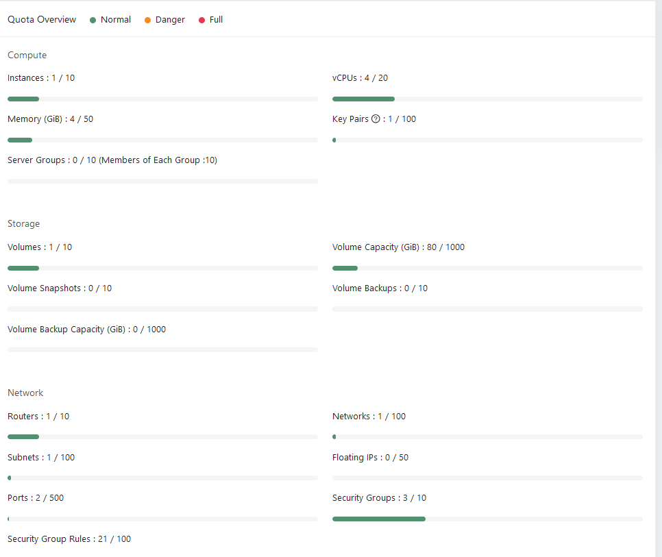
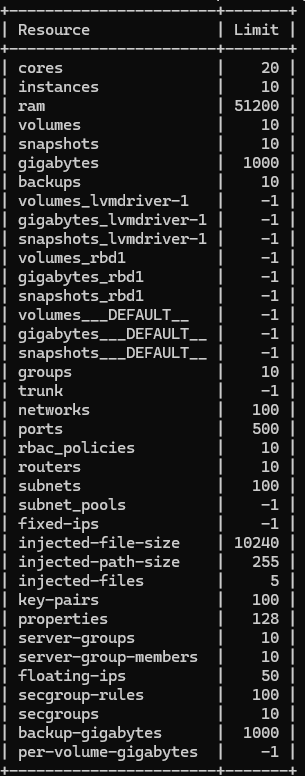
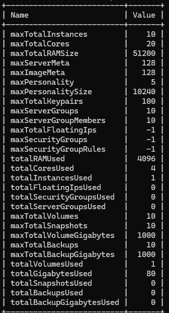

# OpenStack Quotas

To read more about Openstack quotas please visit the [upstream docs](https://docs.openstack.org/nova/rocky/admin/quotas.html).

#### Viewing Your Quota

You can view your quotas via Skyline or using the OpenStack CLI client.  The Skyline home page is the easiest way to view your quota limits and utilization in one place.


You can also view quota information using the OpenStack CLI, however, you'll need to use a couple of commands.<BR>
Use the quota option to list all of your quota limits.

```shell
openstack quota show
```



The limits option returns quota limits along with utilization information for most services.

```shell
openstack limits show --absolute
```



#### Increasing Your Quota

If you need to request a quota increase, please contact your Account Manager or navigate to the [MyCloud](https://mycloud.rackspace.com) portal, create a ticket, and select Account as the category.
