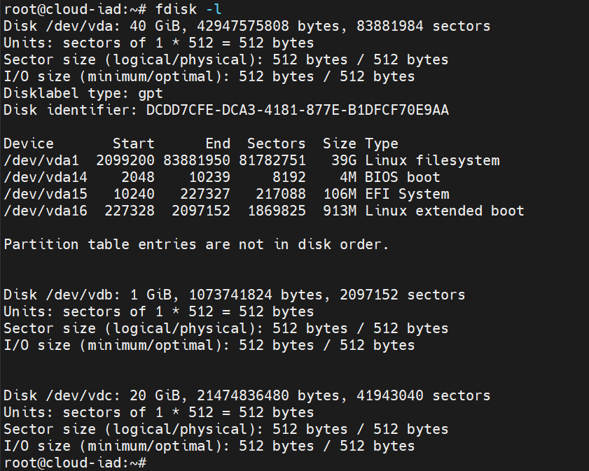
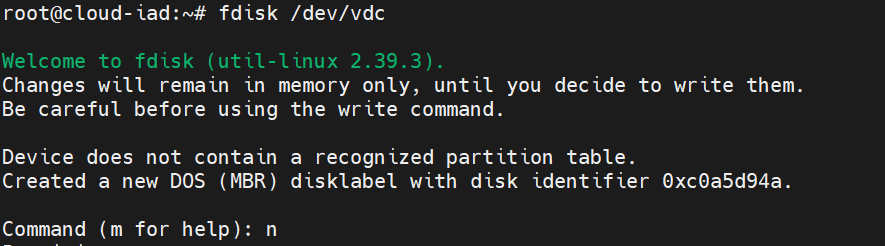
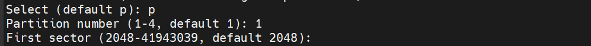
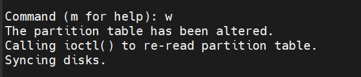
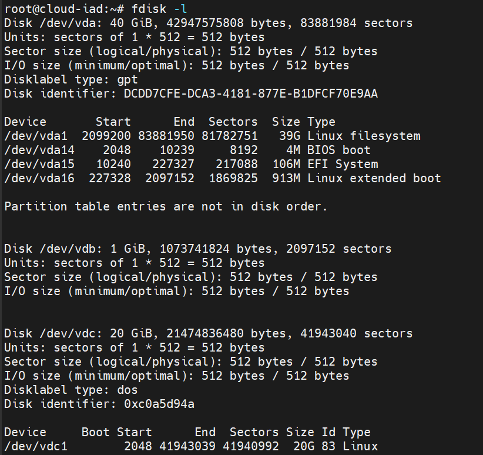
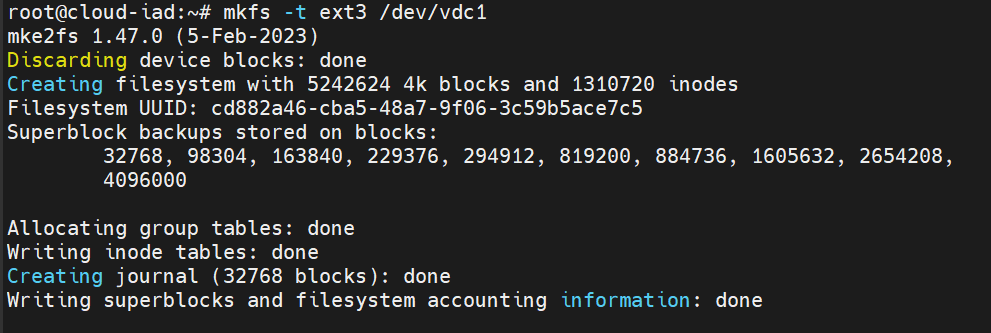
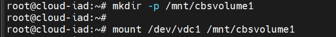
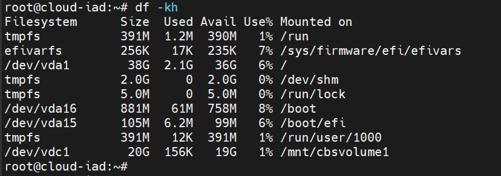
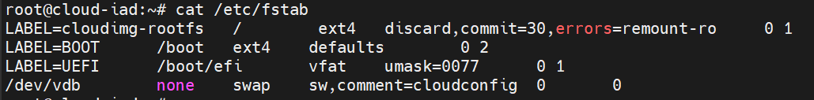
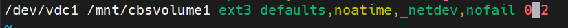

# Prepare Your Flex Block Storage Volume

Previous section: [Create and Attach a Flex Block Storage Volume](create-and-attach-a-flex-block-storage-volume.md)

After you have created and attached your Flex Block Storage volume, you must prepare it for use on your server. To prepare the volume, you must partition, format, and mount it. After you have completed these steps, your volume is usable like a drive on your server.

## Prepare your volume for use with a Linux server

### Connect to your server via SSH

Using SSH, log in to the server as root by using its IP address and root password. You can find the server's IP address in the Skyline portal under Compute > Instances.

``` shell
ssh root@{server_ip_address}
```

After you log in, list the disks on your server. Your volume typically displays as the last drive in this list. In the following example, the 20 GB volume is attached to `/dev/vdc`.

``` shell
fdisk -l
```



### Partition the disk

Partitioning the disk tells the server how much space on the drive you want to use. To use all of it, tell the server to start at the first cylinder and go to the last.

1. Run the `fdisk` utility and specify the disk:

    

2. Enter `n` to create a new partition.

3. Enter `p` to indicate a primary partition.

4. Enter `1` to create only one partition on this disk.

    

5. Press **Enter** to accept the default start cylinder.

    

6. Press **Enter** to accept the default end cylinder (uses the entire volume).

7. Enter `w` to write the partition table and exit.

    

After writing, list the disks again to confirm. Your partition now appears as `/dev/vdc1`.



### Format the volume

Formatting the volume enables the server to store information on it. The following example uses ext3. You can use other file systems supported by your kernel.



### Mount the volume

After partitioning and formatting the volume, you must mount it on the server.

1. Create a mount point and mount the volume:

    

2. Verify the volume is mounted by checking free disk space:

    

    Your new volume should appear in the list of available drives.

!!! note

    If you ever decide to move the volume to a different server, unmount the volume first using the `umount` command, then detach it via Skyline and re-attach it to the new server.

### Make the volume persistent after reboot

This step is optional but recommended. It keeps your volume mounted automatically after server restarts.

Add your volume to `/etc/fstab`:





!!! note

    The `_netdev` option prevents attempts to mount the volume until all networking is running. The `nofail` option allows the server to boot even if the volume is unavailable.
