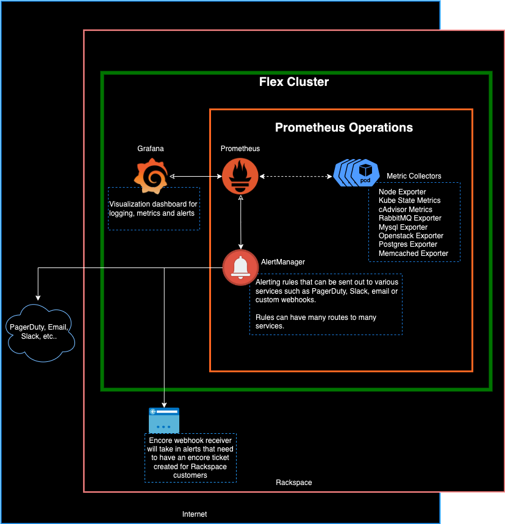

# Prometheus Monitoring Overview

Genestack utilizes Prometheus for monitoring, alerting and metrics collection. To read more about Prometheus please take a look at the [upstream docs](https://prometheus.io).

Components used to monitor and provide alerting and visualization mechanisms for genestack include:

* Prometheus
* AlertManager
* Grafana

Prometheus makes use of various metric exporters used to collect monitoring data related to specific services:

* Node Exporter(Hardware metrics)
* Kube State Exporter(Kubernetes cluster metrics)
* Mysql Exporter(MariaDB/Galera metrics)
* RabbitMQ Exporter(RabbitMQ queue metrics)
* Postgres Exporter(Postgresql metrics)
* Memcached Exporter(Memcached metrics)
* Openstack Exporter(Metrics from various Openstack products)
* Pushgateway (metrics from short-lived jobs)
* SNMP exporter (for monitoring with SNMP)

<figure markdown="span">
  { style="filter:drop-shadow(#3c3c3c 0.5rem 0.5rem 10px);" }
  <figcaption>high level visual of Prometheus and the various monitoring and alerting components within genestack</figcaption>
</figure>

### Getting started with genestack monitoring

To get started using monitoring within the genestack ecosystem begin with the [getting started](monitoring-getting-started.md) page
