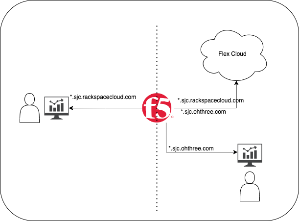

# Example Implementation from Rackspace

This example is not required and is only intended to show how Rackspace deploys specific gateway kustomization files.

``` shell
kubectl kustomize /etc/genestack/kustomize/gateway/nginx-gateway-fabric | kubectl apply -f -
```

## Exposing Flex Services

We have a requirement to expose a service

 1. Internally for private consumption (Management and Administrative Services)
 2. Externally to customers (mostly Openstack services)



This setup can be expended to have multiple MetalLB VIPs with multiple Gateway Services listening on different IP addresses as required by your setup.

!!! tip

    The metalLB speaker wont advertise the service if :
    1. There is no active endpoint backing the service
    2. There are no matching L2 or BGP speaker nodes
    3. If the service has external Traffic Policy set to local you need to have the running endpoint on the speaker node.
