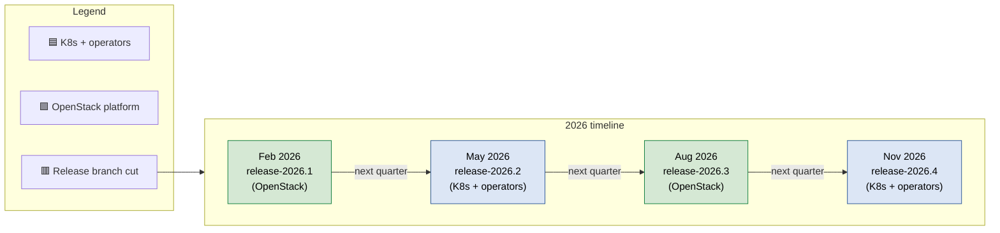
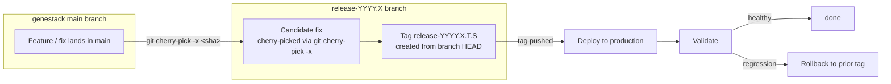

# Genestack Release Strategy

> **Normative companion to** [`docs/adr/0002-genestack-release-and-branching-strategy.md`](adr/0002-genestack-release-and-branching-strategy.md). ADR-0002 records the *decision*; this document records the *rules*.

## 1. Scope

This strategy governs how Genestack is released to production. It covers:

- Branch creation and maintenance policies for the `genestack` repository.
- The naming, structure, and component scope of every release tag.
- The upgrade domains each release tier must contain (and must not contain).
- The fix flow from `main` onto a release branch and into a patch tag.

It does **not** cover per-component version selection (see `helm-chart-versions.yaml` and the upgrade-plan runbooks) or deployment orchestration runbooks.

## 2. Release cadences

### 2.1 Calendar overview

| Quarter | Genestack release | Upgrade domain | Notes |
|---|---|---|---|
| February (`YYYY.1`) | `release-YYYY.1` | OpenStack platform | Deploys the most recent completed upstream OpenStack release. |
| May (`YYYY.2`) | `release-YYYY.2` | Kubernetes + non-OpenStack operators | K8s foundation upgrade; no OpenStack chart changes. |
| August (`YYYY.3`) | `release-YYYY.3` | OpenStack platform | Deploys the most recent completed upstream OpenStack release. |
| November (`YYYY.4`) | `release-YYYY.4` | Kubernetes + non-OpenStack operators | K8s foundation upgrade; no OpenStack chart changes. |



### 2.2 OpenStack version targeting

OpenStack releases follow a coordinated 6-month cadence with odd-numbered release identifiers (`2026.1`, `2026.2`, `2027.1` …). Each OpenStack release is generally available several months before the Genestack release that targets it.

| Genestack release | Targets upstream OpenStack | Rationale |
|---|---|---|
| `release-2026.1` | `2026.1` | Most recent completed OpenStack release. |
| `release-2026.3` | `2026.2` | `2026.2` will have shipped ~3 months prior; `2026.1` is still the previous cycle. |
| `release-2027.1` | `2027.1` | And so on. |

The targeted OpenStack release and its chart commit hash are recorded in `helm-chart-versions.yaml` and the per-release product matrix (`docs/product-matrix-YYYY.X.0.md`).

## 3. Branch model


### 3.1 Branch creation rule
At **00:00 UTC on the first day of the release quarter** (Feb 1 / May 1 / Aug 1 / Nov 1), a new `release-YYYY.X` branch is **cut from the HEAD of `main`**. The cut is performed by a release engineer and announced in the team channel.

### 3.2 Branch naming
`release-YYYY.X` where:

| Component | Meaning | Example |
|---|---|---|
| `YYYY` | Calendar year of the cut. | `2026` |
| `X` | Calendar quarter. `1`=Feb, `2`=May, `3`=Aug, `4`=Nov. | `2` |

### 3.3 Trunk stays open
`main` is **never frozen**. Feature work for the *next* cycle and fix work for the *current* cycle both land on `main` immediately and in parallel.

## 4. Release tags

### 4.1 Tag naming scheme

```
release-YYYY.X.T[.S]
```

| Component | Meaning | Values | Notes |
|---|---|---|---|
| `YYYY` | Release year | `2026`, `2027` | — |
| `X` | Release quarter | `1`, `2`, `3`, `4` | — |
| `T` | Tier | `0`, `1` | `0` = foundation (K8s/OpenStack), `1` = operators. |
| `S` | Optional patch step | `1`, `2`, … | Only produced when a fix is required. |

### 4.2 Tag tiers and their component scope

#### 4.2.1 Foundation tier — `release-YYYY.X.0`

| Quarter parity | Upgrade domain | What ships |
|---|---|---|
| **Even** (May, Nov / `YYYY.2`, `YYYY.4`) | **Kubernetes + kubespray** | K8s version bump, kubespray upgrade, base image updates, and any bug fixes required to stabilize that foundation. **No operator chart changes of any kind.** |
| **Odd** (Feb, Aug / `YYYY.1`, `YYYY.3`) | **OpenStack platform** | OpenStack service chart bumps to the targeted upstream `.1` release, plus any fixes required for that upgrade. **No non-OpenStack operator changes.** |

#### 4.2.2 Operator tier — `release-YYYY.X.1`

| Quarter parity | Upgrade domain | What ships |
|---|---|---|
| **Even** (May, Nov) | **Non-OpenStack operators** | All Helm-managed operators/charts that are *not* OpenStack services, bumped to current supported versions. OpenStack service charts are **explicitly excluded** and remain at the `.0` tag's pinned versions. |
| **Odd** (Feb, Aug) | *(not produced)* | Odd-numbered quarters are OpenStack-only; no separate operator tier is cut. |

#### 4.2.3 Patch tiers — `release-YYYY.X.0.1`, `release-YYYY.X.1.1`, …

Patch tags are **strictly scoped** to the tier they extend:

- A **`.0.1` patch** only backports fixes that are relevant to the `.0` tag's component set (Kubernetes/kubespray for even years; OpenStack for odd years).
- A **`.1.1` patch** only backports fixes that are relevant to the `.1` tag's operator component set.
- A `.1` patch must **never** carry a fix that belongs on the `.0` tier (and vice-versa).

Example: if a `kube-ovn` CNI bug is found after `release-2026.2.0` is cut, it is fixed in `main`, cherry-picked to `release-2026.2`, and a new `release-2026.2.0.1` tag is cut. The same fix is **not** carried on the operator tier.

### 4.3 Tag creation rule
A tag is only cut from a release-branch at the direction of a release engineer, after:

1. The branch HEAD passes the full CI test matrix (`make test`/`ci-pipeline`).
2. The relevant runbook (`docs/openstack-upgrade-checklist.md`, `docs/k8s-upgrade-checklist.md`, or `docs/operator-upgrade-checklist.md`) has been executed against a representative lab.
3. The release notes diff (`docs/release-YYYY.X.T.md`) has been reviewed and approved.

## 5. Fix flow



### 5.1 Landing sequence (mandatory)

1. The fix is authored as a PR against `main`. It is reviewed, tested, and **merged into `main`**.
2. The PR SHA is identified.
3. On the target `release-YYYY.X` branch the fix is applied with:

   ```
   git checkout release-YYYY.X
   git cherry-pick -x <sha-from-main>
   git push origin release-YYYY.X
   ```

   The `-x` flag records the origin SHA in the cherry-pick commit message for traceability.

4. If CI is green, the release engineer creates and pushes the relevant patch tag (`git tag release-YYYY.X.T.S && git push origin release-YYYY.X.T.S`).

### 5.2 Scope guard
A cherry-pick must only touch files/components within the scope of its parent tier:

| Parent tier | Permitted files | Forbidden files |
|---|---|---|
| `.0` (even-year K8s) | `ansible/`, `kubespray/`, `base-images/`, `k8s-*`, `capi_cluster/` | `openstack-components.yaml`, `helm-chart-versions.yaml` (OpenStack entries), operator `base-helm-configs/*` |
| `.0` (odd-year OpenStack) | `openstack-components.yaml`, OSH chart overrides, `helm-chart-versions.yaml` (OpenStack entries) | `ansible/inventory/.../k8s_cluster/`, non-OpenStack operator `base-helm-configs/*` |
| `.1` (even-year operators) | `helm-chart-versions.yaml`, `base-helm-configs/*` (non-OpenStack charts) | OpenStack entries, K8s/kubespray files |

If a fix touches multiple domains, it is **split into separate PRs** so each can be cherry-picked into the correct tier branch on its own timeline.

## 6. Maintenance window

| Branch state | Branches in scope | Action on next quarterly cut |
|---|---|---|
| **2 active** | current `release-YYYY.X` + immediately preceding `release-YYYY.(X-1)` | The older of the two is **EOL'd**: no further tags, branch archived in git (`git tag eol/release-YYYY.(X-2)`). |
| **EOL** | `release-YYYY.(X-2)` and older | Read-only archive. No fixes, no tags. |

> **Example.** After `release-2026.2` is cut in May 2026, the maintained set is `release-2026.2` (current) and `release-2026.1` (previous). When `release-2026.3` is cut in August, `release-2026.1` is marked EOL.

## 7. Release-year examples

### 7.1 Even year — `release-2026.2` (May, Kubernetes + operators)

1. **Branch cut:** `git checkout -b release-2026.2 <main-HEAD>` on 1 May 2026.
2. **Foundation tag:** `release-2026.2.0` — Kubernetes upgraded to v1.35.4 (kubespray v2.31.0) + required bug fixes. Operator charts **frozen** at the `.0` baseline.
3. **Operator tag:** `release-2026.2.1` — all non-OpenStack Helm operators bumped to current supported versions (see `docs/operator-upgrade-plan-k8s-1.35.4.md`). OpenStack charts **unchanged** from `.0`.
4. **Patch (if needed):** `release-2026.2.0.1` reverts/corrects a kubespray regression; `release-2026.2.1.1` corrects a `loki` chart value regression. Each patch is scoped to its parent tier only.

### 7.2 Odd year — `release-2026.1` (February, OpenStack platform)

> `release-2026.1` was already cut in Feb 2026 and targeted OpenStack `2026.1`. It is shown here as the canonical odd-year example.

1. **Branch cut:** `git checkout -b release-2026.1 <main-HEAD>` on 1 Feb 2026.
2. **Foundation tag:** `release-2026.1.0` — all OpenStack-helm charts bumped to the `2026.1` upstream release; Kubernetes version pinned at the baseline stable for that cycle. **No non-OpenStack operator changes.**
3. **Operator tier:** *(not produced)* — odd-year branches do not emit a `.1` tag.
4. **Patch (if needed):** `release-2026.1.0.1` — corrects a Nova cell DB migration ordering bug. OpenStack-scope only.

### 7.3 Odd year — `release-2026.3` (August, OpenStack platform)

1. **Branch cut:** `git checkout -b release-2026.3 <main-HEAD>` on 1 Aug 2026.
2. **Foundation tag:** `release-2026.3.0` — all OpenStack-helm charts bumped to the `2026.2` upstream release (the most recent completed OpenStack release at cut time). Non-OpenStack operators remain at the `release-2026.2` baseline until the next even-year operator tier.
3. **Operator tier:** *(not produced)*.
4. **Patch (if needed):** `release-2026.3.0.1`.

## 8. Documentation artifacts produced per release

| Artifact | When | Owner |
|---|---|---|
| `docs/release-YYYY.X.T.md` | At tag cut | Release engineer |
| `docs/product-matrix-YYYY.X.0.md` | At `.0` tag cut | Release engineer |
| ADR update if strategy changes | As needed | Architect |
| Runbook entries for high-risk upgrades | At tag cut | Domain owner |

## 9. Glossary

| Term | Meaning |
|---|---|
| **Foundation tier** | `.0` tag: Kubernetes/kubespray (even years) or OpenStack platform (odd years). |
| **Operator tier** | `.1` tag: all non-OpenStack Helm operators/charts (even years only). |
| **OpenStack-scope** | Files/charts belonging to OpenStack services (OSH charts, neutron/nova/keystone/etc.). |
| **K8s-scope** | Kubernetes control plane, kubespray, CNI, and cluster provisioning files. |
| **Operator-scope** | Helm-managed non-OpenStack operators and charts (loki, grafana, cert-manager, metallb, etc.). |
