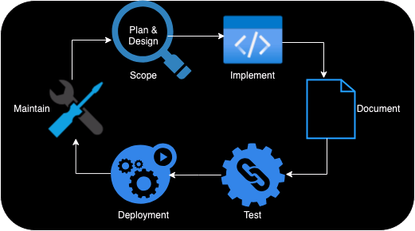

# Genestack SDLC

{align=left : style="max-width:200px"}
Software Development Life Cycle (SDLC) is the process used to ensure high quality solutions are delivered in a predictable, repeatable fashion. The SDLC aims to produce outcomes that meet or exceed customer expectations while reaching completion within time and cost estimates.

 The process is broken down into 6 distinct phases:
 __Scope__, __Implement__, __Document__, __Test__, __Deployment__, and __Maintain__.

### Scope

The scope phase is where new work is identified, based off the stated objective, and the level of effort determined. The plan portion of scope is where the work is assigned to various sprints to ensure timely completion. This step is vital to ensure we are meeting stated goals for the business and the community.

### Implement

In the implement phase, development teams use the requirements gathered in the scope phase to create code or process that meets the deliverable ask.

### Document

Documentation must reflect the current state of the codebase for any deployed application, service or process. If functionality has been added, removed, or changed the documentation is updated to reflect the change.

Tl;dr changed something, added something, removed something -- document it.

### Test

The test phase is used to ensure that the deliverable is free from defects and meets the specified requirements. This is accomplished via a three-step or phased approach:
 1. Github pre-commit checks
 2. Unit testing against development environment
 3. Functional checks using [Rally](https://opendev.org/openstack/rally)
   against our Development and Staging environments

### Deployment

In the deployment phase, the development team deploys deliverables using a multi-environment deployment process. This ensures deliverables are tested through a staging environment for functionality and reliability before reaching production.

### Maintenance

In the maintenance phase, the team focuses on monitoring the various environments, fixing bugs, and addressing any issues brought forth by customers or stakeholders.
