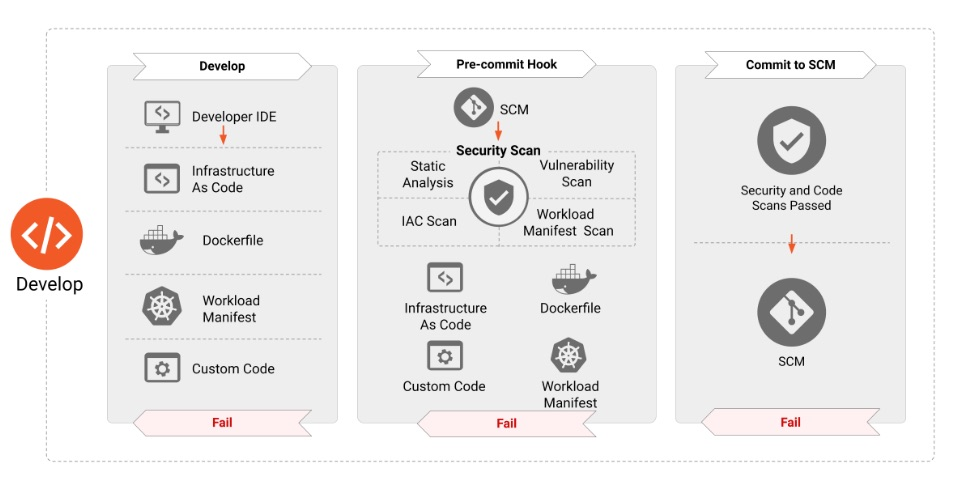
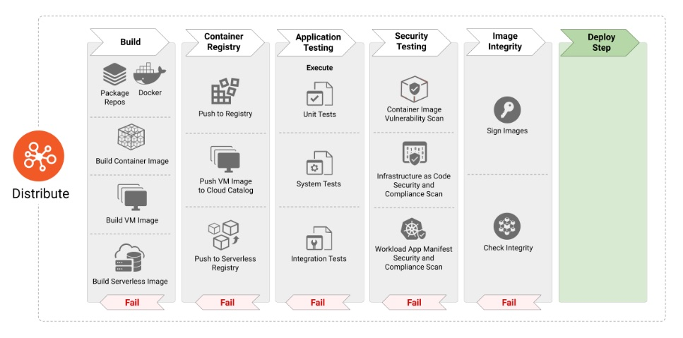
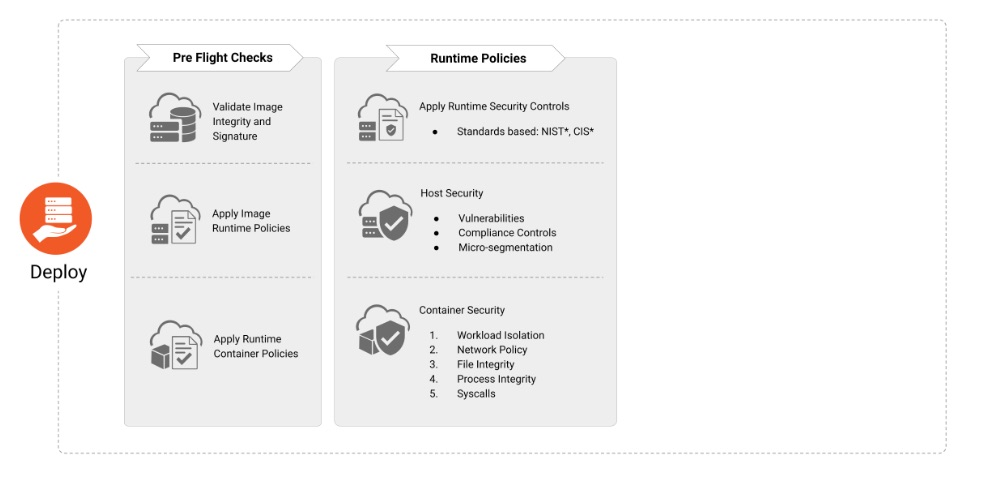
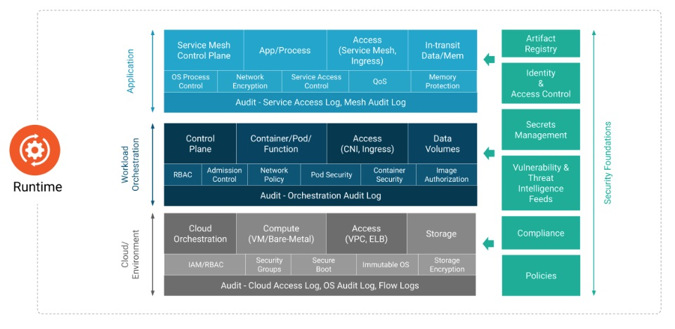

# Layered Security

Layered security in cloud-native environments involves applying protection measures across all lifecycle stages: development, distribution, deployment, and runtime. Each stage incorporates specific controls to address security risks and maintain a robust defense. For example, during development, practices like secure coding and dependency scanning are emphasized. The distribution stage focuses on verifying artifacts, such as container images, with cryptographic signatures. Deployment involves infrastructure hardening and policy enforcement, ensuring secure configuration. Finally, runtime security includes monitoring and detecting anomalies, enforcing least privilege, and safeguarding active workloads to mitigate threats dynamically.

Lets look at each stage in detail.

## Develop

The Develop phase in cloud-native security emphasizes integrating security into the early stages of application development. It involves secure coding practices, managing dependencies by scanning for vulnerabilities, and incorporating security testing into CI/CD pipelines. Developers adopt tools like static and dynamic analysis to identify risks in source code and applications. This proactive approach helps prevent vulnerabilities from progressing further down the lifecycle, reducing risks in later stages.

<figure markdown="span">
  { width="700" height="400"}
  <figcaption>Ref: CNCF Cloud Native Security Develop Phase </figcaption>
</figure>

=== "Infrastructure Layer"

    * **CNCF Context**

        Ensure infrastructure as code (IaC) is secure and scanned for vulnerabilities using tools like Checkov or Terraform Validator.

    * **Recommendations**

        Have separate development, staging and production environments.

        Securely configure physical and virtual resources (e.g., OpenStack nodes, Kubernetes nodes) during the development of IaC templates.

        Implement CI pipelines that test and validate infrastructure configurations against security benchmarks.

=== "Platform Layer"

    * **CNCF Context**

        Harden platform components like OpenStack services or Kubernetes clusters in the configuration stage.

    * **Recommendations**

        Use security-focused configurations for platforms supporting workloads (e.g., hardened Helm charts, secured Nova and Neutron configurations).

        Audit configuration files for misconfigurations using tools like kube-score.

=== "Applications Layer"

    * **CNCF Context**

        Use secure coding practices and dependency scans to mitigate risks in application code.

    * **Recommendations**

        Ensure failures in CI is fixed and that tests exists for failure scenarios.

        Develop application with 12 factor app concept.

        Review code before merging. Follow pre-production and production branching.

        Containerize workloads using scanned, validated images.

        Integrate static application security testing (SAST) into CI pipelines.

=== "Data Layer"

    * **CNCF Context**

        Secure sensitive data early by implementing encryption strategies.

    * **Recommendations**

        Ensure sensitive configuration data (e.g., Secrets, keys) is managed securely using Vault or Barbican.

        Use tools like Snyk to scan code for data exposure risks.

## Distribute

The Distribute phase in cloud-native security focuses on ensuring that all software artifacts, such as container images and binaries, are securely handled during distribution. Key practices include signing artifacts with cryptographic signatures to verify their integrity and authenticity, scanning artifacts for vulnerabilities, and employing policies to prevent the distribution of untrusted or non-compliant components. A secure artifact registry, access controls, and monitoring of repository activity are essential to maintain trust and protect the supply chain. These measures help reduce risks of tampered or malicious artifacts being deployed in production environments.

<figure markdown="span">
  { width="700" height="400"}
  <figcaption>Ref: CNCF Cloud Native Security Distribute Phase </figcaption>
</figure>

=== "Infrastructure Layer"

    * **CNCF Context**

        Securely distribute infrastructure artifacts such as VM images or container runtimes.

    * **Recommendations**

        Build secure image building pipelines.

        Use image signing (e.g., Sigstore, Notary) for OpenStack or Kubernetes.

        Validate VM images against OpenStack Glance hardening guidelines.

=== "Platform Layer"

    * **CNCF Context**

        Ensure platform components are securely distributed and deployed.

    * **Recommendations**

        Apply signed configuration files and use secure channels for distributing Helm charts.

        Use integrity validation tools to verify signed manifests.

        Use secure registry for container images.

=== "Applications Layer"

    * **CNCF Context**

        Harden containers and validate their integrity before deployment.

    * **Recommendations**

        Leverage tools like Harbor to enforce vulnerability scans for container images.

        Ensure SBOM (Software Bill of Materials) generation for all containerized workloads.

        Cryptographically sign images.

        Have container manifest scanning and hardening policies enforced.

        Develop security tests for applications.

=== "Data Layer"

    * **CNCF Context**

        Secure data movement and prevent exposure during distribution.

    * **Recommendations**

        Encrypt data at rest and enforce TLS for data in transit between distribution systems.

        Periodically rotate encryption keys to ensure freshness.

        Use secure container image registry with RABC policy.

## Deploy

The Deploy phase in cloud-native security focuses on securely setting up and configuring workloads and infrastructure in production environments. This phase emphasizes using tools like Infrastructure as Code (IaC) to define secure, consistent configurations. Security controls include enforcing policies such as mandatory access controls, network segmentation, and compliance with deployment best practices. Additionally, ensuring that only trusted artifacts, verified in the "Distribute" phase, are deployed is critical. Continuous validation of deployments and automated scanning help maintain security posture and prevent misconfigurations or vulnerabilities from affecting the runtime environment.

<figure markdown="span">
  { width="700" height="400"}
  <figcaption>Ref: CNCF Cloud Native Security Deploy Phase </figcaption>
</figure>

=== "Infrastructure Layer"

    * **CNCF Context**

        Use hardened deployment practices for nodes, ensuring compliance with security policies.

    * **Recommendations**

        Deploy OpenStack nodes and Kubernetes clusters with minimal services and secure configurations.

        Automate security testing for production deployments.

        Do pre-deploy infrastructure checks. (Example: host state, kerel version, patch status)

        Setup secure log storage.

=== "Platform Layer"

    * **CNCF Context**

        Secure APIs and runtime configurations for platforms.

    * **Recommendations:**

        Enable TLS for OpenStack APIs and enforce RBAC in Kubernetes clusters.

        Use tools like OpenStack Security Groups and Kubernetes NetworkPolicies to isolate workloads.

        Have strong observability and metrics for the platform.

        Setup log aggregration.

=== "Applications Layer"

    * **CNCF Context:**

        Apply runtime policies for containerized applications.

    * **Recommendations:**

        Enforce PodSecurity policies for Kubernetes workloads and hypervisor-level security for OpenStack instances.

        Continuously monitor applications for compliance with runtime security policies.

        Have a strong Incident Management policy.

        Have a strong Alert/Event Management and Automation policy.

=== "Data Layer"

    * **CNCF Context:**

        Protect sensitive data as it enters the runtime environment.

    * **Recommendations:**

        Encrypt data in transit using SSL/TLS and secure APIs with rate-limiting and authentication.

        Perform regular audits of access logs for sensitive data.

	Ensure data protection before deploy. (Example: make sure database backup exist)

## Runtime

The Runtime phase in cloud-native security focuses on protecting active workloads and infrastructure against threats while applications are operational. Key practices include continuous monitoring for anomalous behavior, enforcing runtime policies to restrict actions beyond predefined boundaries, and using tools like intrusion detection systems (IDS) and behavioral analytics. Securing runtime environments also involves employing least-privilege access controls, managing secrets securely, and isolating workloads to contain potential breaches. These proactive measures help maintain the integrity and confidentiality of applications in dynamic cloud-native ecosystems.

<figure markdown="span">
  { width="700" height="400"}
  <figcaption>Ref: CNCF Cloud Native Security Runtime Phase </figcaption>
</figure>

=== "Infrastructure Layer"

    * **CNCF Context**

        Monitor nodes for anomalies and ensure compliance with runtime configurations.

    * **Recommendations**

        Use tools like Prometheus and Falco to detect anomalies in OpenStack and Kubernetes nodes.

        Automate incident response with tools like StackStorm.

=== "Platform Layer"

    * **CNCF Context**

        Continuously secure platform services during operation.

    * **Recommendations**

        Apply monitoring tools to detect unusual API or service behaviors in OpenStack and Kubernetes.

        Set up alerting for deviations in usage patterns or API calls.

=== "Applications Layer"

    * **CNCF Context**

        Monitor containerized workloads for malicious or unexpected behavior.

    * **Recommendations**

        Use runtime security tools like Aqua Security or Sysdig to secure containerized applications.

        Enforce network policies to restrict communication between workloads.

=== "Data Layer"

    * **CNCF Context**

        Secure data throughout its lifecycle in runtime.

    * **Recommendations**

        Encrypt data streams and apply access controls to sensitive information.

        Use backup solutions and test recovery mechanisms to ensure data availability.

The Runtime phase encompasses several key components that form the foundation of a secure and highly available cloud environment. These components include:

- Orchestration
- Compute
- Storage
- Access Control

Each of these components involves complex interdependencies and is critical to the stability and security of your cloud infrastructure. Ensuring their security not only requires adherence to best practices during the Develop, Distribute, and Deploy phases but also relies heavily on the overall cloud environment's design.

## Building a Secure and Resilient Cloud Environment

Our objective is to provide comprehensive guidelines for designing a secure and highly available cloud. Start by reviewing the recommendations outlined in our Cloud Design Documentation to understand best practices for structuring your cloud infrastructure. With this foundation, we can establish security principles tailored to each critical component, ensuring they are robust and resilient against potential threats.
