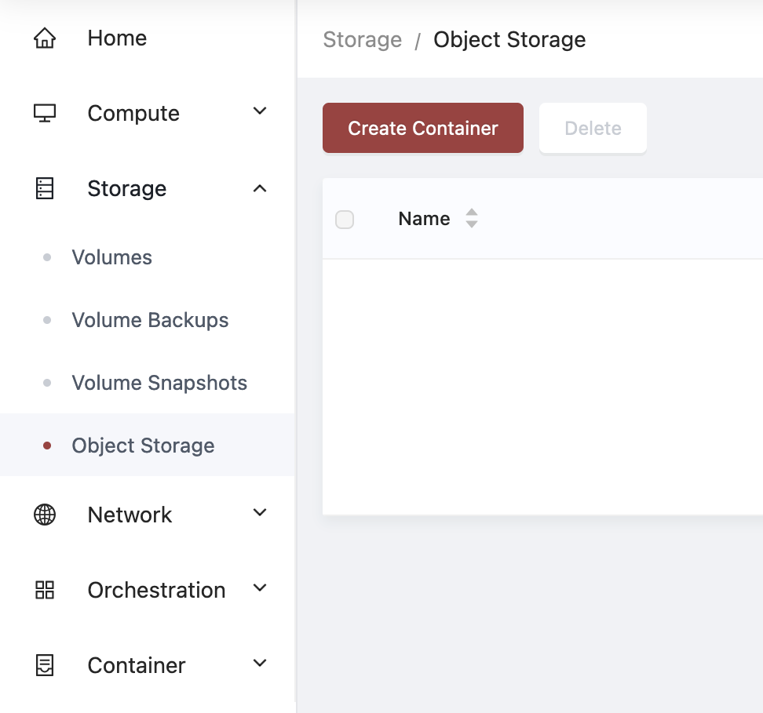
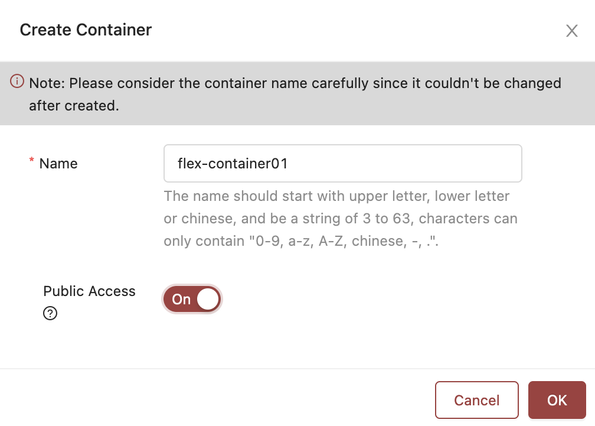
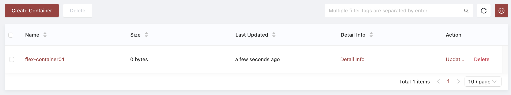
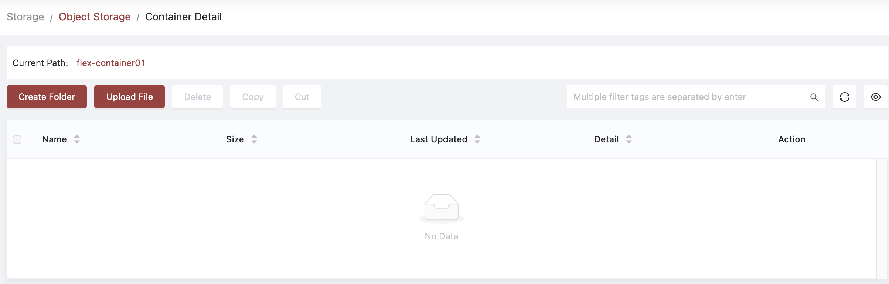
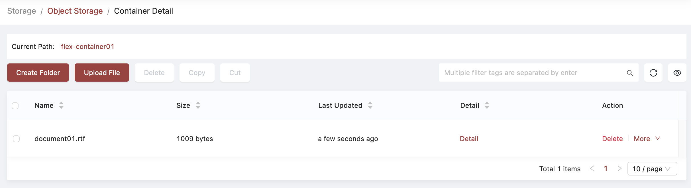

# Object Store Management using the Skyline GUI

## Goal

Use the `Skyline` GUI to perform operations on your object store.

## Prerequisites

Ensure you have access to your OpenStack Skyline GUI.

## Documentation

### Create an object container

Create the container named "flex-container01":

- Navigate to Storage > Object Storage using the left-hand menu.
- Using the right-hand section, you can now click Create Container.

{ align=left : style="filter:drop-shadow(#3c3c3c 0.5rem 0.5rem 10px);" }

- Enter the name for your container in the resulting dialog box. Please note that the container name cannot be changed once created. If you need a different name, you'll need to create another container. If you'd like the container to be made Public, you can switch the slider on here.

{ align=left : style="filter:drop-shadow(#3c3c3c 0.5rem 0.5rem 10px);" }

- Click OK.

{ align=left : style="filter:drop-shadow(#3c3c3c 0.5rem 0.5rem 10px);" }

If you'd like to make the container public after it's created:

- Navigate to Storage > Object Storage using the left-hand menu.
- Using the right-hand section, under the Action heading, click Update.
- Switch the slider on or off here.
- Click OK.

View the container's detail:

- Navigate to Storage > Object Storage using the left-hand menu.
- Using the right-hand section, under the Detail Info heading, click Detail Info.
- Click somewhere else on the page to dismiss the Detail Info box.

### Upload a file to the container

Upload a file to the container:

- Navigate to Storage > Object Storage using the left-hand menu.
- Using the right-hand section, under the Name heading, click on your container's name.
- Click Upload File

{ align=left : style="filter:drop-shadow(#3c3c3c 0.5rem 0.5rem 10px);" }

- Using your file chooser, navigate and select a file.
- Click OK. Depending on the size of your file, you may see a progress bar, while your file is uploaded.

{ align=left : style="filter:drop-shadow(#3c3c3c 0.5rem 0.5rem 10px);" }

!!! Note

    Note that at this time, the Skyline GUI cannot upload entire folders.

To accomplish this you can use either the [openstack client](storage-object-store-openstack-cli.md) or the [swift client](storage-object-store-swift-cli.md).

### Downloading files
When the container is public, you can access each file using a specific URL, made up of your region's endpoint, the name of your container, the prefix (if any) of your object, and finally, the object name.
``` shell
<REGIONAL_ENDPOINT>/storage/container/detail/flex-container01/example.rtf
```

Download a single file from the container:

- Navigate to Storage > Object Storage using the left-hand menu.
- Using the right-hand section, under the Name heading, click on your container's name.
- Locate the file you wish to download.
- On the far right, click More, then Download File.
- Click Confirm.

### Deleting objects

- Navigate to Storage > Object Storage using the left-hand menu.
- Using the right-hand section, under the Name heading, click on your container's name.
- Locate the file you wish to delete.
- Click Delete.
- Click Confirm.

### Deleting a containers

- Navigate to Storage > Object Storage using the left-hand menu.
- Using the right-hand section, locate the container you wish to delete.
- Click Delete.
- Click Confirm.

!!! Note

    Note that at this time, the Skyline GUI cannot delete non-empty containers.

To accomplish this you can use either the [openstack client](storage-object-store-openstack-cli.md) or the [swift client](storage-object-store-swift-cli.md).

### Setting and removing object expiration
At this time, setting and removing object expiration can be done using the the [swift client](storage-object-store-swift-cli.md).

## Additional documentation

Additional documentation can be found at the official skyline site, on the Openstack Documentation Site.\
https://wiki.openstack.org/wiki/Skyline
